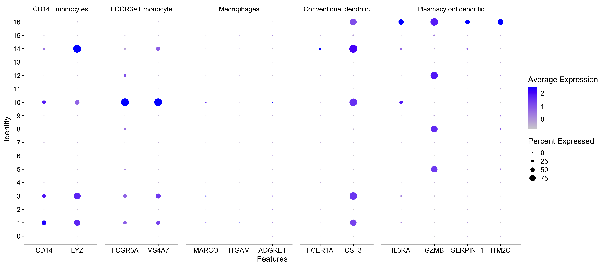

# Single-cell RNA-seq data analysis workshop 

QC             |  Clustering | Annotation
:-------------------------:|:-------------------------:|:-------------------------:
  |   | 

### Description

This **Introduction to single-cell RNA-seq analysis** workshop will instruct participants on how to design and analyze a single-cell RNA-seq experiment from start to end.  

This will be a hands-on workshop geared towards biologists in which we will focus on using the Seurat package using R/RStudio. Working knowledge of R is required or completion of the [Introduction to R workshop](https://hbctraining.github.io/Intro-to-R/). The lessons are spread over 3 sessions, totaling around 7.5 hours of trainer-led time.

### Learning Objectives

- Explain common considerations when designing a single-cell RNA-seq experiment
- Discuss the steps involved in taking raw single-cell RNA-sequencing data and generating a count (gene expression) matrix
- Compute and assess QC metrics at every step in the workflow
- Cluster cells based on expression data and derive the identity of the different cell types present
- Perform integration of different sample conditions
- Annotate cells with marker genes

**Be sure to follow the Installation steps in the pre-reading**

Trainer-led learning | Self-learning
:-------------------------:|:-------------------------:
 | 

### Citation

To cite material from this course in your publications, please use:

> Mary Piper, Meeta Mistry, Jihe Liu, William Gammerdinger, & Radhika Khetani. (2022, January 6). hbctraining/scRNA-seq_online: scRNA-seq Lessons from HCBC (first release). Zenodo. https://doi.org/10.5281/zenodo.5826256

A lot of time and effort went into the preparation of these materials. Citations help us understand the needs of the community, gain recognition for our work, and attract further funding to support our teaching activities. Thank you for citing this material if it helped you in your data analysis.

---

*These materials have been developed by members of the teaching team at the [Harvard Chan Bioinformatics Core (HBC)](http://bioinformatics.sph.harvard.edu/). These are open access materials distributed under the terms of the [Creative Commons Attribution license](https://creativecommons.org/licenses/by/4.0/) (CC BY 4.0), which permits unrestricted use, distribution, and reproduction in any medium, provided the original author and source are credited.*
