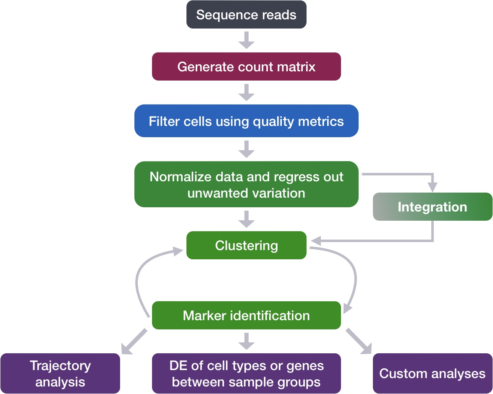
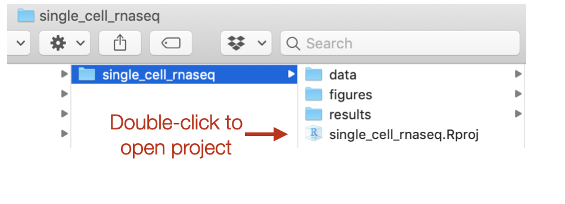

Approximate time: 90 minutes

## Learning Objectives:

* Demonstrate how to import data and set up project for upcoming quality control analylsis.

# Single-cell RNA-seq: Quality control set-up

<p align="center">

</p>

After quantifying gene expression we need to bring this data into R to generate metrics for performing QC. In this lesson we will talk about the format(s) count data can be expected in, and how to read it into R so we can move on to the QC step in the workflow. We will also discuss the dataset we will be using and the associated metadata.

***

## Exploring the example dataset

For this workshop we will be working with a single-cell RNA-seq dataset which is part of a larger study from [Kang et al, 2017](https://www.nature.com/articles/nbt.4042). In this paper, the authors present a a computational algorithm that harnesses genetic variation (eQTL) to determine the genetic identity of each droplet containing a single cell (singlet) and identify droplets containing two cells from different individuals (doublets).

The data used to test their algorithm is comprised of pooled Peripheral Blood Mononuclear Cells (PBMCs) taken from eight lupus patients, split into control and interferon beta-treated (stimulated) conditions. 


<p align="center">

</p>

*Image credit: [Kang et al, 2017](https://www.nature.com/articles/nbt.4042)*

### Raw data

This dataset is available on GEO ([GSE96583](https://www.ncbi.nlm.nih.gov/geo/query/acc.cgi?acc=GSE96583)), however the available counts matrix lacked mitochondrial reads, so we downloaded the BAM files from the SRA ([SRP102802](https://www-ncbi-nlm-nih-gov.ezp-prod1.hul.harvard.edu/sra?term=SRP102802)). These BAM files were converted back to FASTQ files, then run through [Cell Ranger](https://support.10xgenomics.com/single-cell-gene-expression/software/pipelines/latest/what-is-cell-ranger) to obtain the count data that we will be using.

> **NOTE:**  The count data for this dataset is also freely available from 10X Genomics and is used in the [Seurat tutorial](https://satijalab.org/seurat/v3.0/immune_alignment.html). 

### Metadata

In addition to the raw data, we also need to collect **information about the data**; this is known as **metadata**. There is often a temptation to just start exploring the data, but it is not very meaningful if we know nothing about the samples that this data originated from.

Some relevant metadata for our dataset is provided below:

* The libraries were prepared using 10X Genomics version 2 chemistry
* The samples were sequenced on the Illumina NextSeq 500
* PBMC samples from eight individual lupus patients were separated into two aliquots each. 
  * One aliquot of PBMCs was activated by 100 U/mL of recombinant IFN-β for 6 hours. 
  * The second aliquot was left untreated. 
  * After 6 hours, the eight samples for each condition were pooled together in two final pools (stimulated cells and control cells). We will be working with these two, pooled samples. (*We did not demultiplex the samples because SNP genotype information was used to demultiplex in the paper and the barcodes/sample IDs were not readily available for this data. Generally, you would demultiplex and perform QC on each individual sample rather than pooling the samples.*)
* 12,138 and 12,167 cells were identified (after removing doublets) for control and stimulated pooled samples, respectively.

* Since the samples are PBMCs, we will expect immune cells, such as:
  * B cells
  * T cells
  * NK cells
  * monocytes
  * macrophages
  * possibly megakaryocytes
  
**It is recommended that you have some expectation regarding the cell types you expect to see in a dataset prior to performing the QC.** This will inform you if you have any cell types with low complexity (lots of transcripts from a few genes) or cells with higher levels of mitochondrial expression. This will enable us to account for these biological factors during the analysis workflow.

None of the above cell types are expected to be low complexity or anticipated to have high mitochondrial content.

## Set up

For this workshop, we will be working within an RStudio project. In order to follow along you should have **downloaded the R project**.

> If you haven't done this already, the project can be accessed using [this link](https://www.dropbox.com/s/we1gmyb9c8jej2u/single_cell_rnaseq.zip?dl=1).

Once downloaded, you should see a file called `single_cell_rnaseq.zip` on your computer (likely, in your `Downloads` folder). 

1. Unzip this file. It will result in a folder of the same name. 
2. **Move the folder to the location on your computer where you would like to perform the analysis.**
3. Open up the folder. The contents will look like the screenshot below. 
4. **Locate the `.Rproj file` and double-click on it.** This will open up RStudio with the "single_cell_rnaseq" project loaded. 

<p align="center">

</p>

## Project organization

One of the most important parts of research that involves large amounts of data, is how best to manage it. We tend to prioritize the analysis, but there are many other important aspects of **data management that are often overlooked** in the excitement to get a first look at new data. The [HMS Data Management Working Group](https://datamanagement.hms.harvard.edu/), discusses in-depth some things to consider beyond the data creation and analysis.

One important aspect of data management is organization. For each experiment you work on and analyze data for, it is considered best practice to get organized by creating **a planned storage space (directory structure)**. We will do that for our single-cell analysis. 

Look inside your project space and you will find that a directory structure has been setup for you:

```
single_cell_rnaseq/
├── data
├── results
└── figures
```

> **NOTE FOR WINDOWS OS users** - When you open the project folder after unzipping, please check if you have a `data` folder with a sub folder also called `data`. If this is the case, please move all the files from the subfolder into the parent `data` folder.


### New script

Next, open a new Rscript file, and start with some comments to indicate what this file is going to contain:

```r
# July/August 2021
# HBC single-cell RNA-seq workshop

# Single-cell RNA-seq analysis - QC
```

Save the Rscript as `quality_control.R`. Your working directory should look something like this:

<p align="center">

</p>

### Loading libraries 

Now, we can load the necessary libraries:

```r
# Load libraries
library(SingleCellExperiment)
library(Seurat)
library(tidyverse)
library(Matrix)
library(scales)
library(cowplot)
library(RCurl)
```

## Loading single-cell RNA-seq count data 

Regardless of the technology or pipeline used to process your raw single-cell RNA-seq sequence data, the output with quantified expression will generally be the same. That is, for each individual sample you will have the following **three files**:

1. a file with the **cell IDs**, representing all cells quantified
2. a file with the **gene IDs**, representing all genes quantified
3. a **matrix of counts** per gene for every cell

We can explore these files by clicking the `data/ctrl_raw_feature_bc_matrix` folder:

### 1. `barcodes.tsv` 
This is a text file which contains all cellular barcodes present for that sample. Barcodes are listed in the order of data presented in the matrix file (i.e. these are the column names). 

  <p align="center">
  
  </p>
  

### 2. `features.tsv`
This is a text file which contains the identifiers of the quantified genes. The source of the identifier can vary depending on what reference (i.e. Ensembl, NCBI, UCSC) you use in the quantification methods, but most often these are official gene symbols. The order of these genes corresponds to the order of the rows in the matrix file (i.e. these are the row names).

  <p align="center">
  
  </p>


### 3. `matrix.mtx`
This is a text file which contains a matrix of count values. The rows are associated with the gene IDs above and columns correspond to the cellular barcodes. Note that there are **many zero values** in this matrix.

<p align="center">

</p>

Loading this data into R requires us to **use functions that allow us to efficiently combine these three files into a single count matrix.** However, instead of creating a regular matrix data structure, the functions we will use create a **sparse matrix** to reduce the amount of memory (RAM), processing capacity (CPU) and storage required to work with our huge count matrix. 

Different methods for reading in data include:

1. **`readMM()`**: This function is from the **Matrix** package and will convert our standard matrix into a sparse matrix. The `features.tsv` file and `barcodes.tsv` must first be individually loaded into R and then they can be combined. For specific code and instructions on how to do this please see [these additional material](../lessons/readMM_loadData.md).
2. **`Read10X()`**: This function is from the **Seurat** package and will use the Cell Ranger output directory as input, directly. With this method individual files do not need to be loaded in, instead the function will load and combine them into a sparse matrix. ***We will be using this function to load in our data!***

### Reading in a single sample

After processing 10X data using its proprietary software Cell Ranger, you will have an `outs` directory (always). Within this directory you will find a number of different files including the files listed below:

- **`web_summary.html`:** report that explores different QC metrics, including the mapping metrics, filtering thresholds, estimated number of cells after filtering, and information on the number of reads and genes per cell after filtering.
- **BAM alignment files:** files used for visualization of the mapped reads and for re-creation of FASTQ files, if needed
- **`filtered_feature_bc_matrix`:** folder containing all files needed to construct the count matrix using data filtered by Cell Ranger
- **`raw_feature_bc_matrix`:** folder containing all files needed to construct the count matrix using the raw unfiltered data

While Cell Ranger performs filtering on the expression counts (see note below), we wish to perform our own QC and filtering because we want to account for the biology of our experiment/biological system. Given this **we are only interested in the `raw_feature_bc_matrix` folder** in the Cell Ranger output. 

> _**NOTE: Why do we not use the `filtered_feature_bc_matrix` folder?** The `filtered_feature_bc_matrix` uses [internal filtering criteria by Cell Ranger](https://support.10xgenomics.com/single-cell-gene-expression/software/pipelines/latest/algorithms/overview), and we do not have control of what cells to keep or abandon._
> 
> _The filtering performed by Cell Ranger when generating the `filtered_feature_bc_matrix` is often good; however, sometimes data can be of very high quality and the Seurat filtering process can remove high quality cells. In addition, it is generally preferable to explore your own data while taking into account the biology of the experiment for applying thresholds during filtering. For example, if you expect a particular cell type in your dataset to be smaller and/or not as transcriptionally active as other cell types in your dataset, these cells have the potential to be filtered out. However, with Cell Ranger v3 they have tried to account for cells of different sizes (for example, tumor vs infiltrating lymphocytes), and now may not filter as many low quality cells as needed._

If we had a single sample, we could generate the count matrix and then subsequently create a Seurat object:

> The Seurat object is a custom list-like object that has well-defined spaces to store specific information/data. You can find more information about the slots in the Seurat object [at this link](https://github.com/satijalab/seurat/wiki/Seurat).

```r
# How to read in 10X data for a single sample (output is a sparse matrix)
ctrl_counts <- Read10X(data.dir = "data/ctrl_raw_feature_bc_matrix")

# Turn count matrix into a Seurat object (output is a Seurat object)
ctrl <- CreateSeuratObject(counts = ctrl_counts,
                           min.features = 100)
```

> **NOTE**: The `min.features` argument specifies the minimum number of genes that need to be detected per cell. This argument will filter out poor quality cells that likely just have random barcodes encapsulated without any cell present. Usually, cells with less than 100 genes detected are not considered for analysis.

**Seurat automatically creates some metadata** for each of the cells when you use the `Read10X()` function to read in data. This information is stored in the `meta.data` slot within the Seurat object. 

```r
# Explore the metadata
head(ctrl@meta.data)
```

What do the columns of metadata mean?

- `orig.ident`: this often contains the sample identity if known, but will default to "SeuratProject"
- `nCount_RNA`: number of UMIs per cell
- `nFeature_RNA`: number of genes detected per cell

### Reading in multiple samples with a `for loop`

In practice, you will likely have several samples that you will need to read in data for, and that can get tedious and error-prone if you do it one at a time. So, to make the data import into R more efficient we can use a `for` loop, which will interate over a series of commands for each of the inputs given and create seurat objects for each of our samples. 

In R, the `for` loop has the following structure/syntax:

```r
## DO NOT RUN

for (variable in input){
	command1
	command2
	command3
}
```

Today we will use it to iterate over the two sample folders and execute two commands for each sample as we did above for a single sample - (1) read in the count data (`Read10X()`) and (2) create the Seurat objects from the read in data (`CreateSeuratObject()`):

```r
# Create a Seurat object for each sample
for (file in c("ctrl_raw_feature_bc_matrix", "stim_raw_feature_bc_matrix")){
        seurat_data <- Read10X(data.dir = paste0("data/", file))
        seurat_obj <- CreateSeuratObject(counts = seurat_data, 
                                         min.features = 100, 
                                         project = file)
        assign(file, seurat_obj)
}
```

> Let's break down the `for loop` and go over the different lines of code:
> 
> #### Step 1: Specify inputs
> 
> For this dataset, we have two samples and two associated folders that we would like to use as input to create the two Seurat objects:
> 
> - `ctrl_raw_feature_bc_matrix` 
> - `stim_raw_feature_bc_matrix`
> 
> We can specify these sample folders in the *input* part for our `for loop` as elements of a vector using `c()`. We are assigning these to a *variable* and we can call that variable anything we would like (try to give it a name that makes sense). In this example, we called the *variable* `file`. 
> 
> > During the execution of the above loop, `file` will first contain the value *"ctrl_raw_feature_bc_matrix"*, run through the commands all the way through to `assign()`. Next, it will contain the value *"stim_raw_feature_bc_matrix"* and once again run through all the commands. If you had 15 folders as input, instead of 2, the above code will run through 15 times, for each of your data folders.
> 
> ```r
> ## DO NOT RUN
> 
> # Create each individual Seurat object
> for (file in c("ctrl_raw_feature_bc_matrix", "stim_raw_feature_bc_matrix")){
> ```
> 
> #### Step 2: Read in data for the input
> 
> We can continue our `for loop` by adding a line to read in data with `Read10X()`:
> 
> - Here, we need to specify the path to the file, so we will prepend the `data/` directory to our sample folder name using the `paste0()` function.
> 
> ```r
> ## DO NOT RUN
> 
>         seurat_data <- Read10X(data.dir = paste0("data/", file))
> ```
> 
> #### Step 3: Create Seurat object from the 10X count data
> 
> Now, we can create the Seurat object by using the `CreateSeuratObject()` function, adding in the argument `project`, where we can add the sample name.
> 
> ```r
> ## DO NOT RUN
> 
>         seurat_obj <- CreateSeuratObject(counts = seurat_data, 
>                                          min.features = 100, 
>                                          project = file)        
> ```
> 
> #### Step 4: Assign Seurat object to a new variable based on sample
> 
> The last command `assign`s the Seurat object created (`seurat_obj`) to a new variable. In this way, when we iterate and move on to the next sample in our `input` we will not overwrite the Seurat object created in the previous iteration:
> 
> ```r
> ## DO NOT RUN
>   
>         assign(file, seurat_obj)
> }
> ```

Now that we have created both of these objects, let's take a quick look at the metadata:

```r
# Check the metadata in the new Seurat objects
head(ctrl_raw_feature_bc_matrix@meta.data)
head(stim_raw_feature_bc_matrix@meta.data)
```

Next, we need to merge these objects together into a single Seurat object. This will make it easier to run the QC steps for both sample groups together and enable us to easily compare the data quality for all the samples.  

We can use the `merge()` function from the Seurat package to do this:

```r
# Create a merged Seurat object
merged_seurat <- merge(x = ctrl_raw_feature_bc_matrix, 
                       y = stim_raw_feature_bc_matrix, 
                       add.cell.id = c("ctrl", "stim"))
```

Because the same cell IDs can be used for different samples, we add a **sample-specific prefix** to each of our cell IDs using the `add.cell.id` argument. 

> #### What if I am merging more than two samples?
> Seurat now has functionality to merge many samples together. You can do this quite easily by adding all sample objects to the `y` argument in a vector format. An example is provided below: 
>
> ```
> merged_seurat <- merge(x = ctrl_raw_feature_bc_matrix, 
>                       y = c(stim1_raw_feature_bc_matrix, stim2_raw_feature_bc_matrix, stim3_raw_feature_bc_matrix),
>                       add.cell.id = c("ctrl", "stim1", "stim2", "stim3"))
>		       

If we look at the metadata of the merged object we should be able to see the prefixes in the rownames:

```r
# Check that the merged object has the appropriate sample-specific prefixes
head(merged_seurat@meta.data)
tail(merged_seurat@meta.data)
```

---
*This lesson has been developed by members of the teaching team at the [Harvard Chan Bioinformatics Core (HBC)](http://bioinformatics.sph.harvard.edu/). These are open access materials distributed under the terms of the [Creative Commons Attribution license](https://creativecommons.org/licenses/by/4.0/) (CC BY 4.0), which permits unrestricted use, distribution, and reproduction in any medium, provided the original author and source are credited.*
