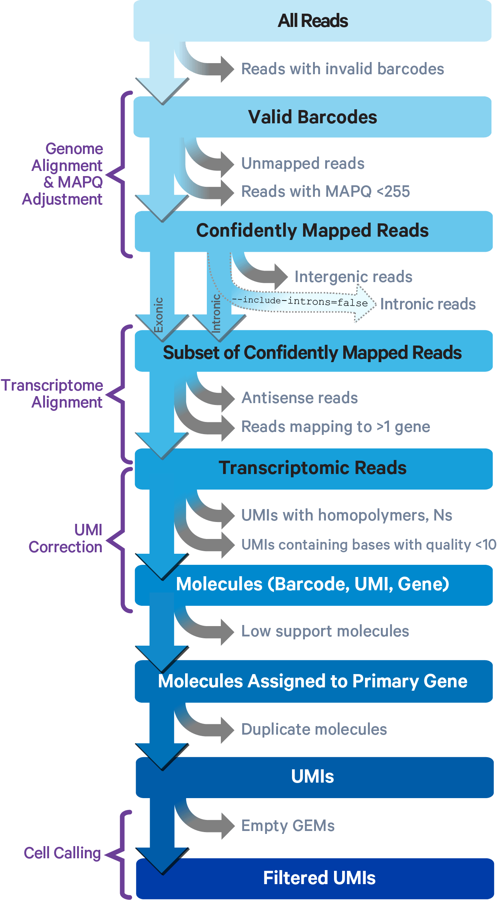
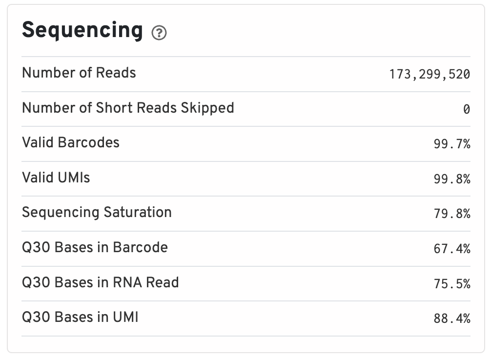
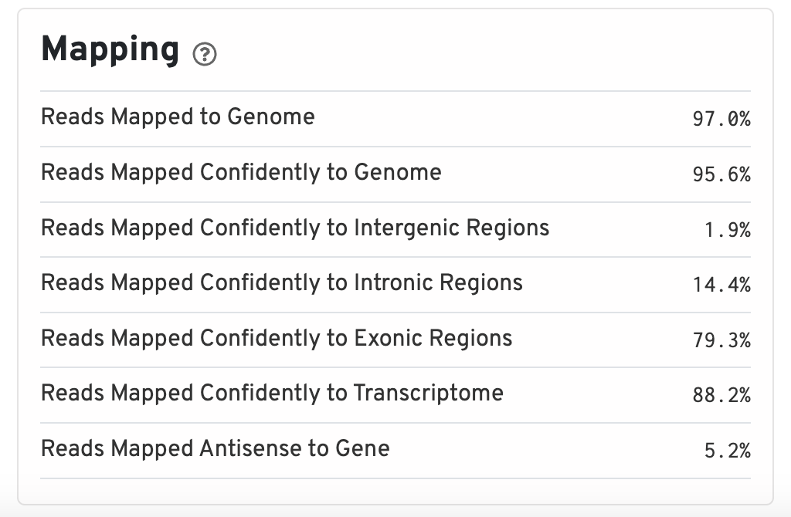
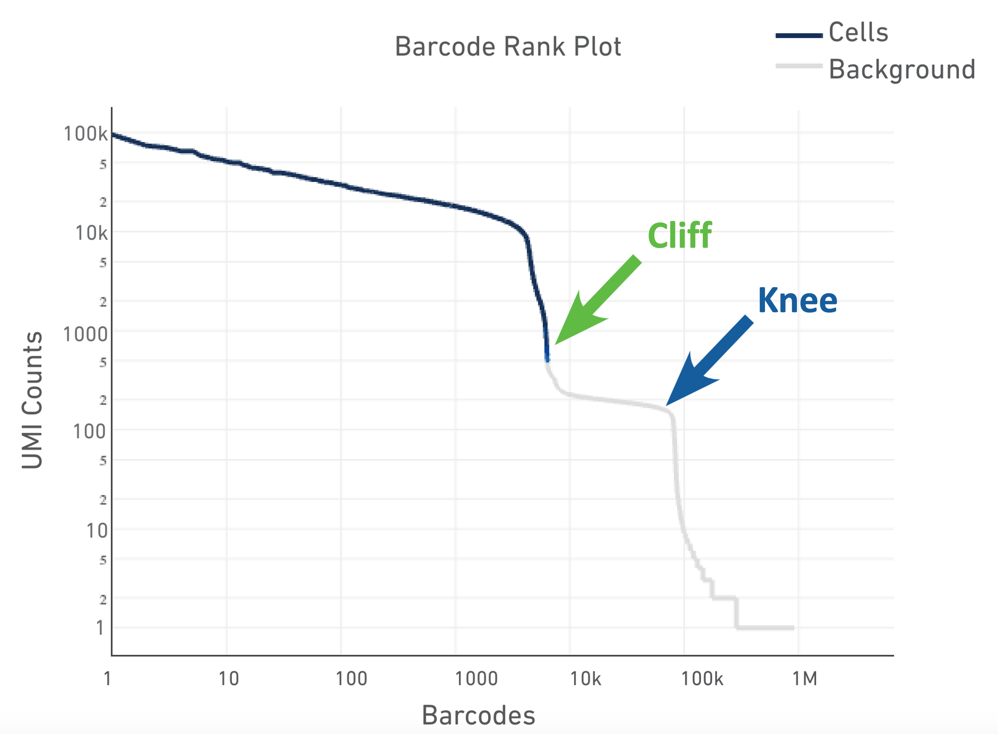
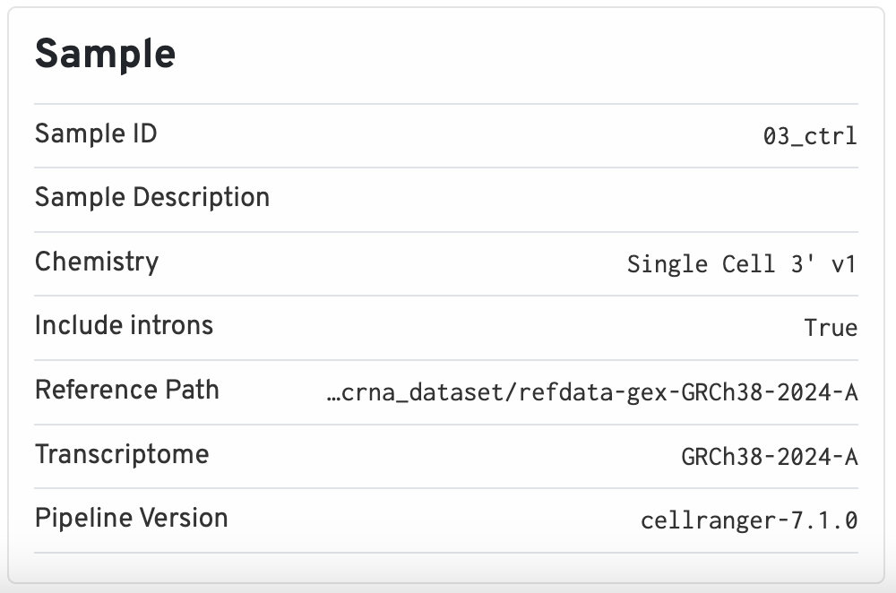
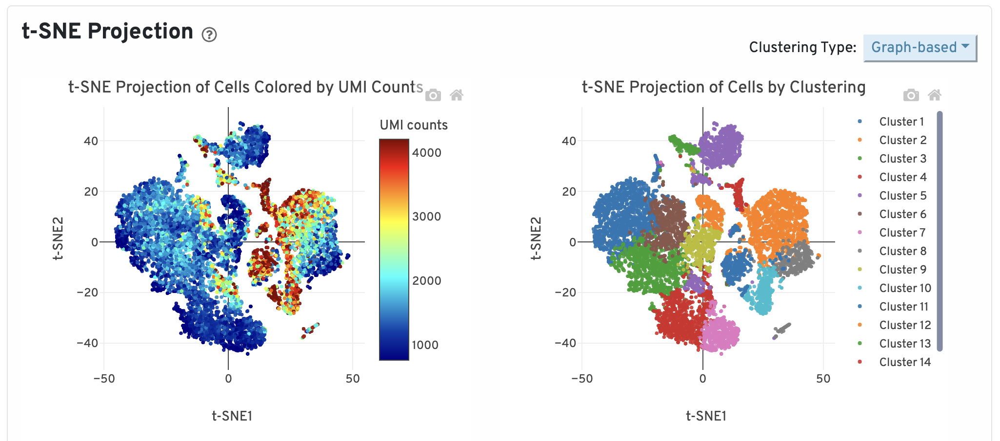
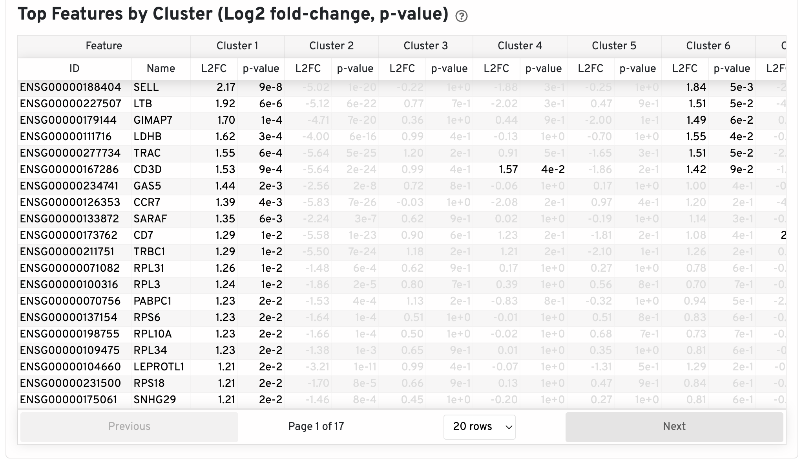
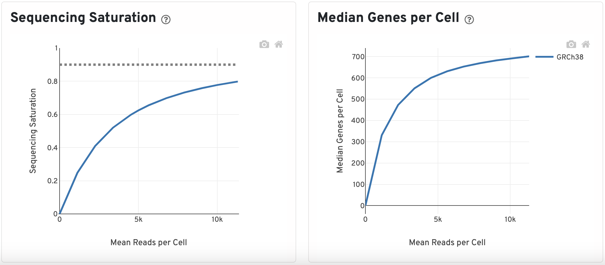
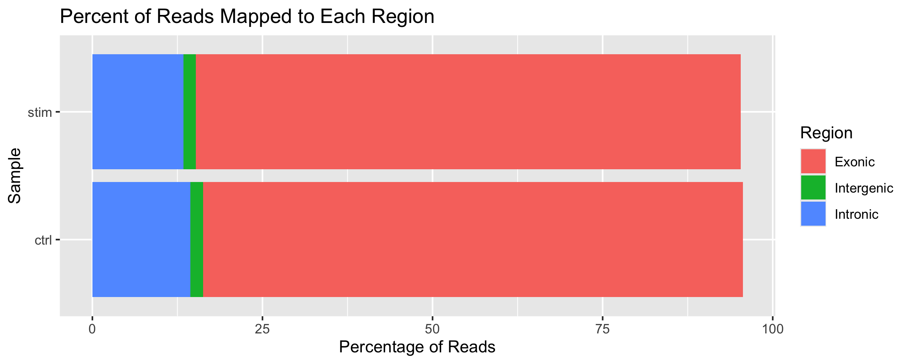

Approximate time: 30 minutes

## Learning Objectives:

* Describe how cellranger is run and what the ouputs are
* Review the Cellranger generated QC report (web summary HTML)
* Create plots will cellranger metrics

# Single-cell RNA-seq: Quality control of Cellranger output

## Cellranger

[Cellranger](https://www.10xgenomics.com/support/software/cell-ranger/latest) is a tool created by 10x to process single-cell sequencing experiments that were processed with their kits.

The algorithm for the single-cell RNA-seq version of cellranger is described by 10x as follows:

<p align="center">

</p>

*Image credit: [10x](https://www.10xgenomics.com/support/software/cell-ranger/latest/algorithms-overview/cr-gex-algorithm)*

The main ideas of this pipeline are as follows:

1. Align FASTQ reads against a reference genome
2. Filter and correct low quailty reads and cell barcodes
3. Collapse on PCR duplicates using UMI information
4. Generate raw counts matrix
5. Run QC on all cells to generate another, filtered counts matrix

While the focus of this workshop is scRNA, we also want to point out that there are multiple different cellranger softwares for other single-cell experiments such as:

| Experiment   | Experiment description | 10x tool |
| :----------- | :--------------------: | -------: |
| RNA     |   RNA    | [cellranger count](https://www.10xgenomics.com/support/software/cell-ranger/latest/analysis/running-pipelines/cr-gex-count) |
| ATAC     |   ATAC    | [cellranger-atac](https://support.10xgenomics.com/single-cell-atac/software/pipelines/latest/using/count) |
| Multiome     |   RNA + ATAC   | [cellranger-arc](https://www.10xgenomics.com/support/software/cell-ranger-arc/latest/analysis/single-library-analysis) |
| V(D)J        |   Clonotypes of T and B cells   | [cellranger vdj](https://www.10xgenomics.com/support/software/cell-ranger/latest/analysis/running-pipelines/cr-5p-vdj) |
| Hashtagging        |  Antibody/oligo tags to differentiate cells after pooling   | [cellranger multi](https://www.10xgenomics.com/support/software/cell-ranger/latest/analysis/) |


## Running Cellranger on O2

Running cellranger requires a lot of time and computational resources in order to process a single sample. Therefore, having access to a High Performance Computing (HPC) cluster is necessary to run it. Some sequencing cores will process samples automatically with cellranger. 

Note that prior to this step, you must have a cellranger compatible reference genome generated. If you are working on mouse or human, 10x has pre-generated the reference and can be accessed from their [website](https://www.10xgenomics.com/support/software/cell-ranger/downloads). If you are using another organism, cellranger has a mode called [mkref](https://www.10xgenomics.com/support/software/cell-ranger/latest/tutorials/cr-tutorial-mr) which will generate a cellranger compatible reference from files you supply (GTF, fasta, etc).

Here we are showing an example of how to run `cellranger count` on Harvard's O2 HPC using SLURM. To run this script, you will have add some additional information, such as the name of your project (which will place the results in a folder of the same name), path to the FASTQ files from your experiment, and a reference genome. In the following example script, you would just have to change the variable specified in the "Inputs for cellranger" section. We have already provided some optimal information in terms of runtime and memory for running cellranger count.

```bash
#!/bin/bash

#SBATCH --partition=short               # Partition name
#SBATCH --time=0-06:00                  # Runtime in D-HH:MM format
#SBATCH --nodes=1                       # Number of nodes (keep at 1)
#SBATCH --ntasks=1                      # Number of tasks per node (keep at 1)
#SBATCH --cpus-per-task=16              # CPU cores requested per task (change for threaded jobs)
#SBATCH --mem=64G                       # Memory needed per node (total)
#SBATCH --error=jobid_%j.err            # File to which STDERR will be written, including job ID
#SBATCH --output=jobid_%j.out           # File to which STDOUT will be written, including job ID
#SBATCH --mail-type=ALL                 # Type of email notification (BEGIN, END, FAIL, ALL)

module load gcc
module load cellranger/7.1.0

local_cores=16
local_mem=64

# Inputs for cellranger
project_name=""                         # Name of output
path_fastq="/path/to/fastq"             # Path to folder with FASTQ files for one sample
path_ref="/path/to/reference"           # Path to cellranger compatible reference


cellranger count \
    --id=${project_name} \
    --fastqs=${path_fastq} \
    --transcriptome=${path_ref} \
    --localcores=${local_cores} \
    --localmem=${local_mem}
```

## Cellranger outs

Once cellranger has finished running, there will be a folder titled `outs/` in a directory titled what you specified the `project_name` as. Generation of all the following files is expected from a succesful completion of the `cellranger counts` pipeline:

```
├── cloupe.cloupe
├── filtered_feature_bc_matrix
│   ├── barcodes.tsv.gz
│   ├── features.tsv.gz
│   └── matrix.mtx.gz
├── filtered_feature_bc_matrix.h5
├── metrics_summary.csv
├── molecule_info.h5
├── possorted_genome_bam.bam
├── possorted_genome_bam.bam.bai
├── raw_feature_bc_matrix
│   ├── barcodes.tsv.gz
│   ├── features.tsv.gz
│   └── matrix.mtx.gz
├── raw_feature_bc_matrix.h5
└── web_summary.html
```

## Web summary html

The Web summary HTML file is a great resource for looking at the basic quality of your sample before starting on an analysis. 10x has a [document describing each metric](https://www.10xgenomics.com/analysis-guides/quality-assessment-using-the-cell-ranger-web-summary) in depth. There are two pages/tabs included in a scRNA report titled "Summary" and "Gene Expression". 

We have included these Web Summary files for the control and stimulated dataset in the [data](https://www.dropbox.com/s/vop78wq76h02a2f/single_cell_rnaseq.zip?dl=1) provided for the workshop.

### Summary

At the top of the "Summary" tab, under the "Alerts" header, will be a list of warnings and messages on the quality/important information about the sample. These messages are very informative on what may have gone wrong with the sample or other flags that can be set in the `cellranger count` run to gain better results.

Underneath the "Alerts" header, in green text, are the estimated number of high quality cells in the sample, average genes per cells, and median genes per cell. The remaining 4 sections include various metrics (which descriptions of each that can be viewed by clicking on the grey question mark) with the following pieces of information:

**Sequencing**

Includes information such as the total number of reads and how many of those reads did not meet the length requirements. Additionally, since all barcodes and UMIs are known values (from the kit used to prep scRNA experiments), we can evaluate what percentage of the barcodes and UMIs belong to that whitelist and are valid. 

<p align="center">

</p>


**Mapping**

Percentage of reads that map to different regions of the reference genome as reported by STAR.

<p align="center">

</p>

**Cells**

Here we can see what an ideal representation of the Barcode Rank Plot looks like. The cells are sorted by the number of UMIs found in the cell to differentiate empty droplets/low quality cells (background) from actual cells. From these plots, the sample can be determined as typical, compromised (failed sample), or heterogeneous (many celltypes) based on the patterns.

<p align="center">

</p>

*Image credit: [10x](https://cdn.10xgenomics.com/image/upload/v1660261286/support-documents/CG000329_TechnicalNote_InterpretingCellRangerWebSummaryFiles_RevA.pdf)*

This section additionally describes averages and medians for number of genes and reads in the sample.

**Sample**

The sample section contains important metadata information you supplied to cellranger, such as what the Sample ID and the path used for the reference. Additionally, it supplies information concerning if introns were included and which version of the 10x kit was used. For reproducibility purposes, this information is extremely useful as the version of cellranger that was used is also stored.

<p align="center">

</p>

### Gene Expression

The "Gene Expression" table contains information downstream of the basic QC, such as:

**t-SNE Projection**

Dotplot showing the t-SNE projection of filtered cells colored by UMI counts and clusters. The report allows you select various values of K for the K-means clustering, showing different groupings that can be generated from the data.

<p align="center">

</p>

**Top Features by Cluster**

This table shows the log2 fold-change and p-value for each gene and cluster after a differential expression analysis is run.

<p align="center">

</p>

**Sequencing Saturation and Median Genes per Cell**

The sequencing saturation plot is a measure of library complexity. In scRNA, more genes can be detected with higher sequencing depth. At a point, you reach sequencing saturation where you do not gain any more meaningful insights which is what the dotted line represents here.


Similar to the sequencing saturation plot, looking at the median gene per cells against mean reads per cell will indicate if your have over or under-sequenced. The slope near the endpoint can be used to determine how much benefit would be gained from sequencing more deeply.

<p align="center">

</p>


## Metrics evaluation

Many of the core pieces of information from the web summary are stored in the `metrics_summary.csv` file. As this is a csv file, we can read it into R and generate plots to include in reports on the general quality of the samples.

First, to read the files in:

```r
# Names of samples (same name as folders stored in data)
samples <- c("ctrl", "stim")

# Loop over each sample and read the metrics summary in
metrics <- list()
for (sample in samples) {
    path_csv <- paste0("data/", sample, "_metrics_summary.csv")
    df <- read.csv(path_csv)
    rownames(df) <- sample
    metrics[[sample]] <- df
}
# Concatenate each sample metrics together
metrics <- ldply(metrics, rbind)
# Remove periods and percentags to make the values numeric
metrics <- metrics %>%
    column_to_rownames(".id") %>%
    mutate_all(funs(parse_number(str_replace(., ",", "")))) %>%
    mutate_all(funs(parse_number(str_replace(., "%", ""))))
metrics$sample <- rownames(metrics)
```

The information available in this file include: 

```
 [1] "Estimated.Number.of.Cells"                     
 [2] "Mean.Reads.per.Cell"                           
 [3] "Median.Genes.per.Cell"                         
 [4] "Number.of.Reads"                               
 [5] "Valid.Barcodes"                                
 [6] "Sequencing.Saturation"                         
 [7] "Q30.Bases.in.Barcode"                          
 [8] "Q30.Bases.in.RNA.Read"                         
 [9] "Q30.Bases.in.UMI"                              
[10] "Reads.Mapped.to.Genome"                        
[11] "Reads.Mapped.Confidently.to.Genome"            
[12] "Reads.Mapped.Confidently.to.Intergenic.Regions"
[13] "Reads.Mapped.Confidently.to.Intronic.Regions"  
[14] "Reads.Mapped.Confidently.to.Exonic.Regions"    
[15] "Reads.Mapped.Confidently.to.Transcriptome"     
[16] "Reads.Mapped.Antisense.to.Gene"                
[17] "Fraction.Reads.in.Cells"                       
[18] "Total.Genes.Detected"                          
[19] "Median.UMI.Counts.per.Cell"                    
[20] "sample"
```

With all of this information available as a dataframe, we can use ggplot to visualize these values. As an example of how this information can be used, we can display what percentage of reads map to the various parts of the genome (Intergentic, Intronic, and Exonic).

```r
# Columns of interest
cols <- c("Reads.Mapped.Confidently.to.Intergenic.Regions",
          "Reads.Mapped.Confidently.to.Intronic.Regions",
          "Reads.Mapped.Confidently.to.Exonic.Regions",
          "sample")

# Data wrangling to sculpt dataframe in a ggplot friendly manner
df <- metrics %>%
    select(cols) %>%
    melt() %>%
    mutate(variable = str_replace_all(variable, "Reads.Mapped.Confidently.to.", "")) %>%
    mutate(variable = str_replace_all(variable, ".Regions", ""))

# ggplot code to make a barplot
df %>% ggplot() +
    geom_bar(
        aes(x = sample, y = value, fill = variable),
        position = "stack",
        stat = "identity") +
    coord_flip() +
    labs(
        x = "Sample",
        y = "Percentage of Reads",
        title = "Region",
        fill = "Percent of Reads Mapped to Each Region")

```

<p align="center">

</p>

## Matrix folders

The most important files that are generated during this cellranger run are the two matrix folders, which contain the count matrices from the experiment:

- raw_feature_bc_matrix
- filtered_feature_bc_matrix

 In the previous lesson, we used `raw_feature_bc_matrix` to load the counts into Seurat. You can similarly do the same with `filtered_feature_bc_matrix`, the difference being that the filtered matrix has removed cells that cellranger determined as low quality using a variety of different tools. We chose to start with the raw counts matrix in this lesson so that you can better see what metrics are used to determine which cells are considered high quality.

---
*This lesson has been developed by members of the teaching team at the [Harvard Chan Bioinformatics Core (HBC)](http://bioinformatics.sph.harvard.edu/). These are open access materials distributed under the terms of the [Creative Commons Attribution license](https://creativecommons.org/licenses/by/4.0/) (CC BY 4.0), which permits unrestricted use, distribution, and reproduction in any medium, provided the original author and source are credited.*
