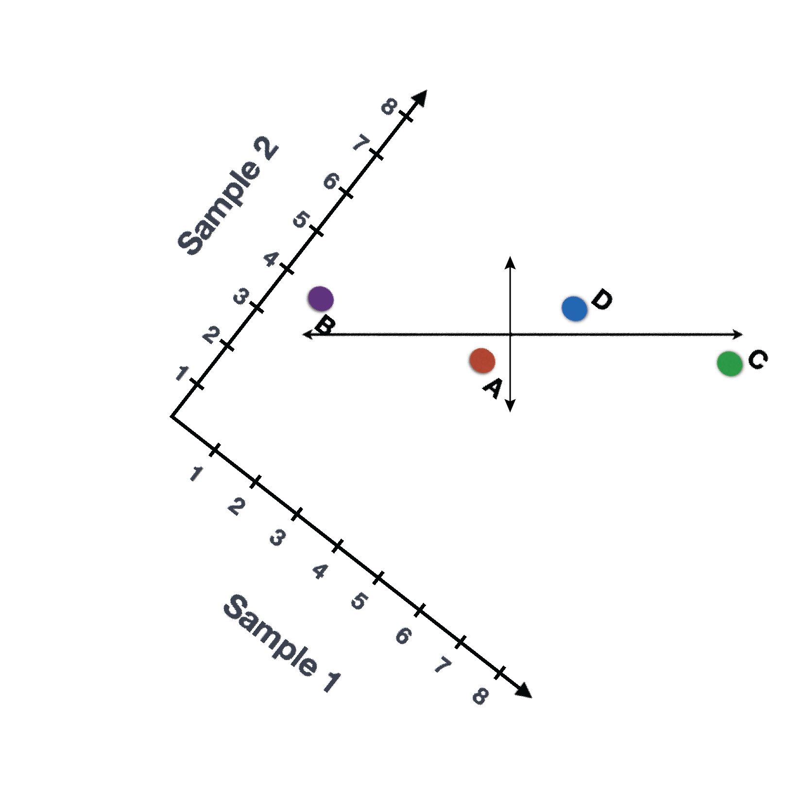
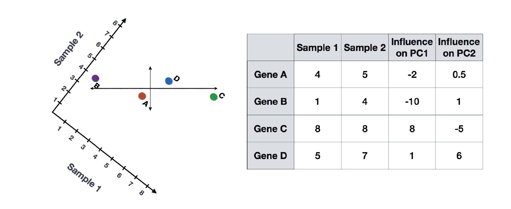

Approximate time: 90 minutes

## Learning Objectives 

* Explain how similarity between cells/samples can be evaluated by the Principal Components Analysis (PCA)

## Principal Component Analysis (PCA)

Principal Component Analysis (PCA) is a technique used to emphasize variation as well as similarity, and to bring out strong patterns in a dataset; it is one of the methods used for *"dimensionality reduction"*. We will briefly go over PCA in this lesson (adapted from StatQuests/Josh Starmer's YouTube video), but we strongly encourage you to explore the video [StatQuest's video](https://www.youtube.com/watch?v=_UVHneBUBW0) for a more thorough explanation/understanding. 

#### Basic explanation with a simple example

Let's say you had quantified the expression of four genes in two samples (or cells), you could plot the expression values of those genes with one sample represented on the x-axis and the other sample on the y-axis as shown below:

You could draw a line through the data in the direction representing the **most variation**, which is on the diagonal in this example. The maximum variation in the dataset is between the genes that make up the two endpoints of this line.  

We also see the genes vary somewhat above and below the line. We could draw another line through the data representing **the second most amount of variation** in the data, since this plot is in 2D (2 axes).

The genes near the ends of each line would be those with the highest variation; these genes have the **greatest influence** on the direction of the line, mathematically. 

For example, a small change in the value of *Gene C* would greatly change the direction of the longer line, whereas a small change in *Gene A* or *Gene D* would have little affect on it.

We could also rotate the entire plot and view the lines representing the variation as left-to-right and up-and-down. We see most of the variation in the data is left-to-right (longer line) and the second most variation in the data is up-and-down (shorter line). You can now think of these lines as the axes that represent the variation. These axes are essentially the "Principal Components", with PC1 representing the most variation in the data and PC2 representing the second most variation in the data. 

Now, what if we had three samples/cells, then we would have an extra direction in which we could have variation (3D). Therefore, if we have *N* samples/cells we would have *N*-directions of variation or *N* principal components (PCs)! Once these PCs have been calculated, the PC that deals with the largest variation in the dataset is designated PC1, and the next one is designated PC2 and so on. 

Once the PCs have been determined for an dataset, we have to figure out how each sample/cell fits back into that context to enable us to visualize the similarities/dissimilarities in an intuitive manner.  The question here is "what is sample_X's score for a given PC based on the gene expression in sample_X?". This is the actual step where the dimensionality is reduced, since you plot PC scores for each sample/cell on the final PCA plot.

PC scores are calculated for all sample-PC pairs as described in the steps and schematic below: 

(1) First, each gene is assigned an "influence" score based on how much it influenced each PC. Genes that did not have any influence on a given PC get scores near zero, while genes with more influence receive larger scores. Genes on the ends of a PC line will have a larger influence, so they would receive larger scores but with opposite signs.

(2) Once the influence has been determined, the score for each sample is calculated using the following equation:
	
	Sample1 PC1 score = (read count * influence) + ... for all genes
	
For our 2-sample example, the following is how the scores would be calculated: 

	## Sample1
	PC1 score = (4 * -2) + (1 * -10) + (8 * 8) + (5 * 1) = 51
	PC2 score = (4 * 0.5) + (1 * 1) + (8 * -5) + (5 * 6) = -7
	
	## Sample2
	PC1 score = (5 * -2) + (4 * -10) + (8 * 8) + (7 * 1) = 21
	PC2 score = (5 * 0.5) + (4 * 1) + (8 * -5) + (7 * 6) = 8.5
	
Here is a schematic that goes over the first 2 steps:

(3) Once these scores are calculated for all the PCs, they can be plotted on a simple scatter plot. Below is the plot for the example here, going from the 2D matrix to a 2D plot:

***

*This lesson has been developed by members of the teaching team at the [Harvard Chan Bioinformatics Core (HBC)](http://bioinformatics.sph.harvard.edu/). These are open access materials distributed under the terms of the [Creative Commons Attribution license](https://creativecommons.org/licenses/by/4.0/) (CC BY 4.0), which permits unrestricted use, distribution, and reproduction in any medium, provided the original author and source are credited.*
