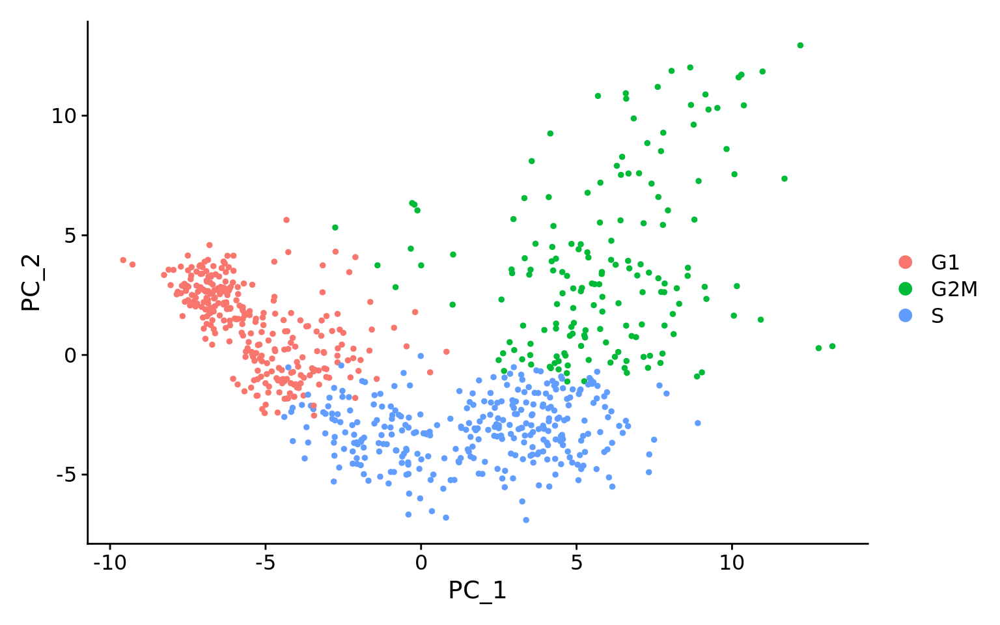
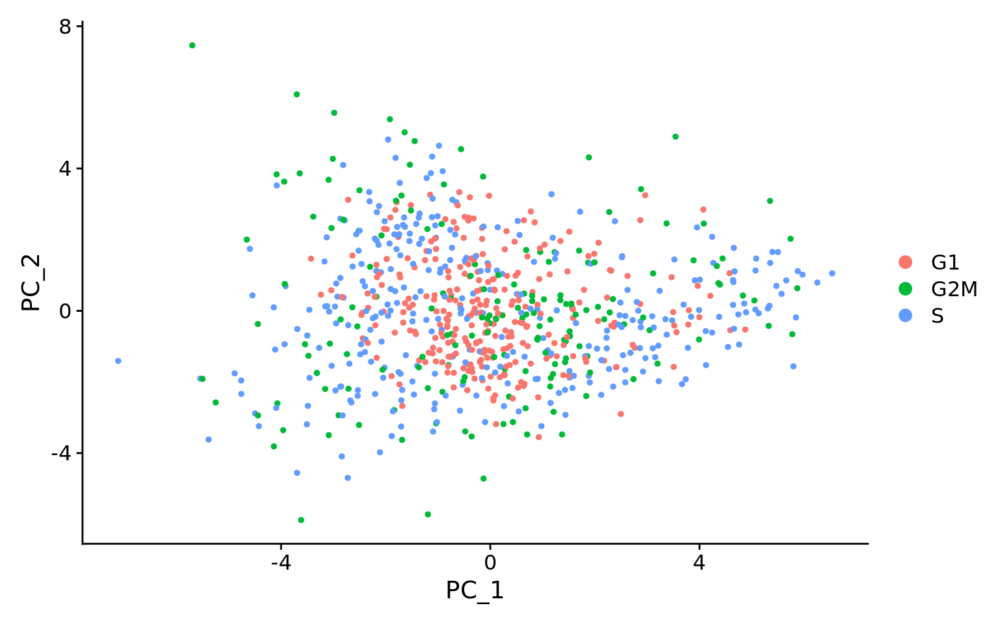
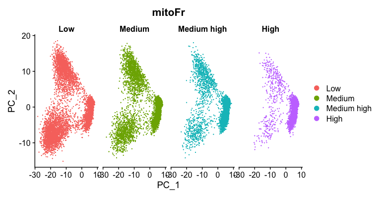

Approximate time: 90 minutes

## Learning Objectives:

* Execute the normalization, variance estimation, and identification of the most variable genes for each sample


# Single-cell RNA-seq: Normalization and regressing out unwanted variation

Now that we have our high quality cells, we need to first explore our data and identify any sources of unwanted variation. Then we need to normalize the data, perform variance stabilization and regress out the effects of any covariates that have an effect on our data.


***

_**Goals:**_ 
 
 - _To accurately **normalize and scale the gene expression values** to account for differences in sequencing depth and overdispersed count values._
 - _To **identify the most variant genes** likely to be indicative of the different cell types present._

_**Challenges:**_
 
 - _**Checking and removing unwanted variation** so that we do not have cells clustering by artifacts downstream_

_**Recommendations:**_
 
 - _Have a good idea of your expectations for the **cell types to be present** prior to performing the clustering. Know whether you expect cell types of low complexity or higher mitochondrial content AND whether the cells are differentiating_
 - _**Regress out** number of UMIs (default using sctransform), mitochondrial content, and cell cycle, if needed and appropriate for experiment, so not to drive clustering downstream_
 
***


## Set-up

Let's start by creating a new script for the normalization and integration steps. Create a new script (File -> New File -> R script), and save it as `SCT_integration_analysis.R`.

For the remainder of the workflow we will be mainly using functions available in the Seurat package. Therefore, we need to load the Seurat library in addition to the tidyverse library and a few others listed below. 

```r
# Single-cell RNA-seq - normalization

# Load libraries
library(Seurat)
library(tidyverse)
library(RCurl)
library(cowplot)
```

The input for this analysis is a `seurat` object. We will use the one that we created in the QC lesson called `filtered_seurat`.

##  Explore sources of unwanted variation

Correction for biological covariates serves to single out particular biological signals of interest, while correcting for technical covariates may be crucial to uncovering the underlying biological signal. The most common biological data correction is to remove the effects of the cell cycle on the transcriptome. This data correction can be performed by a simple linear regression against a cell cycle score which is what we will demonstrate below.

The first step is to explore the data and see if we observe any effects in our data. The raw counts are not comparable between cells and we can't use them as is for our exploratory analysis. So we will **perform a rough normalization** by dividing by total counts per cell and taking the natural log. This normalization is solely for the purpose of exploring the sources of variation in our data.  

> **NOTE**: Seurat recently introduced a new normalization method called  _**sctransform**_, which simultaneously performs variance stabilization and regresses out unwanted variation. This is the normalization method that we are implementing in our workflow. 

```r
# Normalize the counts
seurat_phase <- NormalizeData(filtered_seurat)
```

Next, we take this normalized data and check to see if data correction methods are necessary. 

### Evaluating effects of cell cycle 

To assign each cell a score based on its expression of G2/M and S phase markers, we can use the Seuart function `CellCycleScoring()`. This function calculates cell cycle phase scores based on canonical markers that required as input.

We have provided a list of human cell cycle markers for you to download. Right click on [this link](https://www.dropbox.com/s/hus4mrkueh1tfpr/cycle.rda?dl=1) to "Save link as ..." directly into your `data` directory. However, if you are not working with human data we have [additional materials](../lessons/cell_cycle_scoring.md) detailing how to acquire cell cycle markers for other organisms of interest.

```r
# Load cell cycle markers
load("data/cycle.rda")

# Score cells for cell cycle
seurat_phase <- CellCycleScoring(seurat_phase, 
                                 g2m.features = g2m_genes, 
                                 s.features = s_genes)

# View cell cycle scores and phases assigned to cells                                 
View(seurat_phase@meta.data)                                
```

After scoring the cells for cell cycle, we would like to determine whether cell cycle is a major source of variation in our dataset using PCA. To perform PCA, we need to **first choose the most variable features, then scale the data**. Since highly expressed genes exhibit the highest amount of variation and we don't want our 'highly variable genes' only to reflect high expression, we need to scale the data to scale variation with expression level. The Seurat `ScaleData()` function will scale the data by:

* adjusting the expression of each gene to give a mean expression across cells to be 0
* scaling expression of each gene to give a variance across cells to be 1

```r
# Identify the most variable genes
seurat_phase <- FindVariableFeatures(seurat_phase, 
                     selection.method = "vst",
                     nfeatures = 2000, 
                     verbose = FALSE)
		     
# Scale the counts
seurat_phase <- ScaleData(seurat_phase)
```

> _**NOTE:** For the `selection.method` and `nfeatures` arguments the values specified are the default settings. Therefore, you do not necessarily need to include these in your code. We have included it here for transparency and inform you what you are using._	

Now, we can perform the PCA analysis and plot the first two principal components against each other. We also split the figure by cell cycle phase, to evaluate similarities and/or differences. **We do not see large differences due to cell cycle phase. Based on this plot, we would not regress out the variation due to cell cycle.**

```r
# Perform PCA
seurat_phase <- RunPCA(seurat_phase)

# Plot the PCA colored by cell cycle phase
DimPlot(seurat_phase,
        reduction = "pca",
        group.by= "Phase",
        split.by = "Phase")
```

<p align="center">

</p>

> #### Example of when cell cycle phase needs to be regressed out
> Below are two PCA plots taken from the Seurat vignette dealing with ["Cell-Cycle Scoring and Regression"](https://satijalab.org/seurat/archive/v3.1/cell_cycle_vignette.html).
>
> This first plot is similar to what we plotted above, it is a PCA prior to regression to evaluate if the cell cycle is playing a big role in driving PC1 and PC2. 
> <p align="center">
> 
> </p>
>
> Clearly, the cells are separating by cell type in this case, so the vignette suggests using the `ScaleData()` function to regress out this impact.
>
> This second plot is post-regression, and displays how effective the regression was in the separation of cells when we look at PC1 vs PC2.
>
> <p align="center">
> 
> </p>
>
> The cell cycle gene expression is no longer driving PC1 or PC2, allowing us to identify other biologically significant features that are at play in our dataset.

### Evaluating effects of mitochodrial expression

Mitochondrial expression is another factor which can greatly influence clustering. Oftentimes, it is useful to regress out variation due to mitochondrial expression. However, if the differences in mitochondrial gene expression represent a biological phenomenon that may help to distinguish cell clusters, then we advise not regressing this out. We can perform a quick check similar to looking at cell cycle, but we first can turn the mitochondrial ratio variable into a categorical variable based on quartiles.

```r
# Turn mitoRatio into categorical variable
seurat_phase@meta.data$mitoFr[seurat_phase@meta.data$mitoRatio <= 0.0144] <- "Low"
seurat_phase@meta.data$mitoFr[seurat_phase@meta.data$mitoRatio > 0.0144 & seurat_phase@meta.data$mitoRatio <= 0.0199] <- "Medium"
seurat_phase@meta.data$mitoFr[seurat_phase@meta.data$mitoRatio > 0.0199 & seurat_phase@meta.data$mitoRatio <= 0.0267] <- "Medium high"
seurat_phase@meta.data$mitoFr[seurat_phase@meta.data$mitoRatio > 0.0267] <- "High"

# Turn categorical mitoFr into a factor
seurat_phase@meta.data$mitoFr <- factor(seurat_phase@meta.data$mitoFr, 
                                        levels = c("Low", "Medium", "Medium high", "High"))
					
# Plot the PCA colored by mitoFr
DimPlot(seurat_phase,
        reduction = "pca",
        group.by= "mitoFr",
        split.by = "mitoFr")
```

<p align="center">

</p>

Based on this plot, we can see a rather distinct clustering of 'High' mitochondrial ratios in the group of cells on the right-hand side of the plot, and very few cells with 'High' in the lobes of cells on the left-hand side of the plot. Since we see this clear difference, we will regress out the 'mitoRatio' when we identify the most variant genes.


## Normalization and regressing out sources of unwanted variation using SCTransform

Now we can use the sctransform method as a **more accurate method of normalizing, estimating the variance of the raw filtered data, and identifying the most variable genes**. The sctransform method models the UMI counts using a **regularized negative binomial model** to remove the variation due to sequencing depth (total nUMIs per cell), while adjusting the variance based on pooling information across genes with similar abundances (similar to some bulk RNA-seq methods). 

<p align="center">

</p>

_**Image credit:** Hafemeister C and Satija R. Normalization and variance stabilization of single-cell RNA-seq data using regularized negative binomial regression, bioRxiv 2019 (https://doi.org/10.1101/576827)_

The **output of the model** (residuals) is the normalized expression levels for each transcript tested.

Sctransform automatically accounts for cellular sequencing depth by regressing out sequencing depth (nUMIs). However, if there are other sources of uninteresting variation identified in the data during the exploration steps we can also include these. We observed little to no effect due to cell cycle phase and so we chose not to regress this out of our data.

To run the SCTransform we have the code below as an example. **Do not run this code**, as we prefer to run this for each sample separately in the next section below.

```r
## DO NOT RUN CODE ##

# SCTranform
seurat_phase <- SCTransform(seurat_phase, vars.to.regress = c("mitoRatio"))

```

## Iterating over samples in a dataset

Since we have two samples in our dataset (from two conditions), we want to keep them as separate objects and transform them as that is what is required for integration. We will first split the cells in `filtered_seurat` object into "Control" and "Stimulated":

```r
# Split seurat object by condition to perform cell cycle scoring and SCT on all samples
split_seurat <- SplitObject(filtered_seurat, split.by = "sample")

split_seurat <- split_seurat[c("ctrl", "stim")]

```

Now we will **use a 'for loop'** to run the `NormalizeData()`, `CellCycleScoring()`, and `SCTransform()` on each sample, and regress out mitochondrial expression by specifying in the `vars.to.regress` argument of the `SCTransform()` function.

Before we run this `for loop`, we know that the output can generate large R objects/variables in terms of memory. If we have a large dataset, then we might need to **adjust the limit for allowable object sizes within R** (*Default is 500 * 1024 ^ 2 = 500 Mb*) using the following code:

```r
options(future.globals.maxSize = 4000 * 1024^2)
```

Now, we run the following loop to **perform the cell cycle scoring and sctransform on all samples**. This may take some time (~10 minutes):

```r

for (i in 1:length(split_seurat)) {
    split_seurat[[i]] <- NormalizeData(split_seurat[[i]], verbose = TRUE)
    split_seurat[[i]] <- CellCycleScoring(split_seurat[[i]], g2m.features=g2m_genes, s.features=s_genes)
    split_seurat[[i]] <- SCTransform(split_seurat[[i]], vars.to.regress = c("mitoRatio"))
    }
```

> _**NOTE:** By default, after normalizing, adjusting the variance, and regressing out uninteresting sources of variation, SCTransform will rank the genes by residual variance and output the 3000 most variant genes. If the dataset has larger cell numbers, then it may be beneficial to adjust this parameter higher using the `variable.features.n` argument._ 

Note, the last line of output specifies "Set default assay to SCT". We can view the different assays that we have stored in our seurat object.

```r
# Check which assays are stored in objects
split_seurat$ctrl@assays
```

Now we can see that in addition to the raw RNA counts, we now have a SCT component in our `assays` slot. The most variable features will be the only genes stored inside the SCT assay. As we move through the scRNA-seq analysis, we will choose the most appropriate assay to use for the different steps in the analysis. 

***
**Exercise**

1. Are the same assays available for the "stim" samples within the `split_seurat` object? What is the code you used to check that?
2. Any observations for the genes or features listed under *"First 10 features:"* and the *"Top 10 variable features:"* for "ctrl" versus "stim"?

***

### Save the object!

Before finishing up, let's save this object to the `data/` folder. It can take a while to get back to this stage especially when working with large datasets, it is best practice to save the object as an easily loadable file locally.

```r
# Save the split seurat object
saveRDS(split_seurat, "data/split_seurat.rds")
```

> To load the `.rds` file back into your environment you would use the following code:
> ```r
> # Load the split seurat object into the environment
> split_seurat <- readRDS("data/split_seurat.rds")
> ```

***


*This lesson has been developed by members of the teaching team at the [Harvard Chan Bioinformatics Core (HBC)](http://bioinformatics.sph.harvard.edu/). These are open access materials distributed under the terms of the [Creative Commons Attribution license](https://creativecommons.org/licenses/by/4.0/) (CC BY 4.0), which permits unrestricted use, distribution, and reproduction in any medium, provided the original author and source are credited.*

* *A portion of these materials and hands-on activities were adapted from the [Satija Lab's](https://satijalab.org/) [Seurat - Guided Clustering Tutorial](https://satijalab.org/seurat/pbmc3k_tutorial.html)*
