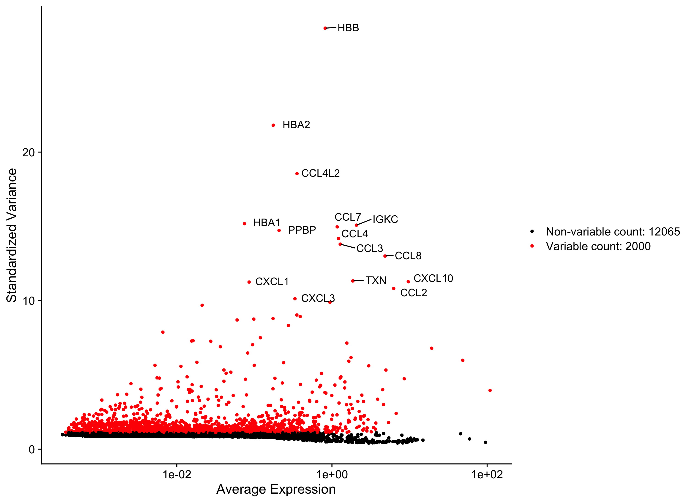
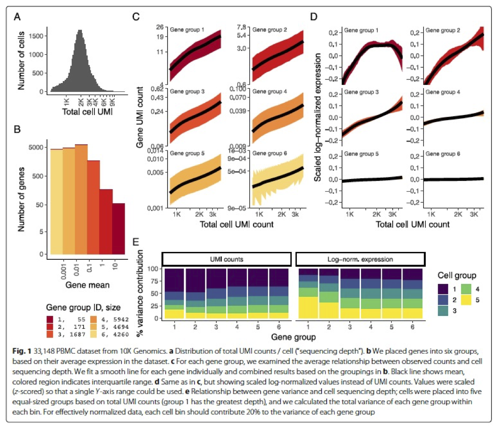
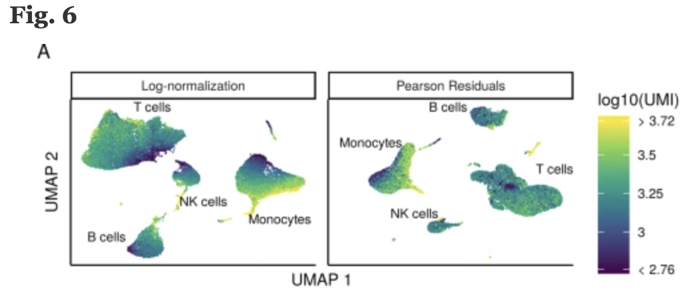

Approximate time: 90 minutes

## Learning Objectives:

* Discuss why normalizing counts is necessary for accurate comparison between cells
* Describe different normalization approaches
* Evaluate the effects from any unwanted sources of variation and correct for them


# Single-cell RNA-seq: Normalization and regressing out unwanted variation

Now that we have our high quality cells, we can explore our data and see if we are able to identify any sources of unwanted variation. Depending on what we observe, we will utilize that information when performing variance stabilization using SCTransform but also to regress out the effects of any covariates that have an effect on our data.

<p align="center">

</p>

***

_**Goals:**_ 
 
 - _To accurately **normalize the gene expression values** to account for differences in sequencing depth and overdispersed count values._
 - _To **identify the most variant genes** likely to be indicative of the different cell types present._

_**Challenges:**_
 
 - _**Checking and removing unwanted variation** so that we do not have cells clustering by artifacts downstream_

_**Recommendations:**_
 
 - _Have a good idea of your expectations for the **cell types to be present** prior to performing the clustering. Know whether you expect cell types of low complexity or higher mitochondrial content AND whether the cells are differentiating_
 - _**Regress out** number of UMIs (default using sctransform), mitochondrial content, and cell cycle, if needed and appropriate for experiment, so not to drive clustering downstream_
 
***

## Normalization
An essential first step in the majority of mRNA expression analyses is normalization, whereby systematic variations are adjusted for to **make expression counts comparable across genes and/or samples**. The counts of mapped reads for each gene is proportional to the expression of RNA ("interesting") in addition to many other factors ("uninteresting"). Normalization is the process of adjusting raw count values to account for the "uninteresting" factors. 

The main factors often considered during normalization are:
 
 - **Sequencing depth:** Accounting for sequencing depth is necessary for comparison of gene expression between cells. In the example below, each gene appears to have doubled in expression in cell 2, however this is a consequence of cell 2 having twice the sequencing depth.

<p align="center">

</p>

Each cell in scRNA-seq will have a differing number of reads associated with it. So to accurately compare expression between cells, it is necessary to normalize for sequencing depth.
 
 - **Gene length:** Accounting for gene length is necessary for comparing expression between different genes within the same cell. The number of reads mapped to a longer gene can appear to have equal count/expression as a shorter gene that is more highly expressed. 
 
<p align="center"> 

</p>

> **NOTE:** *If using a 3' or 5' droplet-based method, the length of the gene will not affect the analysis because only the 5' or 3' end of the transcript is sequenced.* However, if using full-length sequencing, the transcript length should be accounted for.

### Methods for scRNA-seq normalization

Various methods have been developed specifically for scRNA-seq normalization. Some **simpler methods resemble what we have seen with bulk RNA-seq**; the application of **global scale factors** adjusting for a count-depth relationship that is assumed common across all genes. However, if those assumptions are not true then this basic normalization can lead to over-correction for lowly and moderately expressed genes and, in some cases, under-normalization of highly expressed genes ([Bacher R et al, 2017](https://www.ncbi.nlm.nih.gov/pmc/articles/PMC5473255/)). **More complex methods will apply correction on a per-gene basis.** In this lesson we will explore both approaches.

Regardless of which method is used for normalization, it can be helpful to **think of it as a two-step process** (even though it is often described as a single step in most papers). The first is a scaling step and the second is a transformation.

**1. Scaling**

The first step in normalization is to **multiply each UMI count by a cell specific factor to get all cells to have the same UMI counts**. Why would we want to do this? Different cells have different amounts of mRNA; this could be due to differences between cell types or variation within the same cell type depending on how well the chemistry worked in one drop versus another. In either case, we are not interested in comparing these absolute counts between cells. Instead we are interested in comparing concentrations, and scaling helps achieve this.


**2. Transformation**

The next step is a transformation, and it is at this step where we can distinguish the simpler versus complex methods as mentioned above.

**Simple transformations** are those which apply the same function to each individual measurement. Common examples include a **log transform** (which is applied in the original Seurat workflow), or a square root transform (less commonly used).


##  Explore sources of unwanted variation

The most common biological data correction (or source of "uninteresting" variation) in single cell RNA-seq is the effects of the cell cycle on the transcriptome. We need to explore the data and see if we observe any effects in our data.   

### Set-up

Let's start by creating a new script for the normalization and integration steps. Create a new script (File -> New File -> R script), and save it as `SCT_integration_analysis.R`.

For the remainder of the workflow we will be mainly using functions available in the Seurat package. Therefore, we need to load the Seurat library in addition to the tidyverse library and a few others listed below. 

```r
# Single-cell RNA-seq - normalization

# Load libraries
library(Seurat)
library(tidyverse)
library(RCurl)
library(cowplot)
```

Before we make any comparisons across cells, we will **apply a simple normalization.** This is solely for the purpose of exploring the sources of variation in our data.

The input for this analysis is a `seurat` object. We will use the one that we created in the QC lesson called `filtered_seurat`.

```r
# Normalize the counts
seurat_phase <- NormalizeData(filtered_seurat)
```

Next, we take this normalized data and check to see if data correction methods are necessary. 


### Evaluating effects of cell cycle 

To assign each cell a score based on its expression of G2/M and S phase markers, we can use the Seuart function `CellCycleScoring()`. This function calculates cell cycle phase scores based on canonical markers that required as input.

We have provided a list of human cell cycle markers for you in the `data` folder as an Rdata file called `cycle.rda`. However, if you are not working with human data we have [additional materials](../lessons/cell_cycle_scoring.md) detailing how to acquire cell cycle markers for other organisms of interest.

```r
# Load cell cycle markers
load("data/cycle.rda")

# Score cells for cell cycle
seurat_phase <- CellCycleScoring(seurat_phase, 
                                 g2m.features = g2m_genes, 
                                 s.features = s_genes)

# View cell cycle scores and phases assigned to cells                                 
View(seurat_phase@meta.data)                                
```

After scoring the cells for cell cycle, we would like to **determine whether cell cycle is a major source of variation in our dataset using PCA**. 

### PCA

Principal Component Analysis (PCA) is a technique used to emphasize variation as well as similarity, and to bring out strong patterns in a dataset; it is one of the methods used for *"dimensionality reduction"*. 

> **NOTE:** For a more **detailed explanation on PCA**, please [look over this lesson](05_theory_of_PCA.md) (adapted from StatQuests/Josh Starmer's YouTube video). We also strongly encourage you to explore the video [StatQuest's video](https://www.youtube.com/watch?v=_UVHneBUBW0) for a more thorough understanding. 

Let's say you are working with a single-cell RNA-seq dataset with *12,000 cells* and you have quantified the expression of *20,000 genes*. The schematic below demonstrates how you would go from a cell x gene matrix to principal component (PC) scores for each inividual cell.

<p align="center">

</p>

After the PC scores have been calculated, you are looking at a matrix of 12,000 x 12,000 that represents the information about relative gene expression in all the cells. You can select the PC1 and PC2 columns and plot that in a 2D way.

<p align="center">

</p>

You can also use the PC scores from the first 40 PCs for downstream analysis like clustering, marker identification etc., since these represent the majority of the variation in the data. We will be talking a lot more about this later in this workshop.

<p align="center">

</p>

> *NOTE:* For datasets with a larger number of cells, only the PC1 and PC2 scores for each cell are usually plotted, or used for visualization. Since these PCs explain the most variation in the dataset, the expectation is that the cells that are more similar to each other will cluster together with PC1 and PC2.

### Using PCA to evaluate the effects of cell cycle

To perform PCA, we need to **first choose the most variable features, then scale the data**. Since highly expressed genes exhibit the highest amount of variation and we don't want our 'highly variable genes' only to reflect high expression, we need to scale the data to scale variation with expression level. The Seurat `ScaleData()` function will scale the data by:

* adjusting the expression of each gene to give a mean expression across cells to be 0
* scaling expression of each gene to give a variance across cells to be 1

```r
# Identify the most variable genes
seurat_phase <- FindVariableFeatures(seurat_phase, 
                     selection.method = "vst",
                     nfeatures = 2000, 
                     verbose = FALSE)
		     
# Scale the counts
seurat_phase <- ScaleData(seurat_phase)
```

> _**NOTE:** For the `selection.method` and `nfeatures` arguments the values specified are the default settings. Therefore, you do not necessarily need to include these in your code. We have included it here for transparency and inform you what you are using._	

Highly variable gene selection is extremely important since many downstream steps are computed only on these genes. Seurat allows us to access the ranked highly variable genes with the `VariableFeatures()` function. We can additionally visualize the dispersion of all genes using Seurat's `VariableFeaturePlot()`, which shows a gene's average expression across all cells on the x-axis and variance on the y-axis. Ideally we want to use genes that have high variance since this can indicate a change in expression depending on populations of cells. Adding labels using the `LabelPoints()` helps us understand which genes will be driving shape of our data.

```r
# Identify the 15 most highly variable genes
ranked_variable_genes <- VariableFeatures(seurat_phase)
top_genes <- ranked_variable_genes[1:15]

# Plot the average expression and variance of these genes
# With labels to indicate which genes are in the top 15
p <- VariableFeaturePlot(seurat_phase)
LabelPoints(plot = p, points = top_genes, repel = TRUE)
```

<p align="center">

</p>


Now, we can perform the PCA analysis and plot the first two principal components against each other. We also split the figure by cell cycle phase, to evaluate similarities and/or differences. **We do not see large differences due to cell cycle phase. Based on this plot, we would not regress out the variation due to cell cycle.**

```r
# Perform PCA
seurat_phase <- RunPCA(seurat_phase)

# Plot the PCA colored by cell cycle phase
DimPlot(seurat_phase,
        reduction = "pca",
        group.by= "Phase",
        split.by = "Phase")
```

<p align="center">

</p>

<details>
	<summary><b><i>When should cell cycle phase be regressed out?</i></b></summary>
	<br>Below are two PCA plots taken from the Seurat vignette dealing with <a href="https://satijalab.org/seurat/archive/v3.1/cell_cycle_vignette.html">Cell-Cycle Scoring and Regression</a>.<br>

 	<ul><li>This first plot is similar to what we plotted above, it is a PCA prior to regression to evaluate if the cell cycle is playing a big role in driving PC1 and PC2. Clearly, the cells are separating by cell type in this case, so the vignette suggests regressing out these effects.</li></ul>
 	<p align="center">
 	
 	</p>

	<ul><li>This second PCA plot is <b>post-regression</b>, and displays how effective the regression was in removing the effect we observed.</li></ul>

	<p align="center">
	
	</p>
</details>


***

**Exercise: Evaluating effects of mitochondrial expression**

Mitochondrial expression is another factor which can greatly influence clustering. Oftentimes, it is useful to regress out variation due to mitochondrial expression. However, if the differences in mitochondrial gene expression represent a biological phenomenon that may help to distinguish cell clusters, then we advise not regressing this out. In this exercise, we can perform a quick check similar to looking at cell cycle and decide whether or not we want to regress it out.

<ol><li>First, turn the mitochondrial ratio variable into a new categorical variable based on quartiles (using the code below):</li>
<pre>
&#35; Check quartile values
summary(seurat_phase@meta.data$mitoRatio)

&#35; Turn mitoRatio into categorical factor vector based on quartile values
seurat_phase@meta.data$mitoFr <- cut(seurat_phase@meta.data$mitoRatio, 
                   breaks=c(-Inf, 0.0144, 0.0199, 0.0267, Inf), 
                   labels=c("Low","Medium","Medium high", "High"))</pre>
<li>Next, plot the PCA similar to how we did with cell cycle regression. <i>Hint: use the new <code>mitoFr</code> variable to split cells and color them accordingly.</i>
<li>Evaluate the PCA plot generated in &#35;2.
	<ol><li>Determine whether or not you observe an effect.</li>
	<li>Describe what you see.</li> 
	<li>Would you regress out mitochondrial fraction as a source of unwanted variation?</li></ol></li>
 </ol>

***


## Normalization and regressing out sources of unwanted variation using SCTransform

In the [Hafemeister and Satija, 2019 paper](https://genomebiology.biomedcentral.com/articles/10.1186/s13059-019-1874-1) the authors explored the issues with simple transformations. Specifically they evaluated the standard log normalization approach and found that genes with different abundances are affected differently and that **effective normalization (using the log transform) is only observed with low/medium abundance genes (Figure 1D, below)**. Additionally, **substantial imbalances in variance were observed with the log-normalized data (Figure 1E, below)**. In particular, cells with low total UMI counts exhibited disproportionately higher variance for high-abundance genes, dampening the variance contribution from other gene abundances. 

<p align="center">

</p>

_**Image credit:** Hafemeister C and Satija R. Normalization and variance stabilization of single-cell RNA-seq data using regularized negative binomial regression, Genom Biology 2019 (https://doi.org/10.1101/576827)_


The conclusion is, **we cannot treat all genes the same.**

The proposed solution was the use of **Pearson residuals for transformation**, as implemented in Seurat's `SCTransform` function. With this approach:
* Measurements are multiplied by a gene-specific weight
* Each gene is weighted based on how much evidence there is that it is non-uniformly expressed across cells
* More evidence == more of a weight; Genes that are expressed in only a small fraction of cells will be favored (useful for finding rare cell populations)
* Not just a consideration of the expression level is, but also the distribution of expression

> #### Why don't we just run SCTransform to normalize?
> While the functions `NormalizeData`, `VariableFeatures` and `ScaleData` can be replaced by the function `SCTransform`, the latter uses a more sophisticated way to perform the normalization and scaling. We suggest using log normalization because it is good to observe the data and any trends using a simple transformation, as methods like SCT can alter the data in a way that is not as intuitive to interpret. 

Now that we have established which effects are observed in our data, we can use the SCTransform method to regress out these effects. The **SCTransform** method was proposed as a better alternative to the log transform normalization method that we used for exploring sources of unwanted variation. The method not only **normalizes data, but it also performs a variance stabilization and allows for additional covariates to be regressed out**.

As described earlier, all genes cannot be treated the same. As such, the **SCTransform method constructs a generalized linear model (GLM) for each gene** with UMI counts as the response and sequencing depth as the explanatory variable. Information is pooled across genes with similar abundances, to regularize parameter estimates and **obtain residuals which represent effectively normalized data values** which are no longer correlated with sequencing depth.

<p align="center">

</p>

_**Image credit:** Hafemeister C and Satija R. Normalization and variance stabilization of single-cell RNA-seq data using regularized negative binomial regression, Genom Biology 2019 (https://doi.org/10.1101/576827)_


> **NOTE:** Since the UMI counts are part of the GLM, the effects are automatically regressed out. The user can include any additional covariates (`vars.to.regress`) that may have an effect on expression and will be included in the model. 

To run the SCTransform we have the code below as an example. **Do not run this code**, as we prefer to run this for each sample separately in the next section below.


```r
## DO NOT RUN CODE ##

# SCTranform
seurat_phase <- SCTransform(seurat_phase, vars.to.regress = c("mitoRatio"))
```

## Iterating over samples in a dataset

Since we have two samples in our dataset (from two conditions), we want to keep them as separate objects and transform them as that is what is required for integration. We will first split the cells in `seurat_phase` object into "Control" and "Stimulated":

```r
# Split seurat object by condition to perform cell cycle scoring and SCT on all samples
split_seurat <- SplitObject(seurat_phase, split.by = "sample")
```

> **NOTE:** If you only wanted to integrate on a subset of your samples (e.g. all Ctrl replicates only), you could select which ones you wanted from the `split_seurat` object as shown below and move forward with those.
>
> ```r
> ctrl_reps <- split_seurat[c("ctrl_1", "ctrl_2")]
> ```

Now we will **use a 'for loop'** to run the `SCTransform()` on each sample, and regress out mitochondrial expression by specifying in the `vars.to.regress` argument of the `SCTransform()` function.

Before we run this `for loop`, we know that the output can generate large R objects/variables in terms of memory. If we have a large dataset, then we might need to **adjust the limit for allowable object sizes within R** (*Default is 500 * 1024 ^ 2 = 500 Mb*) using the following code:

```r
options(future.globals.maxSize = 4000 * 1024^2)
```

Now, we run the following loop to **perform the sctransform on all samples**. This may take some time (~10 minutes):

```r

for (i in 1:length(split_seurat)) {
    split_seurat[[i]] <- SCTransform(split_seurat[[i]], vars.to.regress = c("mitoRatio"), vst.flavor = "v2")
    }
```

Please note that in the for loop above, we specify that `vst.flavor = "v2"` to use the updated version of SCT. "v2" was introduced in early 2022, and is now commonly used. This update improves:
* speed and memory consumption
* the stability of parameter estimates
* variable feature identification in subsequent steps

For more information, please see the [Seurat vignette's section on SCTransform, v2 regularization](https://satijalab.org/seurat/articles/sctransform_v2_vignette.html). 

> _**NOTE:** By default, after normalizing, adjusting the variance, and regressing out uninteresting sources of variation, SCTransform will rank the genes by residual variance and output the 3000 most variant genes. If the dataset has larger cell numbers, then it may be beneficial to adjust this parameter higher using the `variable.features.n` argument._ 

Note, the last line of output specifies **"Set default assay to SCT"**. This specifies that moving forward we would like to use the data after SCT was implemented. We can view the different assays that we have stored in our seurat object.

```r
# Check which assays are stored in objects
split_seurat$ctrl@assays
```

Now we can see that in addition to the raw RNA counts, we now have a SCT component in our `assays` slot. The most variable features will be the only genes stored inside the SCT assay. As we move through the scRNA-seq analysis, we will choose the most appropriate assay to use for the different steps in the analysis. 

***

**Exercise**

4. Are the same assays available for the "stim" samples within the `split_seurat` object? What is the code you used to check that?
5. Any observations for the genes or features listed under *"First 10 features:"* and the *"Top 10 variable features:"* for "ctrl" versus "stim"?

***

### Save the object!

Before finishing up, let's save this object to the `data/` folder. It can take a while to get back to this stage especially when working with large datasets, it is best practice to save the object as an easily loadable file locally.

```r
# Save the split seurat object
saveRDS(split_seurat, "data/split_seurat.rds")
```

> To load the `.rds` file back into your environment you would use the following code:
> ```r
> # Load the split seurat object into the environment
> split_seurat <- readRDS("data/split_seurat.rds")
> ```

***


*This lesson has been developed by members of the teaching team at the [Harvard Chan Bioinformatics Core (HBC)](http://bioinformatics.sph.harvard.edu/). These are open access materials distributed under the terms of the [Creative Commons Attribution license](https://creativecommons.org/licenses/by/4.0/) (CC BY 4.0), which permits unrestricted use, distribution, and reproduction in any medium, provided the original author and source are credited.*

* *A portion of these materials and hands-on activities were adapted from the [Satija Lab's](https://satijalab.org/) [Seurat - Guided Clustering Tutorial](https://satijalab.org/seurat/pbmc3k_tutorial.html)*
