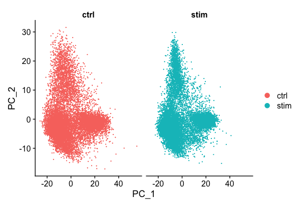
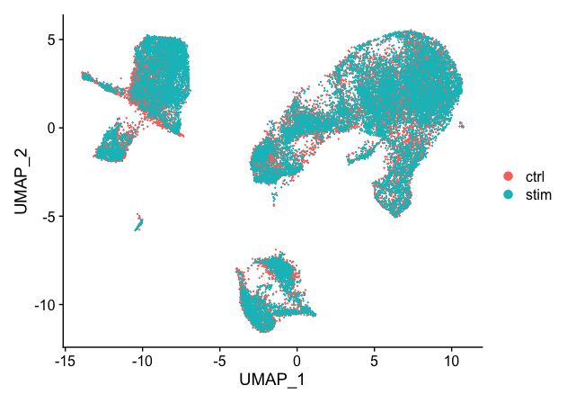
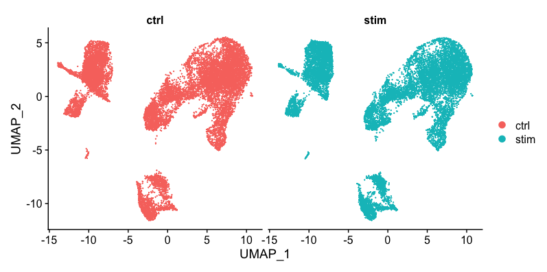
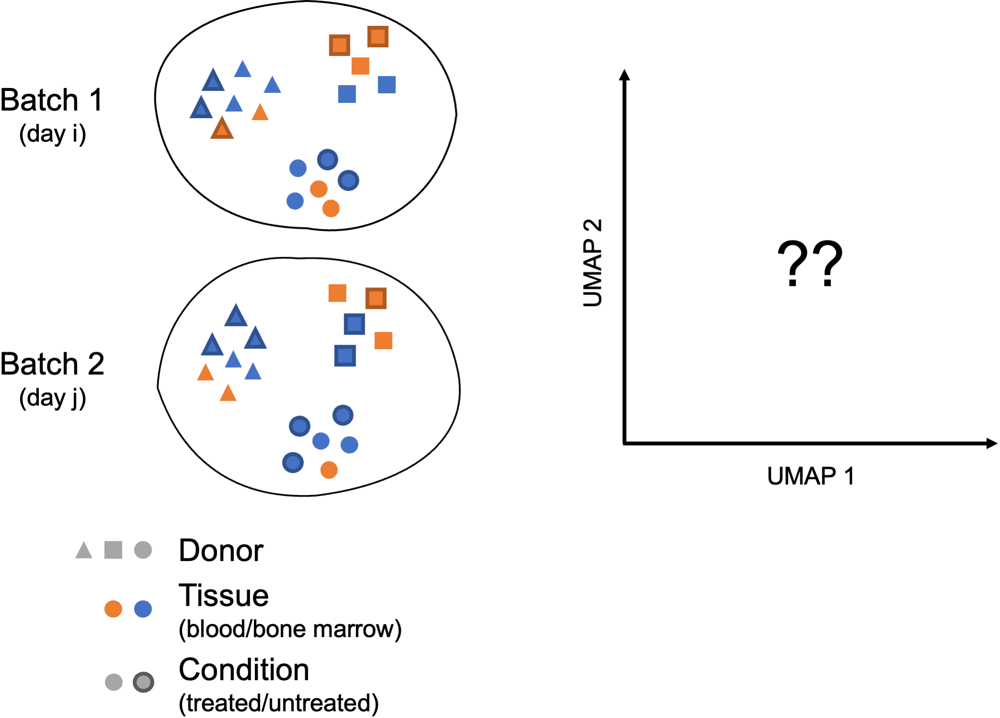

Approximate time: 30 minutes

## Learning Objectives:

* Perform integration of cells across conditions to identify cells that are similar to each other
* Describe complex integration tasks and alternative tools for integration


# Single-cell RNA-seq clustering analysis: Integration code

<p align="center">

</p>

***

## Running CCA

In the last lesson we described in detail the steps of integration. **Now, we need to run the code to inetgrate our data.** We will start by using our SCTransform object as input, let's perform the integration across conditions (ctrl and stim).

First, we need to identify the shared variable genes for the integration. By default, this function only selects the top 2000 genes. In this step Seuart performs a more complex version of an intersect between the highly variable genes from each condition (based on SCTransform). We have specified 3000 genes for the size of the intersect set.
 
```r
# Select the most variable features to use for integration
integ_features <- SelectIntegrationFeatures(object.list = split_seurat, 
                                            nfeatures = 3000) 
```

> **NOTE:** If you are missing the `split_seurat` object, you can first load it from your `data` folder:
>
> ```r
> # Load the split seurat object into the environment
> split_seurat <- readRDS("data/split_seurat.rds")
> ```
>
> If you do not have the `split_seurat.rds` file in your `data` folder, you can right-click [here](https://www.dropbox.com/s/avda4sxhhtahsl6/split_seurat.rds?dl=1) to download it to the `data` folder (it may take a bit of time to download). 

Now, we need to **prepare the SCTransform object** for integration. This function basically prepares for integration analysis by ensuring all necessary data (specifically the SCTransform residuals) are present for the features chosen as anchors between datasets.

```r   

# Prepare the SCT list object for integration
split_seurat <- PrepSCTIntegration(object.list = split_seurat, 
                                   anchor.features = integ_features)
```

Now, we are going to **perform CCA, find the best buddies or anchors and filter incorrect anchors**. For our dataset, this will take up to 15 minutes to run. *Also, note that the progress bar in your console will stay at 0%, but know that it is actually running.*

```r
## Don't run this during class
# Find best buddies - can take a while to run
integ_anchors <- FindIntegrationAnchors(object.list = split_seurat, 
                                        normalization.method = "SCT", 
                                        anchor.features = integ_features)
```

Finally, we can **integrate across conditions**.

```r
## Don't run this during class
# Integrate across conditions
seurat_integrated <- IntegrateData(anchorset = integ_anchors, 
                                   normalization.method = "SCT")

# Rejoin the layers in the RNA assay that we split earlier
seurat_integrated[["RNA"]] <- JoinLayers(seurat_integrated[["RNA"]])
```

### UMAP visualization

After integration, to visualize the integrated data we can use dimensionality reduction techniques, such as PCA and Uniform Manifold Approximation and Projection (UMAP). While PCA will determine all PCs, we can only plot two at a time. In contrast, UMAP will take the information from any number of top PCs to arrange the cells in this multidimensional space. It will take those distances in multidimensional space and plot them in two dimensions working to preserve local and global structure. In this way, the distances between cells represent similarity in expression. If you wish to explore UMAP in more detail, [this post](https://pair-code.github.io/understanding-umap/) is a nice introduction to UMAP theory.

To generate these visualizations we need to first run PCA and UMAP methods. Let's start with PCA.

```r
# Run PCA
seurat_integrated <- RunPCA(object = seurat_integrated)

# Plot PCA
PCAPlot(seurat_integrated,
        split.by = "sample")  
```

<p align="center">

</p>

We can see with the PCA mapping that we have a good overlay of both conditions by PCA. 

Now, we can also **visualize with UMAP**. Let's run the method and plot. UMAP is a stochastic algorithm – this means that
it makes use of randomness both to speed up approximation steps, and to aid in solving hard optimization problems. Due to the stochastic nature, different runs of UMAP can produce different results. **We can set the seed to a specific (but random) number**, and this avoids the creation of a slightly different UMAP each time re-run our code.

> **NOTE:** Typically, the `set.seed()` would be placed at the beginning of your script. In this way the selected random number would be applied to any function that uses pseudorandom numbers in its algorithm.

```r

# Set seed
set.seed(123456)

# Run UMAP
seurat_integrated <- RunUMAP(seurat_integrated, 
                             dims = 1:40,
			     reduction = "pca")

# Plot UMAP                             
DimPlot(seurat_integrated)                             
```

<p align="center">

</p>

> When we compare the similarity between the ctrl and stim clusters in the above plot with what we see using the the unintegrated dataset, **it is clear that this dataset benefitted from the integration!**
> 
> <p align="center">
> 
> </p>

#### Side-by-side comparison of clusters

Sometimes it's easier to see whether all of the cells align well if we **split the plotting between conditions**, which we can do by adding the `split.by` argument to the `DimPlot()` function:

```r
# Plot UMAP split by sample
DimPlot(seurat_integrated,
        split.by = "sample")  
```

<p align="center">

</p>

### Save the "integrated" object!

Since it can take a while to integrate, it's often a good idea to **save the integrated seurat object**.

```r
# Save integrated seurat object
saveRDS(seurat_integrated, "results/integrated_seurat.rds")
```


## Complex Integration Tasks

In the section above, we've presented the `Seurat` integration workflow, which uses canonical correlation analysis (CCA) and multiple nearest neighbors (MNN) to find "anchors" and integrate across samples, conditions, modalities, etc. While the `Seurat` integration approach is widely used and several benchmarking studies support its great performance in many cases, it is important to recognize that **alternative integration algorithms exist and may work better for more complex integration tasks** (see [Luecken et al. (2022)](https://doi.org/10.1038/s41592-021-01336-8) for a comprehensive review). 

Not all integration algorithms rely on the same methodology, and they do not always provide the same type of corrected output (embeddings, count matrix...). Their performance is also affected by preliminary data processing steps, including which normalization method was used and how highly variable genes (HVGs) were determined. All those considerations are important to keep in mind when selecting a data integration approach for your study.

**What do we mean by a "complex" integration task?**

In their benchmarking study, [Luecken et al. (2022)](https://doi.org/10.1038/s41592-021-01336-8) compared the performance of different scRNA-seq integration tools when confronted to different "complex" tasks. The "complexity" of integrating a dataset may relate to the number of samples (perhaps generated using different protocols) but also to the biological question the study seeks to address (e.g. comparing cell types across tissues, species...). In these contexts, you may **need to integrate across multiple confounding factors before you can start exploring the biology of your system.** 

<p align="center">

</p>

In these **more complex scenarios**, you want to select a data integration approach that successfully balances out the following challenges:

- Correcting for inter-sample variability due to source samples from different donors
- Correcting for variability across protocols/technologies (10X, SMART-Seq2, inDrop...; single-cell vs. single nucleus; variable number of input cells and sequencing depth; different sample preparation steps...)
- Identifying consistent cell types across different tissues (peripheral blood, bone marrow, lung...) and/or different locations (e.g. areas of the brain)
- Keeping apart cell subtypes (or even cell states) that show similar transcriptomes (CD4 naive vs. memory, NK vs NKT)
- Keeping apart cell subtypes that are unique to a tissue/condition
- Conserving the developmental trajectory, if applicable

Not all tools may perform as well on every task, and complex datasets may require testing several data integration approaches. You might want to analyze independently each of the batches you consider to integrate across, in order to define cell identities at this level before integrating and checking that the initially annotated cell types are mixed as expected.

## Harmonizing as a method of integration

[Harmony](https://www.nature.com/articles/s41592-019-0619-0) was devleoped in 2019, and is an example of **a tool that can work with complex integration tasks**. It is available as an [R package on GitHub](https://github.com/immunogenomics/harmony), and it has functions for standalone and Seurat pipeline analyses. It has been shown to perform incredibly well from recent benchmarking studies [[1]](https://genomebiology.biomedcentral.com/articles/10.1186/s13059-019-1850-9). 


### Overview of Harmony

In this section, we illustrate the use of [`Harmony`](https://portals.broadinstitute.org/harmony/articles/quickstart.html) as a possible alternative to the `Seurat` integration workflow. Compared to other algorithms, `Harmony` notably presents the following advantages ([Korsunsky et al. 2019](https://www.nature.com/articles/s41592-019-0619-0), [Tran et al. 2020](https://genomebiology.biomedcentral.com/articles/10.1186/s13059-019-1850-9)): 

1. Possibility to integrate data across several variables (for example, by experimental batch and by condition)
2. Significant gain in speed and lower memory requirements for integration of large datasets
3. Interoperability with the `Seurat` workflow

Instead of using CCA, `Harmony` applies a transformation to the principal component (PCs) values, using all available PCs, e.g. as pre-computed within the `Seurat` workflow. In this space of transformed PCs, `Harmony` uses k-means clustering to delineate clusters, seeking to define clusters with maximum "diversity". The diversity of each cluster reflects whether it contains balanced amounts of cells from each of the batches (donor, condition, tissue, technolgy...) we seek to integrate on, as should be observed in a well-integrated dataset. After defining diverse clusters, `Harmony` determines how much a cell's batch identity impacts on its PC coordinates, and applies a correction to "shift" the cell towards the centroid of the cluster it belongs to. Cells are projected again using these corrected PCs, and the process is repeated iteratively until convergence. 

<p align="center">

</p>

_**Image credit:** Korsunsky, I., Millard, N., Fan, J. et al. Fast, sensitive and accurate integration of single-cell data with Harmony. Nat Methods 16, 1289–1296 (2019). https://doi.org/10.1038/s41592-019-0619-0_

For a more detailed breakdown of the `Harmony` algorithm, we recommend checking [this advanced vignette](http://htmlpreview.github.io/?https://github.com/immunogenomics/harmony/blob/master/docs/advanced.html) from the package developers.

<details> 
<summary><b>Click here for details on Implementing Harmony within the Seurat workflow</b></summary>
In practice, we can easily use Harmony within our Seurat workflow. To perform integration, <code>Harmony</code> takes as input a <i>merged</i> Seurat object, containing data that has been appropriately normalized (i.e. here, normalized using <code>SCTransform</code>) and for which highly variable features and PCs are defined.

There are <b>2 ways to create the input</b>:

<ol><li><b>Merge the <i>raw</i> Seurat objects</b> for all samples to integrate; then perform normalization, variable feature selection and PC calculation on this merged object (workflow recommended by <code>Harmony</code> developers)<br></li>

<li>Perform (SCT) normalization independently on each sample and find integration features across samples using Seurat; then <b>merge these normalized Seurat objects</b>, set variable features manually to integration features, and finally calculate PCs on this merged object (workflow best reflecting recommendations for application of <code>SCTransform</code>)</li></ol><br>

In the first scenario, assuming <code>raw_seurat_list</code> is a list of N samples containing raw data that have only undergone QC filtering, we would thus run the following code:

<pre>
# Merge raw samples
merged_seurat <- merge(x = raw_seurat_list[[1]],
		       y = raw_seurat_list[2:length(raw_seurat_list)],
		       merge.data = TRUE)<br>

# Perform log-normalization and feature selection, as well as SCT normalization on global object
merged_seurat <- merged_seurat %>%
    NormalizeData() %>%
    FindVariableFeatures(selection.method = "vst", nfeatures = 2000) %>% 
    ScaleData() %>%
    SCTransform(vars.to.regress = c("mitoRatio"))<br>

# Calculate PCs using variable features determined by SCTransform (3000 by default)
merged_seurat <- RunPCA(merged_seurat, assay = "SCT", npcs = 50)
</pre>

In the second scenario, assuming <code>norm_seurat_list</code> is a list of N samples similar to our <code>split_seurat</code> object, i.e. containing data that have been normalized as demonstrated in the previous lecture on SCT normalization, we would thus run the following code:

<pre>
# Find most variable features across samples to integrate
integ_features <- SelectIntegrationFeatures(object.list = norm_seurat_list, nfeatures = 3000)<br>

# Merge normalized samples
merged_seurat <- merge(x = norm_seurat_list[[1]],
		       y = norm_seurat_list[2:length(raw_seurat_list)],
		       merge.data = TRUE)
DefaultAssay(merged_seurat) <- "SCT"<br>

# Manually set variable features of merged Seurat object
VariableFeatures(merged_seurat) <- integ_features<br>

# Calculate PCs using manually set variable features
merged_seurat <- RunPCA(merged_seurat, assay = "SCT", npcs = 50)
</pre>

<blockquote><i><b>NOTE:</b> As mentioned above, there is active discussion within the community regarding which of those 2 approaches to use (see for example <a href="https://github.com/immunogenomics/harmony/issues/41">here</a> and <a href="https://github.com/satijalab/sctransform/issues/55#issuecomment-633843730">here</a>). We recommend that you check GitHub forums to make your own opinion and for updates.</i></blockquote>

Regardless of the approach, we now have a merged Seurat object containing normalized data for all the samples we need to integrate, as well as defined variable features and PCs. 

One last thing we need to do before running <code>Harmony</code> is to <b>make sure that the metadata of our Seurat object contains one (or several) variable(s) describing the factor(s) we want to integrate on</b> (e.g. one variable for <code>sample_id</code>, one variable for <code>experiment_date</code>). 

We're then ready to run <code>Harmony</code>!

<pre>
harmonized_seurat <- RunHarmony(merged_seurat, 
				group.by.vars = c("sample_id", "experiment_date"), 
				reduction = "pca", assay.use = "SCT", reduction.save = "harmony")
</pre>

<blockquote><i><b>NOTE:</b> You can specify however many variables to integrate on using the <code>group.by.vars</code> parameter, although we would recommend keeping these to the minimum necessary for your study.</i></blockquote>

The line of code above adds a new reduction of 50 "harmony components" (~ corrected PCs) to our Seurat object, stored in <code>harmonized_seurat@reductions$harmony</code>.

To make sure our </code>Harmony</code> integration is reflected in the data visualization, we still need to generate a UMAP derived from these harmony embeddings instead of PCs:

<pre>
harmonized_seurat <- RunUMAP(harmonized_seurat, reduction = "harmony", assay = "SCT", dims = 1:40)
</pre>

Finally, when running the clustering analysis later on (see next lecture for details), we will also need to set the reduction to use as "harmony" (instead of "pca" by default).

<pre>
harmonized_seurat <- FindNeighbors(object = harmonized_seurat, reduction = "harmony")
harmonized_seurat <- FindClusters(harmonized_seurat, resolution = c(0.2, 0.4, 0.6, 0.8, 1.0, 1.2))
</pre>

The rest of the <code>Seurat</code> workflow and downstream analyses after integration using <code>Harmony</code> can then proceed without further amendments.
</details>

***

*This lesson has been developed by members of the teaching team at the [Harvard Chan Bioinformatics Core (HBC)](http://bioinformatics.sph.harvard.edu/). These are open access materials distributed under the terms of the [Creative Commons Attribution license](https://creativecommons.org/licenses/by/4.0/) (CC BY 4.0), which permits unrestricted use, distribution, and reproduction in any medium, provided the original author and source are credited.*

* *A portion of these materials and hands-on activities were adapted from the [Satija Lab's](https://satijalab.org/) [Seurat - Guided Clustering Tutorial](https://satijalab.org/seurat/pbmc3k_tutorial.html)*
