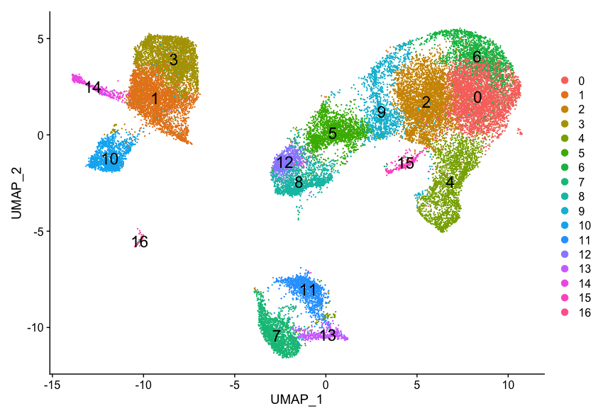
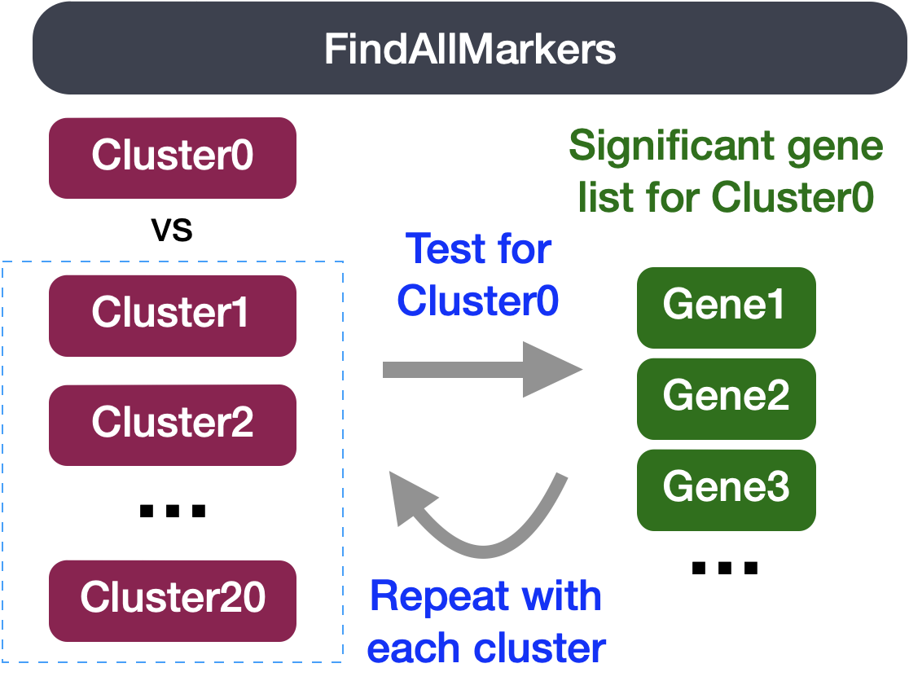
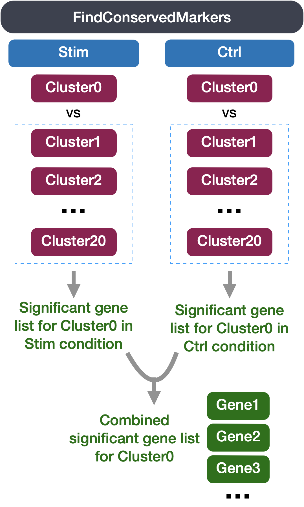
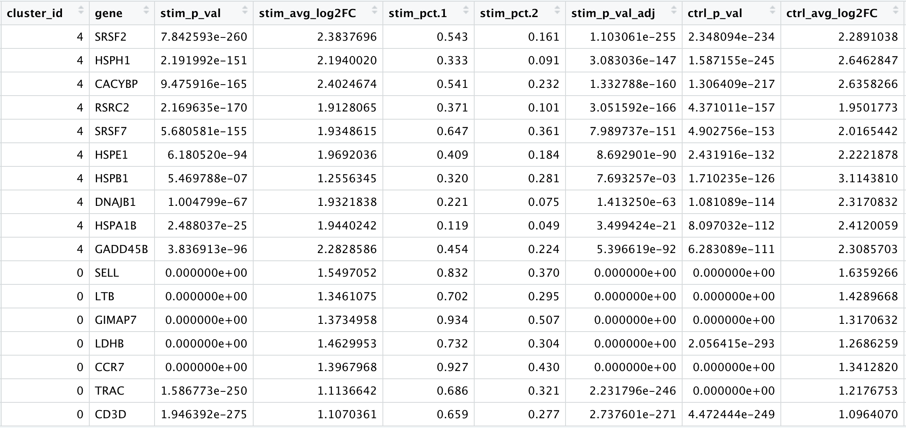
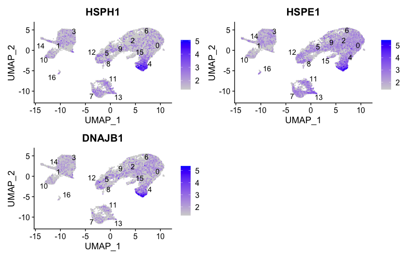
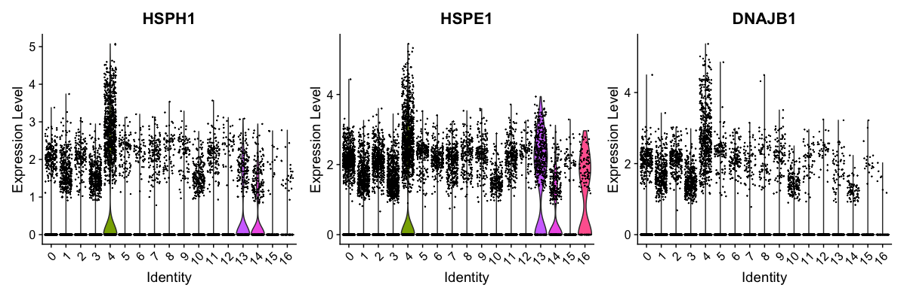
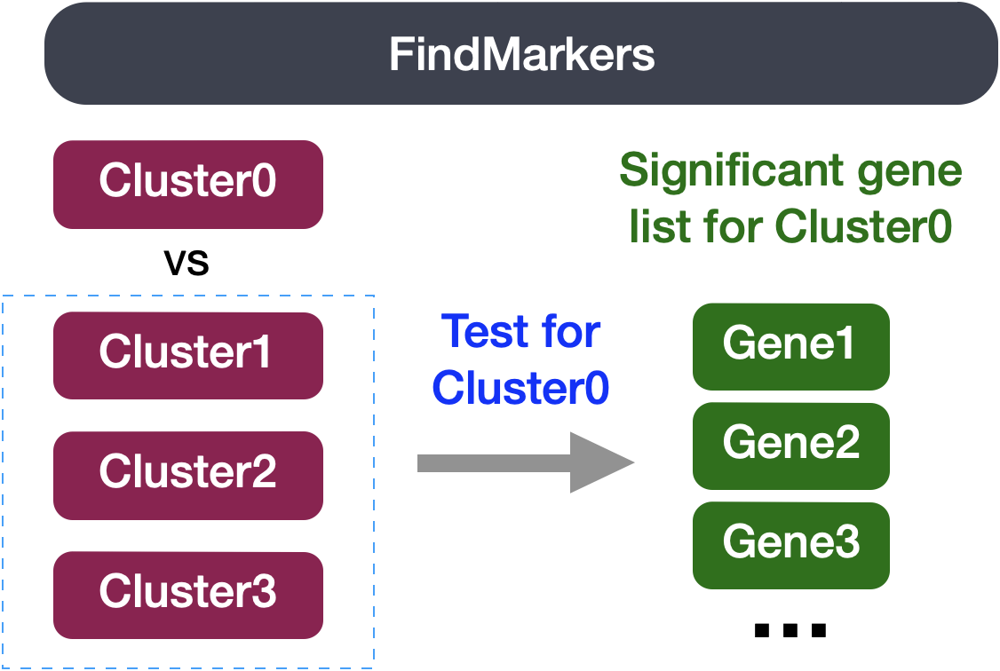
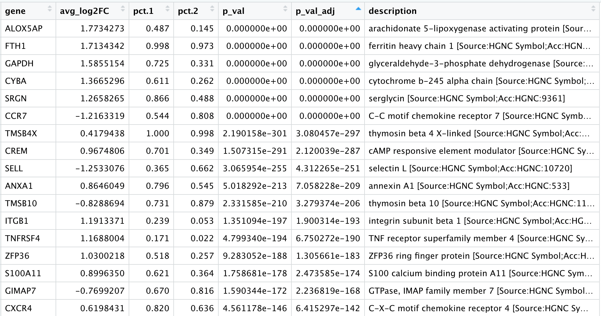
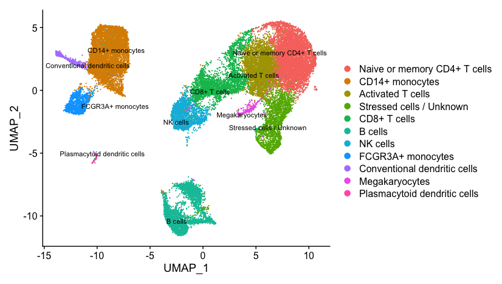
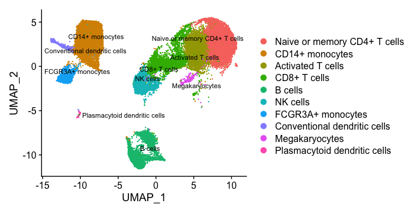

Approximate time: 75 minutes

## Learning Objectives:

* Describe how to determine markers of individual clusters
* Discuss the iterative processes of clustering and marker identification

# Single-cell RNA-seq marker identification

Now that we have identified our desired clusters, we can move on to marker identification, which will allow us to verify the identity of certain clusters and help surmise the identity of any unknown clusters. 

<p align="center">

</p>


***

_**Goals:**_ 
 
 - _To **determine the gene markers** for each of the clusters_
 - _To **identify cell types** of each cluster using markers_
 - _To determine whether there's a need to **re-cluster based on cell type markers**, perhaps clusters need to be merged or split_

_**Challenges:**_
 
 - _Over-interpretation of the results_
 - _Combining different types of marker identification_

_**Recommendations:**_
 
 - _Think of the results as hypotheses that need verification. Inflated p-values can lead to over-interpretation of results (essentially each cell is used as a replicate). Top markers are most trustworthy._
 - _Identify all markers conserved between conditions for each cluster_
 - _Identify markers that are differentially expressed between specific clusters_

***

Our clustering analysis resulted in the following clusters:

<p align="center">

</p>

**Remember that we had the following questions from the clustering analysis**: 

1. _Do the clusters corresponding to the same cell types have biologically meaningful differences? Are there subpopulations of these cell types?_
2. _Can we acquire higher confidence in these cell type identities by identifying other marker genes for these clusters?_

There are a few different types of marker identification that we can explore using Seurat to get to the answer of these questions. Each with their own benefits and drawbacks:

1. **Identification of all markers for each cluster:** this analysis compares each cluster against all others and outputs the genes that are differentially expressed/present. 
	- *Useful for identifying unknown clusters and improving confidence in hypothesized cell types.*

2. **Identification of conserved markers for each cluster:** This analysis looks for genes that are differentially expressed/present within each condition first, and then reports those genes that are conserved in the cluster across all conditions. These genes can help to figure out the identity for the cluster. 
	- *Useful with more than one condition to identify cell type markers that are conserved across conditions.*  	
 
3. **Marker identification between specific clusters:** this analysis explores differentially expressed genes between specific clusters. 
	- *Useful for determining differences in gene expression between clusters that appear to be representing the same celltype (i.e with markers that are similar) from the above analyses.*

## Identification of all markers for each cluster

This type of analysis is typically **recommended for when evaluating a single sample group/condition**. With the ` FindAllMarkers()` function we are comparing each cluster against all other clusters to identify potential marker genes. The cells in each cluster are treated as replicates, and essentially a **differential expression analysis is performed** with some statistical test. 

> **NOTE:** The default is a Wilcoxon Rank Sum test, but there are other options available. 

<p align="center">

</p>

The `FindAllMarkers()` function has **three important arguments** which provide thresholds for determining whether a gene is a marker:

- `logfc.threshold`: minimum log2 fold change for average expression of gene in cluster relative to the average expression in all other clusters combined. Default is 0.25.
	- **Cons:** 
		- could miss those cell markers that are expressed in a small fraction of cells within the cluster of interest, but not in the other clusters, if the average logfc doesn't meet the threshold
		- could return a lot of metabolic/ribosomal genes due to slight differences in metabolic output by different cell types, which are not as useful to distinguish cell type identities
- `min.diff.pct`: minimum percent difference between the percent of cells expressing the gene in the cluster and the percent of cells expressing gene in all other clusters combined.
	- **Cons:** could miss those cell markers that are expressed in all cells, but are highly up-regulated in this specific cell type
- `min.pct`: only test genes that are detected in a minimum fraction of cells in either of the two populations. Meant to speed up the function by not testing genes that are very infrequently expressed. Default is 0.1.
	- **Cons:** if set to a very high value could incur many false negatives due to the fact that not all genes are detected in all cells (even if it is expressed) 
	
You could use any combination of these arguments depending on how stringent/lenient you want to be. Also, by default this function will return to you genes that exhibit both positive and negative expression changes. Typically, we add an argument `only.pos` to opt for keeping only the positive changes. The code to find markers for each cluster is shown below. **We will not run this code.**

```r
## DO NOT RUN THIS CODE ##

# Find markers for every cluster compared to all remaining cells, report only the positive ones
markers <- FindAllMarkers(object = seurat_integrated, 
                          only.pos = TRUE,
                          logfc.threshold = 0.25)                     
```

> _**NOTE:** This command can take quite long to run, as it is processing each individual cluster against all other cells._

## Identification of conserved markers in all conditions

Since we have samples representing different conditions in our dataset, **our best option is to find conserved markers**. This function internally separates out cells by sample group/condition, and then performs differential gene expression testing for a single specified cluster against all other clusters (or a second cluster, if specified). Gene-level p-values are computed for each condition and then combined across groups using meta-analysis methods from the MetaDE R package.

<p align="center">

</p>

Before we start our marker identification we will explicitly set our default assay, we want to use the **normalized data, but not the integrated data**.

```r
DefaultAssay(seurat_integrated) <- "RNA"
```

> _**NOTE:** The default assay should have already been `RNA`, because we set it up in the previous clustering quality control lesson. But we encourage you to run this line of code above to be absolutely sure in case the active slot was changed somewhere upstream in your analysis. Note that the raw and normalized counts are stored in the `counts` and `data` slots of `RNA` assay. By default, the functions for finding markers will use normalized data._

The function `FindConservedMarkers()`, has the following structure:

**`FindConservedMarkers()` syntax:**

```r
## DO NOT RUN ##

FindConservedMarkers(seurat_integrated,
                     ident.1 = cluster,
                     grouping.var = "sample",
                     only.pos = TRUE,
		     min.diff.pct = 0.25,
                     min.pct = 0.25,
		     logfc.threshold = 0.25)
```

You will recognize some of the arguments we described previously for the `FindAllMarkers()` function; this is because internally it is using that function to first find markers within each group. Here, we list **some additional arguments** which provide for when using `FindConservedMarkers()`:

- `ident.1`: this function only evaluates one cluster at a time; here you would specify the cluster of interest.
- `grouping.var`: the variable (column header) in your metadata which specifies the separation of cells into groups

For our analysis we will be fairly lenient and **use only the log fold change threshold greater than 0.25**. We will also specify to return only the positive markers for each cluster.


Let's **test it out on one cluster** to see how it works:

```r
cluster0_conserved_markers <- FindConservedMarkers(seurat_integrated,
                              ident.1 = 0,
                     	      grouping.var = "sample",
                              only.pos = TRUE,
		              logfc.threshold = 0.25)
```

<p align="center">

</p>

**The output from the `FindConservedMarkers()` function**, is a matrix containing a ranked list of putative markers listed by gene ID for the cluster we specified, and associated statistics. Note that the same set of statistics are computed for each group (in our case, Ctrl and Stim) and the last two columns correspond to the combined p-value across the two groups. We describe some of these columns below:

- **gene:** gene symbol
- **condition_p_val:** p-value not adjusted for multiple test correction for condition
- **condition_avg_logFC:** average log fold change for condition. Positive values indicate that the gene is more highly expressed in the cluster.	
- **condition_pct.1:** percentage of cells where the gene is detected in the cluster for condition		
- **condition_pct.2:** percentage of cells where the gene is detected on average in the other clusters for condition
- **condition_p_val_adj:** adjusted p-value for condition, based on bonferroni correction using all genes in the dataset, used to determine significance
- **max_pval:**	largest p value of p value calculated by each group/condition
- **minimump_p_val:** combined p value

>**NOTE:** Since each cell is being treated as a replicate this will result in inflated p-values within each group! A gene may have an incredibly low p-value < 1e-50 but that doesn't translate as a highly reliable marker gene. 

When looking at the output, **we suggest looking for markers with large differences in expression between `pct.1` and `pct.2` and larger fold changes**. For instance if `pct.1` = 0.90 and `pct.2` = 0.80, it may not be as exciting of a marker. However, if `pct.2` = 0.1 instead, the bigger difference would be more convincing. Also, of interest is if the majority of cells expressing the marker is in my cluster of interest. If `pct.1` is low, such as 0.3, it may not be as interesting. Both of these are also possible parameters to include when running the function, as described above.


### Adding Gene Annotations

It can be helpful to add columns with gene annotation information. In order to do that we will load in an annotation file located in your `data` folder, using the code provided below: 

```r
annotations <- read.csv("data/annotation.csv")
```
>_**NOTE:** If you are interested in knowing how we obtained this annotation file, take a look at [the linked materials](fetching_annotations.md)._

First, we will turn the row names with gene identifiers into its own columns. Then we will merge this annotation file with our results from the `FindConservedMarkers()`:

```r

# Combine markers with gene descriptions 
cluster0_ann_markers <- cluster0_conserved_markers %>% 
                rownames_to_column(var="gene") %>% 
                left_join(y = unique(annotations[, c("gene_name", "description")]),
                          by = c("gene" = "gene_name"))

View(cluster0_ann_markers)
```

***

**Exercise**

In the previous lesson, we identified cluster 10 as FCGR3A+ monocytes by inspecting the expression of known cell markers FCGR3A and MS4A7. Use `FindConservedMarkers()` function to find conserved markers for cluster 10. What do you observe? Do you see FCGR3A and MS4A7 as highly expressed genes in cluster 10?

***

### Running on multiple samples

The function `FindConservedMarkers()` **accepts a single cluster at a time**, and we could run this function as many times as we have clusters. However, this is not very efficient. Instead we will first create a function to find the conserved markers including all the parameters we want to include. We will also **add a few lines of code to modify the output**. Our function will:

1. Run the `FindConservedMarkers()` function
2. Transfer row names to a column using `rownames_to_column()` function
3. Merge in annotations
3. Create the column of cluster IDs using the `cbind()` function


```r
# Create function to get conserved markers for any given cluster
get_conserved <- function(cluster){
  FindConservedMarkers(seurat_integrated,
                       ident.1 = cluster,
                       grouping.var = "sample",
                       only.pos = TRUE) %>%
    rownames_to_column(var = "gene") %>%
    left_join(y = unique(annotations[, c("gene_name", "description")]),
               by = c("gene" = "gene_name")) %>%
    cbind(cluster_id = cluster, .)
  }

```

Now that we have this function created  we can use it as an argument to the appropriate `map` function. We want the output of the `map` family of functions to be a **dataframe with each cluster output bound together by rows**, we will use the `map_dfr()` function.

**`map` family syntax:**

```r
## DO NOT RUN ##
map_dfr(inputs_to_function, name_of_function)
```

Now, let's try this function to **find the conserved markers for the clusters that were identified as CD4+ T cells (4,0,6,2)** from our use of known marker genes. Let's see what genes we identify and of there are overlaps or obvious differences that can help us tease this apart a bit more.

```r
# Iterate function across desired clusters
conserved_markers <- map_dfr(c(4,0,6,2), get_conserved)
```

> #### Finding markers for all clusters
> For your data, you may want to run this function on all clusters, in which case you could input `0:20` instead of `c(4,0,6,2)`; however, it would take quite a while to run. Also, it is possible that when you run this function on all clusters, in **some cases you will have clusters that do not have enough cells for a particular group** - and  your function will fail. For these clusters you will need to use `FindAllMarkers()`.

### Evaluating marker genes

We would like to use these gene lists to see of we can **identify which celltypes these clusters identify with.** Let's take a look at the top genes for each of the clusters and see if that gives us any hints. We can view the top 10 markers by average fold change across the two groups, for each cluster for a quick perusal:

```r

# Extract top 10 markers per cluster
top10 <- conserved_markers %>% 
  mutate(avg_fc = (ctrl_avg_log2FC + stim_avg_log2FC) /2) %>% 
  group_by(cluster_id) %>% 
  top_n(n = 10, 
        wt = avg_fc)

# Visualize top 10 markers per cluster
View(top10)
```

<p align="center">

</p>

When we look at the entire list, we see clusters 0 and 6 have some overlapping genes, like CCR7 and SELL which correspond to **markers of memory T cells**. It is possible that these two clusters are more similar to one another and could be merged together as naive T cells. On the other hand, with cluster 2 we observe CREM as one of our top genes; a **marker gene of activation**. This suggests that perhaps cluster 2 represents activated T cells.

| Cell State | Marker |
|:---:|:---:|
| Naive T cells | CCR7, SELL | 
| Activated T cells | CREM, CD69 |

For cluster 4, we see a lot of heat shock and DNA damage genes appear in the top gene list. Based on these markers, it is likely that these are **stressed or dying cells**. However, if we explore the quality metrics for these cells in more detail (i.e. mitoRatio and nUMI overlayed on the cluster) we don't really support for this argument. There is a breadth of research supporting the association of heat shock proteins with reactive T cells in the induction of anti‐inflammatory cytokines in chronic inflammation. This is a cluster for which we would need a deeper understanding of immune cells to really tease apart the results and make a final conclusion.

### Visualizing marker genes

To get a better idea of cell type identity for **cluster 4** we can **explore the expression of different identified markers** by cluster using the `FeaturePlot()` function. We see that only a subset of cluster 4 are highly expressing these genes.

```r
# Plot interesting marker gene expression for cluster 4
FeaturePlot(object = seurat_integrated, 
                        features = c("HSPH1", "HSPE1", "DNAJB1"),
                         order = TRUE,
                         min.cutoff = 'q10', 
                         label = TRUE,
			 repel = TRUE)
```

<p align="center">

</p>

We can also explore the range in expression of specific markers by using **violin plots**:

> **Violin plots** are similar to box plots, except that they also show the probability density of the data at different values, usually smoothed by a kernel density estimator. A violin plot is more informative than a plain box plot. While a box plot only shows summary statistics such as mean/median and interquartile ranges, the violin plot shows the full distribution of the data. The difference is particularly useful when the data distribution is multimodal (more than one peak). In this case a violin plot shows the presence of different peaks, their position and relative amplitude.

```r
# Vln plot - cluster 4
VlnPlot(object = seurat_integrated, 
        features = c("HSPH1", "HSPE1", "DNAJB1"))
```        

<p align="center">

</p>

These results and plots can help us determine the identity of these clusters or verify what we hypothesize the identity to be after exploring the canonical markers of expected cell types previously.


## Identifying gene markers for each cluster

Sometimes the list of markers returned don't sufficiently separate some of the clusters. For instance, we had previously identified clusters 0, 4, 6 and 2 as CD4+ T cells, but when looking at marker gene lists we identfied markers to help us further subset cells. We were lucky and the signal observed from `FindAllMarkers()` helped us differentiate between naive and activated cells. Another option to identify biologically meaningful differences would be to use the **`FindMarkers()` function to determine the genes that are differentially expressed between two specific clusters**. 

<p align="center">

</p>

We can try all combinations of comparisons, but we'll start with cluster 2 versus all other CD4+ T cell clusters:

```r

# Determine differentiating markers for CD4+ T cell
cd4_tcells <- FindMarkers(seurat_integrated,
                          ident.1 = 2,
                          ident.2 = c(0,4,6))                  

# Add gene symbols to the DE table
cd4_tcells <- cd4_tcells %>%
  rownames_to_column(var = "gene") %>%
  left_join(y = unique(annotations[, c("gene_name", "description")]),
             by = c("gene" = "gene_name"))

# Reorder columns and sort by padj      
cd4_tcells <- cd4_tcells[, c(1, 3:5,2,6:7)]

cd4_tcells <- cd4_tcells %>%
  dplyr::arrange(p_val_adj) 

# View data
View(cd4_tcells)

```

<p align="center">

</p>

Of these top genes the **CREM gene** stands out as a marker of activation with a positive fold change.  We also see markers of naive or memory cells include the SELL and CCR7 genes with negative fold changes, which is in line with previous results. 

As markers for the naive and activated states both showed up in the marker list, it is helpful to visualize expression. Based on these plots it seems as though clusters 0 and 2 are reliably the naive T cells. However, for the activated T cells it is hard to tell. We might say that clusters 4 and 18 are activated T cells, but the CD69 expression is not as apparent as CREM. We will label the naive cells and leave the remaining clusters labeled as CD4+ T cells.

Now taking all of this information, we can surmise the cell types of the different clusters and plot the cells with cell type labels.


| Cluster ID	| Cell Type |
|:-----:|:-----:|
|0	| Naive or memory CD4+ T cells|
|1	| CD14+ monocytes |
|2	| Activated T cells|
|3	| CD14+ monocytes|
|4	| Stressed cells / Unknown|
|5	| CD8+ T cells |
|6	| Naive or memory CD4+ T cells |
|7	| B cells |
|8	| NK cells |
|9	| CD8+ T cells |
|10	| FCGR3A+ monocytes |
|11	| B cells |
|12	| NK cells |
|13	| B cells|
|14	| Conventional dendritic cells |
|15| Megakaryocytes |
|16| Plasmacytoid dendritic cells |


We can then reassign the identity of the clusters to these cell types:

```r
# Rename all identities
seurat_integrated <- RenameIdents(object = seurat_integrated, 
                               "0" = "Naive or memory CD4+ T cells",
                               "1" = "CD14+ monocytes",
                               "2" = "Activated T cells",
                               "3" = "CD14+ monocytes",
                               "4" = "Stressed cells / Unknown",
                               "5" = "CD8+ T cells",
                               "6" = "Naive or memory CD4+ T cells",
                               "7" = "B cells",
                               "8" = "NK cells",
                               "9" = "CD8+ T cells",
                               "10" = "FCGR3A+ monocytes",
                               "11" = "B cells",
                               "12" = "NK cells",
                               "13" = "B cells",
                               "14" = "Conventional dendritic cells",
                               "15" = "Megakaryocytes",
			       "16" = "Plasmacytoid dendritic cells")


# Plot the UMAP
DimPlot(object = seurat_integrated, 
        reduction = "umap", 
        label = TRUE,
        label.size = 3,
        repel = TRUE)
```

<p align="center">

</p>

If we wanted to remove the potentially stressed cells, we could use the `subset()` function:

```r
# Remove the stressed or dying cells
seurat_subset_labeled <- subset(seurat_integrated,
                               idents = "Stressed cells / Unknown", invert = TRUE)

# Re-visualize the clusters
DimPlot(object = seurat_subset_labeled, 
        reduction = "umap", 
        label = TRUE,
        label.size = 3,
	repel = TRUE)
```

<p align="center">

</p>

Now we would want to save our final labelled Seurat object and the output of `sessionInfo()`:

```r        
# Save final R object
write_rds(seurat_integrated,
          file = "results/seurat_labelled.rds")

# Create and save a text file with sessionInfo
sink("sessionInfo_scrnaseq_Feb2023.txt")
sessionInfo()
sink()
```

> You can find out more about the `sink()` function [at this link](https://www.rdocumentation.org/packages/base/versions/3.6.2/topics/sink).

***

Now that we have our clusters defined and the markers for each of our clusters, we have a few different options:

- Experimentally validate intriguing markers for our identified cell types.
- Explore a subset of the cell types to discover subclusters of cells as described [here](seurat_subclustering.md)
- Perform differential expression analysis between conditions `ctrl` and `stim`
	- Biological replicates are **necessary** to proceed with this analysis, and we have [additional materials](pseudobulk_DESeq2_scrnaseq.md) to help walk through this analysis.
- Trajectory analysis, or lineage tracing, could be performed if trying to determine the progression between cell types or cell states. For example, we could explore any of the following using this type of analysis:
	- Differentiation processes
	- Expression changes over time
	- Cell state changes in expression

***


*This lesson has been developed by members of the teaching team at the [Harvard Chan Bioinformatics Core (HBC)](http://bioinformatics.sph.harvard.edu/). These are open access materials distributed under the terms of the [Creative Commons Attribution license](https://creativecommons.org/licenses/by/4.0/) (CC BY 4.0), which permits unrestricted use, distribution, and reproduction in any medium, provided the original author and source are credited.*

* *A portion of these materials and hands-on activities were adapted from the [Satija Lab's](https://satijalab.org/) [Seurat - Guided Clustering Tutorial](https://satijalab.org/seurat/pbmc3k_tutorial.html)*
