Approximate time: 90 minutes

### Learning Objectives:

* Understand how to prepare single-cell RNA-seq raw count data for pseudobulk differential expression analysis
* Utilize the DESeq2 tool to perform pseudobulk differential expression analysis on a specific cell type cluster
* Create functions to iterate the pseudobulk differential expression analysis across different cell types

_The [2019 Bioconductor tutorial on scRNA-seq pseudobulk DE analysis](http://biocworkshops2019.bioconductor.org.s3-website-us-east-1.amazonaws.com/page/muscWorkshop__vignette/) was used as a fundamental resource for the development of this lesson, especially for some of the data wrangling steps._

* * *

# Differential expression analysis with DESeq2

<p align="center">

</p>

After determining the cell type identities of the scRNA-seq clusters, we often would like to perform a differential expression (DE) analysis between conditions within particular cell types. While functions exist within Seurat to perform DE analysis, the p-values from these analyses are often inflated as each cell is treated as an independent sample. This is problematic, since we know that single cells isolated from the same biological sample (whether the same mouse, same human sample or same cell culture, etc.) are *not* independent of each other. If we treat cells as independent samples, then we are not truly investigating the variation across a population, but the variation across an individual/organism. Therefore, we could only make conclusions at the level of this individual, not the population. 

Usually, we want to infer which genes might be important for a condition at the population level, so we need the samples contrasted in our DE analysis to originate from different organisms/samples, not different cells. To do this, the current best practice is using a pseudobulk approach, which involves the following steps:

1. Subsetting to the cells for the cell type(s) of interest to perform the DE analysis;
2. Extracting the raw counts after QC filtering of cells to be used for the DE analysis;
3. Aggregating the counts and metadata to the sample level; 
4. Performing the DE analysis (Need at least two biological replicates per condition to perform the analysis, but more replicates are recommended).

We will be using the same dataset as what we had used for the rest of the workflow, but it has now been demultiplexed into the individual samples to use the replicates allowing for differential expression analysis. We will be importing it as a `SingleCellExperiment` object.

>_**NOTE:** To subset and extract the cells from a Seurat object, which we had created at the end of the single-cell analysis workflow, we could use code similar to that below:_
>
>```r
># Bring in Seurat object
>seurat <- readRDS("path/to/seurat.rds")
>
># Extract raw counts and metadata to create SingleCellExperiment object
>counts <- seurat@assays$RNA@counts 
>
>metadata <- seurat@meta.data
>
># Set up metadata as desired for aggregation and DE analysis
>metadata$cluster_id <- factor(seurat@active.ident)
>
># Create single cell experiment object
>sce <- SingleCellExperiment(assays = list(counts = counts), 
>                            colData = metadata)
>```


## Understanding the dataset

For this workshop we will be working with the same single-cell RNA-seq dataset from [Kang et al, 2017](https://www.nature.com/articles/nbt.4042) that we had used for the rest of the single-cell RNA-seq analysis workflow. However, for differential expression analysis, we are using the non-pooled count data with eight control samples and eight interferon stimulated samples. This is in contrast to the rest of the scRNA-seq analysis class, where we used the **pooled** Peripheral Blood Mononuclear Cells (PBMCs) taken from eight lupus patients, split into a single pooled control and a single pooled interferon-stimulated condition. 

_**IMPORTANT NOTE:** You should always work with non-pooled samples from the beginning of the scRNA-seq workflow, if possible._

We acquired the raw counts dataset split into the individual eight samples from the ExperimentHub R package, as described [here](http://biocworkshops2019.bioconductor.org.s3-website-us-east-1.amazonaws.com/page/muscWorkshop__vignette/). **[BROKEN LINK]**


### Metadata

In addition to the raw data, we also need to collect **information about the data**; this is known as **metadata**. There is often a temptation to just start exploring the data, but it is not very meaningful if we know nothing about the samples that this data originated from.

Some relevant metadata for our dataset is provided below:

* The libraries were prepared using 10X Genomics version 2 chemistry
* The samples were sequenced on the Illumina NextSeq 500
* PBMC samples from eight distinct lupus patients were separated into two aliquots each to receive different treatments:
  * One aliquot of PBMCs was activated by 100 U/mL of recombinant IFN-β for 6 hours; 
  * The second aliquot was left untreated. 
* PBMCs that received the same treatment were then pooled together for processing as one 10X Genomics sample, then computationally demultiplexed:
  * After 6 hours, the eight samples for each condition were pooled together in two final pools (stimulated cells and control cells)
  * 12,138 and 12,167 cells were identified (after removing doublets) for control and stimulated pooled samples, respectively
  * The samples were demultiplexed using the tool Demuxlet

> _**NOTE:** Other relevant metadata for a pseudobulk differential expression analysis include information about the individuals that will be contrasted (age, sex, clinical presentation, etc.). The more information you can collect about your study samples, the better!_

* After clustering and marker identification, the following cell types were identified:
  * B cells
  * CD4 T cells
  * CD8 T cells
  * NK cells
  * FCGR3A+ Monocytes
  * CD14+ Monocytes
  * Dendritic cells
  * Megakaryocytes

> _**NOTE:** We had identified a few additional cell types during our single-cell workflow, but we will be moving forward with this version of the dataset and the cell types that were identified as part of this analysis._


## Setting up the R environment

To prepare for differential expression analysis, we need to set up the project and directory structure, load the necessary libraries and bring in the **raw count** single-cell RNA-seq gene expression data.

Open up RStudio and create a new R project entitled `DE_analysis_scrnaseq`. Then, create the following directories:

```
DE_analysis_scrnaseq/
├── data
├── results
└── figures
```

### Download data

**Right-click** the link below to download the RData object into your `data` folder:

- [scRNA-seq filtered counts](https://www.dropbox.com/s/l2pa2brpmz9sw03/scRNA-seq_pseudobulk_filtered_sce.rds?dl=1)


### Create new script

Next, open a new Rscript file, and start with some comments to indicate what this file is going to contain:

```r
# Single-cell RNA-seq analysis - Pseudobulk DE analysis with DESeq2
```

Save the Rscript as `DE_analysis_scrnaseq.R`.


### Load libraries

After bringing in the raw counts data for our experiment, we will use tools from various packages to wrangle our data to the format needed, followed by aggregation of the raw counts across the single cells to the sample level. Then, we will use DESeq2 to perform the differential expression analysis across conditions of interest. To learn more about the DESeq2 method and deconstruction of the steps in the analysis, we have [additional materials available](https://hbctraining.github.io/DGE_workshop_salmon_online/schedule/links-to-lessons.html).

Let's load the libraries that we will be using for the analysis.

```r
# Load libraries
library(tidyverse)
library(cowplot)
library(Matrix.utils)
library(edgeR)
library(dplyr)
library(magrittr)
library(Matrix)
library(purrr)
library(reshape2)
library(S4Vectors)
library(tibble)
library(SingleCellExperiment)
library(pheatmap)
library(apeglm)
library(png)
library(DESeq2)
library(RColorBrewer)
library(data.table)
```

### Load the RData (RDS) object
  
The dataset that we are working with has been saved as an RData object to an RDS file. We can read it in using the `readRDS()` function.

```r 
# Read in the SingleCellExperiment object with the filtered raw counts
sce <- readRDS("data/scRNA-seq_pseudobulk_filtered_sce.rds")
```

>_**NOTE:** The filtered raw counts stored in this SingleCellExperiment object were filtered using the same metrics as described in the [QC lesson](https://hbctraining.github.io/scRNA-seq_online/lessons/04_SC_quality_control.html)._

The RData object is a single-cell experiment object, which is a type of specialized list, generated using the SingleCellExperiment package. These objects have the following structure:

<p align="center">

</p>

_**Image credit:** [Amezquita, R.A., Lun, A.T.L., Becht, E. et al. Orchestrating single-cell analysis with Bioconductor. Nat Methods 17, 137–145 (2020). https://doi-org.ezp-prod1.hul.harvard.edu/10.1038/s41592-019-0654-x](https://www.nature.com/articles/s41592-019-0654-x?draft=collection)_

We can use the functions from the SingleCellExperiment package to extract the different components. Let's explore the counts and metadata for the experimental data.

**Counts matrix:**

```r
# Explore the raw counts for the dataset

## Check the assays present
assays(sce)

## Check the counts matrix
dim(counts(sce))
counts(sce)[1:6, 1:6]
```

<p align="center">
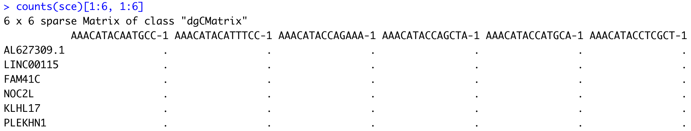
</p>

We see the raw counts data is a cell by gene sparse matrix with over 11,000 rows (genes) and nearly 30,000 columns (cells). 

>_**NOTE:** We don't want to run `head()` on this dataset, since it will still show the thousands of columns, so we just looked at the first six rows and columns._


**Metadata:**

Next, we can get an idea of the metadata that we have for every cell.

```r
# Explore the cellular metadata for the dataset

dim(colData(sce))
head(colData(sce))
```

<p align="center">
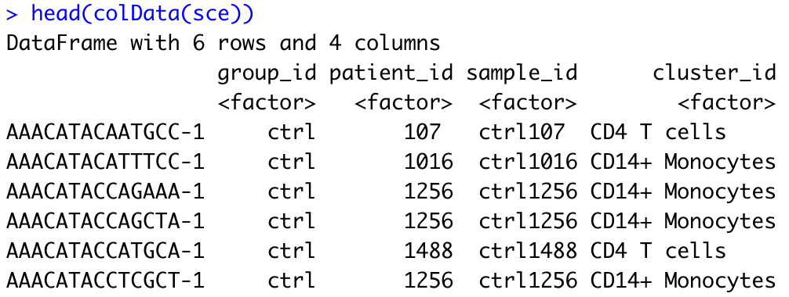
</p>

For every cell, we have information about the associated condition (ctrl or stim), sample ID, and cell type. We will use this information to perform the differential expression analysis between conditions for any particular cell type of interest.

>_**NOTE:** When working with a SingleCellExperiment object generated from a Seurat object you generated for analysis of your own experiment, your metadata will likely include many more variables such as nCount_RNA, nFeature_RNA, etc. These variables, which contain information that is relevant at the cell-level but not at the sample-level, will need to be excluded from your sample-level metadata (see below)._


## Preparing the single-cell dataset for pseudobulk analysis

To enable pseudobulk differential expression (DE) analysis, we need to transform our single-cell level dataset into one sample-level dataset per cell type (cluster) that we want to study using DE analysis.


### Extracting necessary metrics for aggregation by cell type in a sample

First, it is useful to determine the number of clusters and the cluster names (cell types) present in our dataset: 

```r
# Extract unique names of clusters (= levels of cluster_id factor variable)
cluster_names <- levels(colData(sce)$cluster_id)
cluster_names

# Total number of clusters
length(cluster_names)
```

<p align="center">
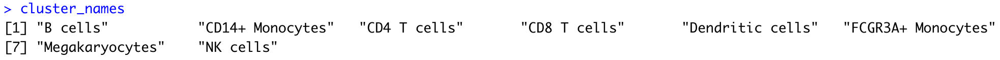
</p>

We find 8 different clusters with their corresponding identities (B cells, Dendritic cells, CD14+ Monocytes, CD4 T cells, CD8 T cells, FCGR3A+ Monocytes, Megakaryocytes, NK cells). 


Then, it is also useful to determine the number of samples, so that we know how many to expect later in our aggregated dataset:

```r
# Extract unique names of samples (= levels of sample_id factor variable)
sample_names <- levels(colData(sce)$sample_id)
sample_names

# Total number of samples
length(sample_names)
```

<p align="center">
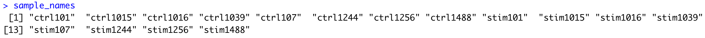
</p>

Here, we identify 16 different samples (8 control and 8 stimulated).


### Aggregating counts to the sample level for each cluster

Now that we've captured our cluster and sample names, let's aggregate our single-cell level counts at the sample level for each unique cluster. At the end of this operation, we want one aggregated counts data matrix per cluster (cell type), with each data matrix listing all genes as rows and all 16 samples as columns.

First, we need to extract the sample and cluster identity of each single cell from our metadata, so that we know which cells "belong" to the same group that we want to aggregate by:

```r
# Subset metadata to include only the variables you want to aggregate across (here, we want to aggregate by sample and by cluster)
groups <- colData(sce)[, c("cluster_id", "sample_id")]
head(groups)
```

<p align="center">
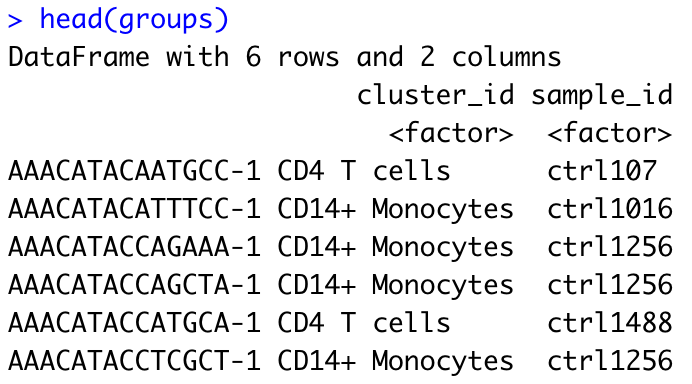
</p>

`groups` is a DataFrame object summarizing the sample and cluster identity of each single cell.

Using the information stored in `groups`, we can readily aggregate our single-cell counts matrix. The function `aggregate.Matrix()` enables to collapse (sum) all rows of the matrix that are associated with the same unique combination of cluster_id x sample_id, as listed in `groups`. For this operation to work, the *row* names of the matrix we seek to aggregate need to match the row names of the `groups` DataFrame (here, unique cell barcodes). Since `counts(sce)` is a matrix with genes as rows and cells as *columns*, we first transpose this matrix using the function `t()` before aggregating.

```r
# Aggregate across cluster-sample groups
# transposing row/columns to have cell_ids as row names matching those of groups
aggr_counts <- aggregate.Matrix(t(counts(sce)), 
                                groupings = groups, fun = "sum") 

# Explore output matrix
class(aggr_counts)
dim(aggr_counts)
aggr_counts[1:6, 1:6]
```

<p align="center">
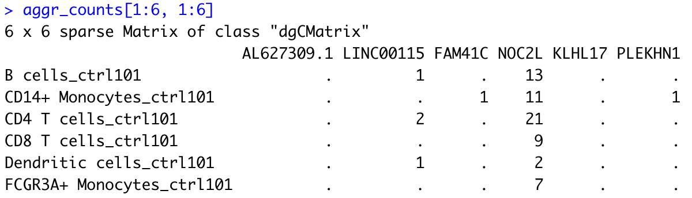
</p>

The output of this aggregation is a sparse matrix with genes as columns and unqiue cell type/sample combinations as rows. Note that each row is now named in the following format: `cell type_sample`. 

In this example, we thus see that for the B cell population, sample `ctrl101` has a total of 13 counts associated with gene _NOC2L_. 


### Splitting the counts matrix by cell type

To perform DE analysis on a per cell type basis, we still need to wrangle our data in a couple ways, including:

1. Transform the matrix back, so that the genes are listed in rows and the samples are in columns
2. Split our matrix by cell type

The first step is easily achieved with the same function `t()` as used above:

```r
# Transpose aggregated matrix to have genes as rows and samples as columns
aggr_counts <- t(aggr_counts)
aggr_counts[1:6, 1:6]
```

<p align="center">
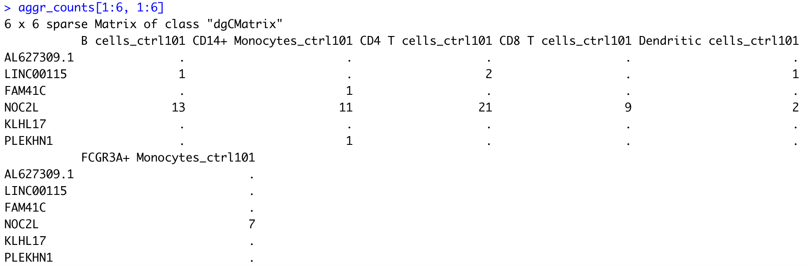
</p>


For the second step, we need to identify all `cell type_sample` column names that correspond to a given cell type (cluster), so that we can subset these columns from our global matrix for DE analysis focused on this cell type. There are multiple ways to achieve this. 

In this example, we use the `tstsrplit()` function to split our `cell type_sample` string by "\_", which will separate the string into `cell type` and `sample` (i.e., the string elements on either side of the underscore split). The output of the `tstrsplit` function is a list, with all `cell type` sub-strings gathered in the first element of the list and all `sample` sub-strings gathered in the second element of the list, with the initial order conserved.

```r
# Understanding tstrsplit()

## Exploring structure of function output (list)
tstrsplit(colnames(aggr_counts), "_") %>% str()

## Comparing the first 10 elements of our input and output strings
head(colnames(aggr_counts), n = 10)
head(tstrsplit(colnames(aggr_counts), "_")[[1]], n = 10)
```

<p align="center">
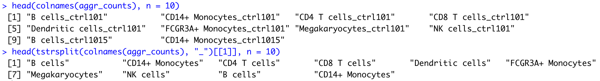
</p>


We can then apply `which()` to look up a given cluster name within the first element of the list output by `tstrsplit()`, and subset the corresponding columns from our global matrix:

```r
# Using which() to look up tstrsplit() output
b_cell_idx <- which(tstrsplit(colnames(aggr_counts), "_")[[1]] == "B cells")
b_cell_idx

colnames(aggr_counts)[b_cell_idx]
aggr_counts[1:10, b_cell_idx]
```

<p align="center">
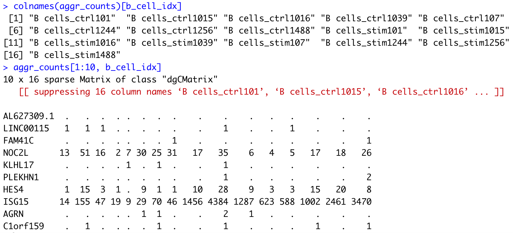
</p>

>_**NOTE:** If your cluster names do not contain any special characters (., +, etc.), a quicker way to extract indexes of columns that match a given cluster would be to use the string search function `grep()`._ 

Finally, we can put everything together by using a `for` loop to repeat the example operations above for all cell types. We will store the matrices for each cell type in a list.

```r
# As a reminder, we stored our cell types in a vector called cluster_names
cluster_names


# Loop over all cell types to extract corresponding counts, and store information in a list

## Initiate empty list
counts_ls <- list()

for (i in 1:length(cluster_names)) {

  ## Extract indexes of columns in the global matrix that match a given cluster
  column_idx <- which(tstrsplit(colnames(aggr_counts), "_")[[1]] == cluster_names[i])
  
  ## Store corresponding sub-matrix as one element of a list
  counts_ls[[i]] <- aggr_counts[, column_idx]
  names(counts_ls)[i] <- cluster_names[i]

}

# Explore the different components of the list
str(counts_ls)
```

<p align="center">
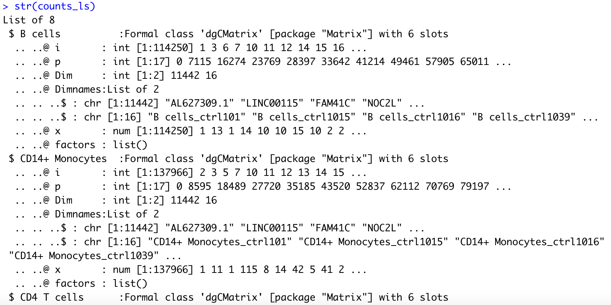
</p>

>_**NOTE:** Some of the samples may have zero cell for some of the cell types. The code above will not break if that is the case, but we need to keep that in mind as we create matching metadata for each cell type in the section below._


### Generating matching metadata at the sample-level 

At this stage, we've generated aggregated counts matrices for each sample and cell type. However, these matrices have little meaning without matching metadata. To perform sample-level differential expression analysis, we need to generate sample-level metadata. 

At the moment, our metadata is stored in the `colData()` field of our SingleCellExperiment object, and contains one row per cell. Not all the variables stored in `colData()` may contain information that is relevant at the sample level. For example, `cluster_id` is defined at the single cell level, with each sample comprising multiple cell types. First, let's extract the variables that will be relevant at the sample level, and reformat our metadata so that it contains one row per sample.

```r
# Reminder: explore structure of metadata
head(colData(sce))

# Extract sample-level variables
metadata <- colData(sce) %>% 
  as.data.frame() %>% 
  dplyr::select(group_id, patient_id, sample_id)

dim(metadata)
head(metadata)

# Exclude duplicated rows
metadata <- metadata[!duplicated(metadata), ]

dim(metadata)
head(metadata)
```

<p align="center">
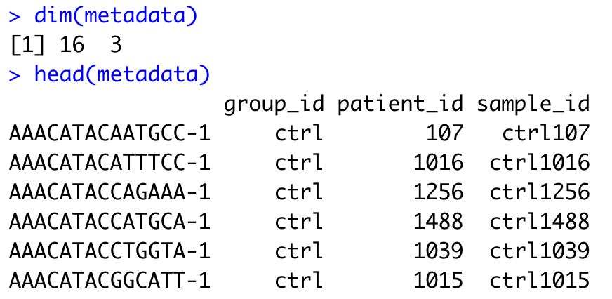
</p>

We've successfully reduced our metadata from a total of ~30,000 rows (one per cell) to 16 rows (one per sample). However, we still need to update the rownames so that they reflect sample IDs instead of cell barcode IDs, which are no longer meaningful here.

```r
# Rename rows
rownames(metadata) <- metadata$sample_id
head(metadata)
```

<p align="center">
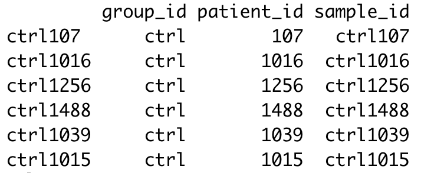
</p>

_**NOTE:** If you have access to additional information regarding your samples (patient age, sex, experimental batch...) that was not already captured in your SingleCellExperiment metadata, now would be a good time to add it in your metadata table._


One additional sample-level variable that is useful to capture in the metadata for each cell type is the number of cells from each sample that belonged to the corresponding cluster (cell type). 

This information is captured in the following table:

```r
# Number of cells per sample and cluster
t <- table(colData(sce)$sample_id,
           colData(sce)$cluster_id)
t[1:6, 1:6]
```

<p align="center">
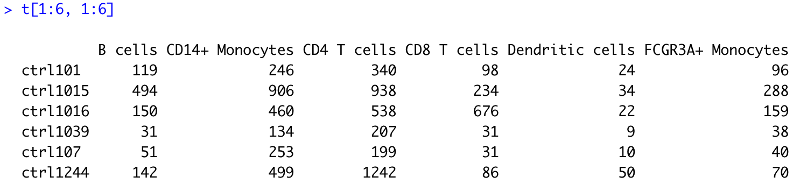
</p>


Using another for loop, we will append this cell count information to our generic metadata table, and thus generate one metadata data frame specific of each cell type. In addition, we need to make sure that for each cell type (cluster), the row names of the metadata data frame match the column names of the corresponding counts matrix. This will be necessary for us to create a DESeq2 object for pseudobulk differential expression analysis later on. 

```r
# Creating metadata list

## Initiate empty list
metadata_ls <- list()

for (i in 1:length(counts_ls)) {
  
    ## Initiate a data frame for cluster i with one row per sample (matching column names in the counts matrix)
    df <- data.frame(cluster_sample_id = colnames(counts_ls[[i]]))
    
    ## Use tstrsplit() to separate cluster (cell type) and sample IDs
    df$cluster_id <- tstrsplit(df$cluster_sample_id, "_")[[1]]
    df$sample_id  <- tstrsplit(df$cluster_sample_id, "_")[[2]]
    
    
    ## Retrieve cell count information for this cluster from global cell count table
    idx <- which(colnames(t) == unique(df$cluster_id))
    cell_counts <- t[, idx]
    
    ## Remove samples with zero cell contributing to the cluster
    cell_counts <- cell_counts[cell_counts > 0]
    
    ## Match order of cell_counts and sample_ids
    sample_order <- match(df$sample_id, names(cell_counts))
    cell_counts <- cell_counts[sample_order]
    
    ## Append cell_counts to data frame
    df$cell_count <- cell_counts
    
    
    ## Join data frame (capturing metadata specific to cluster) to generic metadata
    df <- plyr::join(df, metadata, 
                     by = intersect(names(df), names(metadata)))
    
    ## Update rownames of metadata to match colnames of count matrix, as needed later for DE
    rownames(df) <- df$cluster_sample_id
    
    ## Store complete metadata for cluster i in list
    metadata_ls[[i]] <- df
    names(metadata_ls)[i] <- unique(df$cluster_id)

}

# Explore the different components of the list
str(metadata_ls)
```

<p align="center">
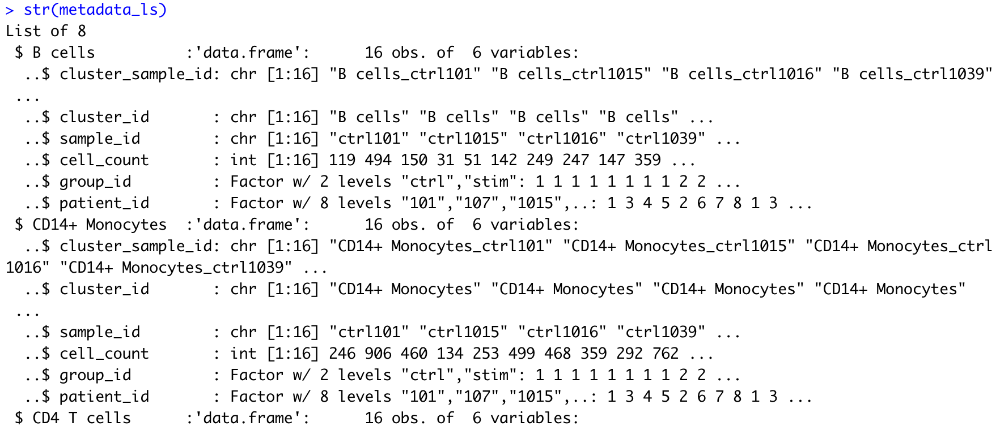
</p>


At last, we have matching lists of counts matrices and sample-level metadata for each cell type, and we are ready to proceed with pseudobulk differential expression analysis.


* * *

## Differential gene expression with DESeq2

**We will be using [DESeq2](https://genomebiology.biomedcentral.com/articles/10.1186/s13059-014-0550-8) for the pseudobulk DE analysis, and the analysis steps with DESeq2 are shown in the flowchart below in green and blue**. DESeq2 first normalizes the count data to account for differences in library sizes and RNA composition between samples. Then, we will use the normalized counts to make some plots for QC at the gene and sample level. The final step is to use the appropriate functions from the DESeq2 package to perform the differential expression analysis. We will go into each of these steps briefly, but additional details and helpful suggestions regarding DESeq2 can be found in [our materials](https://hbctraining.github.io/DGE_workshop_salmon_online/schedule/links-to-lessons.html) detailing the workflow for bulk RNA-seq analysis, as well as in the [DESeq2 vignette](http://bioconductor.org/packages/devel/bioc/vignettes/DESeq2/inst/doc/DESeq2.html).

<p align="center">

</p>


### Creating a DESeq2 object

Since we've organized our counts matrices and metadata for each cell type as two matching lists, we can readily create a DESeq2 object using any element of the lists. All we need to do is decide which cell type we wish to focus on, and retrieve the corresponding data from our lists.

As a reminder, we stored all our cell types in a vector called `cluster_names`, so we can check it to select the population we want to start with. Cell types are also stored in `names(counts_ls)` and `names(metdata_ls)`, which should match each other.

```r
# Select cell type of interest
cluster_names

# Double-check that both lists have same names
all(names(counts_ls) == names(metadata_ls))
```

Here, we will focus on B cells as an example. First, we determine the index of "B cells" in our lists, to extract the counts matrix and metadata for this specific cell type.

```r
idx <- which(names(counts_ls) == "B cells")
cluster_counts <- counts_ls[[idx]]
cluster_metadata <- metadata_ls[[idx]]
```

Then, it is worth double-checking that the extracted `cluster_counts` and `cluster_metadata` objects match, i.e. that they capture information related to the same cell type (cluster). In addition, the columns of our counts matrix and row names of our metadata data frame must be the same and appear in the same order for us to successfully create a DESeq2 object.

```r
# Check contents of extracted objects
cluster_counts[1:6, 1:6]
head(cluster_metadata)

# Check matching of matrix columns and metadata rows
all(colnames(cluster_counts) == rownames(cluster_metadata))
```

<p align="center">
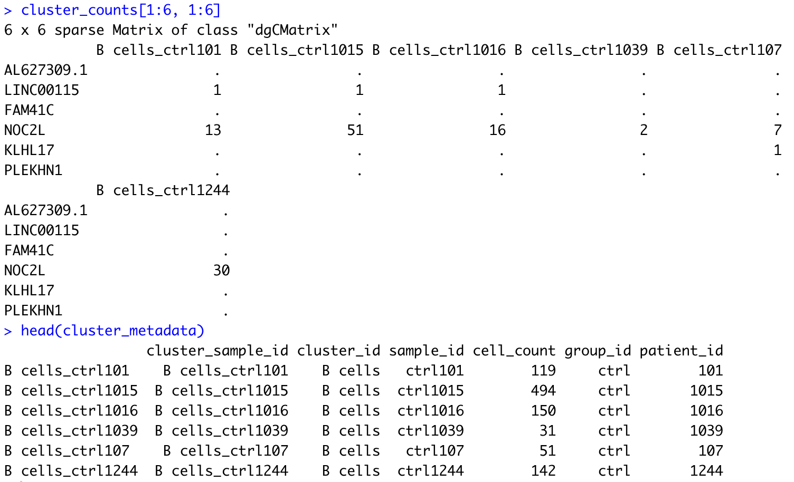
</p>


Now we can create our DESeq2 object to prepare to run the DE analysis. We need to include the raw counts, metadata, and design formula for our comparison of interest. In the design formula, we should also include any other columns in the metadata for which we want to regress out the variation (e.g. batch, sex, age). Here, we only have our comparison of interest (stimulated versus control), which is stored as `group_id` in our metadata data frame.

>_**NOTE:** While a design formula must be specified when creating a DESeq2 object, it is always possible to update it later. You may want to update the design formula after going through the quality control, for example if you notice an unwanted influence of the experimental batch on the clustering observed in PCA plots (see below)._

More information about the DESeq2 workflow and design formulas can be found in our [DESeq2 materials](https://hbctraining.github.io/DGE_workshop_salmon_online/schedule/links-to-lessons.html).

```r 
# Create DESeq2 object        
dds <- DESeqDataSetFromMatrix(cluster_counts, 
                              colData = cluster_metadata, 
                              design = ~ group_id)
```


### Quality Control - sample level

The next step in the DESeq2 workflow is quality control (QC), which includes sample-level and gene-level QC checks on the count data to help us ensure that the samples/replicates look good. 

<p align="center">

</p>

A useful initial step in any bulk (or pseudobulk) RNA-seq analysis is to assess the overall similarity between samples: 

- Which samples are similar to each other, which are different? 
- Does this fit the expectation from the experiment’s design? 
- What are the major sources of variation in the dataset?

To explore the similarity of our samples, we will be performing sample-level QC using Principal Component Analysis (PCA) and hierarchical clustering methods. Sample-level QC allows us to see how well our replicates cluster together and to assess whether our experimental condition represents the major source of variation in the data. Sample-level QC may also highlight outliers or confounding factors, which may need to be explored further to determine whether they need to be removed or regressed out prior to DE analysis. 

<p align="center">

</p>

When using these unsupervised clustering methods (PCA and hierarchical clustering), normalization and log2-transformation of the counts improves the distances/clustering for visualization. DESeq2 uses the median of ratios method for count normalization and a **regularized log transform** (rlog) of the normalized counts for sample-level QC as it moderates the variance across the mean, thus improving the clustering.

<p align="center">

</p>

>_**NOTE:** The [DESeq2 vignette](http://bioconductor.org/packages/devel/bioc/vignettes/DESeq2/inst/doc/DESeq2.html) suggests that for large datasets (100s of samples), variance-stabilizing transformation (vst) can be used instead of rlog for transformation of the counts, since the `rlog()` function might take too long to run and the `vst()` function is faster with similar properties._


#### Principal component analysis

Principal Component Analysis (PCA) is a dimensionality reduction technique used to emphasize variation and bring out strong patterns in a dataset. Details regarding PCA are given in our [additional materials](https://hbctraining.github.io/DGE_workshop_salmon_online/lessons/03_DGE_QC_analysis.html).

We can run the `rlog()` function from DESeq2 to normalize and rlog transform the raw counts. Then, we can use the `plotPCA()` function to plot the first two principal components. By default, the `plotPCA()` function uses the top 500 most variable genes to compute principal components, but this parameter can be adjusted.

```r
# Transform counts for data visualization
rld <- rlog(dds, blind=TRUE)

# Plot PCA
DESeq2::plotPCA(rld, ntop = 500, intgroup = "group_id")
```

<p align="center">
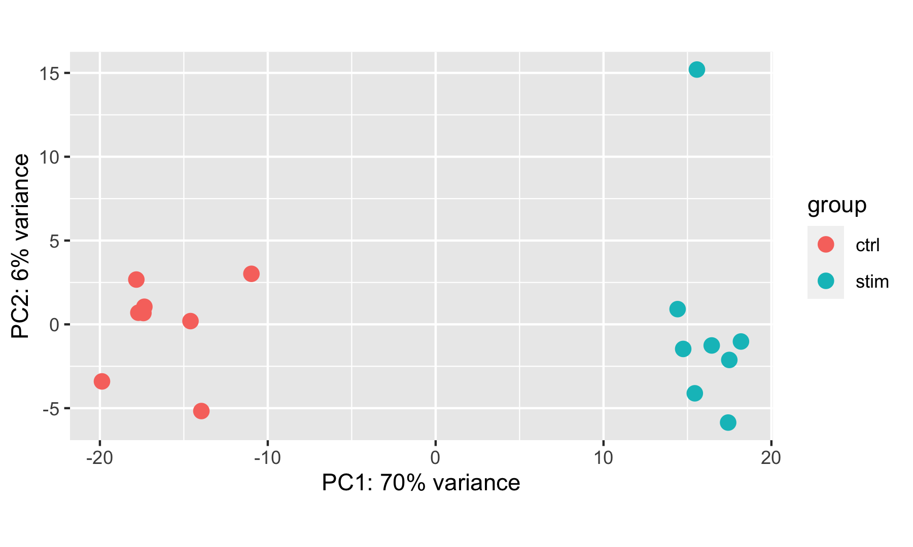
</p>

In this example, we see a nice separation between our samples on PC1 by our condition of interest, which is great; this suggests that our condition of interest is the largest source of variation in our dataset. One sample in the stimulated group may appear as an outlier at first glance, but this sample is only separated from others in its group along the PC2 (y-axis), which only explains 6% of the total variance. 

It is also useful to check whether the number of cells from which the aggregated counts were derived influences the separation of the samples in the PCA plot. This is particularly useful if you notice an outlier sample, which may be explained by its very low (or very large) cell count compared to others.

```r
DESeq2::plotPCA(rld, ntop = 500, intgroup = "cell_count")
```

<p align="center">

</p>

> _**NOTE:** If you have access to additional sample metadata (sex, age, experimental batch...), it is worth checking how these correlate with the observed sample separation along the PC axes. Ideally, you want only your condition of interest to influence the sample clustering._


#### Hierarchical clustering

Similar to PCA, hierarchical clustering is another, complementary method for identifying strong patterns in a dataset and potential outliers. 

The heatmap below displays the correlation in gene expression levels for all pairwise combinations of samples in the dataset. Since the majority of genes are not differentially expressed, samples generally have high correlations with each other (values higher than 0.80). Samples below 0.80 may indicate an outlier in your data and/or some sample contamination.

The hierarchical tree can indicate which samples are more similar to each other based on the normalized gene expression values. The color blocks indicate substructure in the data, and you would expect to see your replicates cluster together as a block for each sample group. Finally, we expect to see clustering of samples in a similar pattern as observed in the PCA plot.

```r
# Extract the rlog matrix from the object and compute pairwise correlation values
rld_mat <- assay(rld)
rld_cor <- cor(rld_mat)

# Plot heatmap
pheatmap(rld_cor, annotation = cluster_metadata[, c("group_id"), drop=F])
```

<p align="center">
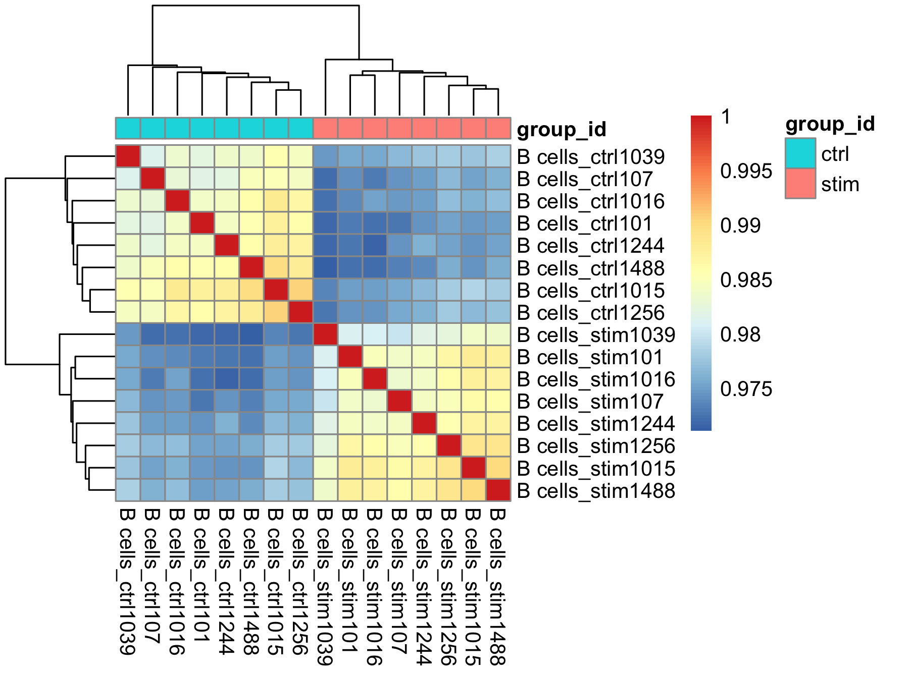
</p>


#### Concluding the sample-level QC

Now that we've plotted our diagnostic plots, we need to decide whether we want to remove any outlier, and/or whether we want to update our design formula to regress out the unwanted effect of a confounding variable.

In this example, neither the PCA nor the hierarchical clustering approach detected a strong outlier. We couldn't investigate sources of variation in very much depth, since we only have access to limited metadata. As we have no sample to remove or variable to regress out, we are ready to proceed with running the differential expression analysis.

>_**NOTE:** In this example dataset, since we have one stimulated and one control sample for each patient, we could add the `patient_id` variable to the design formula to run a paired differential expression analysis, accounting for the fact that stimulated and control samples are paired (see also DESeq2 vignette [here](http://bioconductor.org/packages/devel/bioc/vignettes/DESeq2/inst/doc/DESeq2.html#can-i-use-deseq2-to-analyze-paired-samples)). For simplicity of this tutorial, we will continue with the unpaired design._


### Running DESeq2

Differential expression analysis with DESeq2 involves multiple steps as displayed in the flowchart below in blue. Briefly, DESeq2 will model the **raw counts**, using normalization factors (size factors) to account for differences in library depth. Then, it will estimate the gene-wise dispersions and shrink these estimates to generate more accurate estimates of dispersion to model the counts. Finally, DESeq2 will fit the negative binomial model and perform hypothesis testing using the Wald test or Likelihood Ratio test. All of these steps are explained in detail in our [additional materials](https://hbctraining.github.io/DGE_workshop_salmon_online/schedule/links-to-lessons.html#part-iii-deseq2).

<p align="center">

</p>


All of the steps described above are conveniently performed by running the single `DESeq()` function on the DESeq2 object (`dds`) we created earlier.

```r        
# Run DESeq2 differential expression analysis
dds <- DESeq(dds)
```

We can check the fit of the DESeq2 model to our data by looking at the plot of dispersion estimates. 

```r
# Plot dispersion estimates
plotDispEsts(dds)
```

<p align="center">
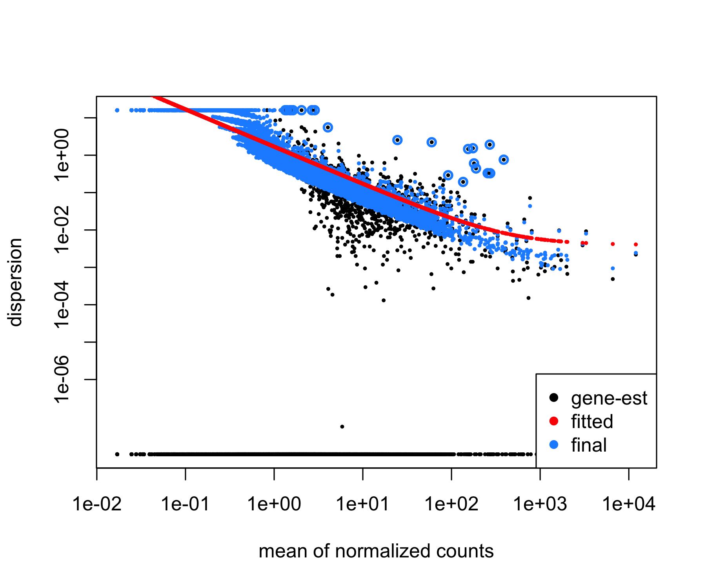
</p>

In this example, the dispersion plot looks encouraging, since we expect our dispersions to decrease with increasing mean and follow the line of best fit (in red).


## Exploring DE results

Now that we have performed the differential expression analysis, we can explore our results for a particular comparison. To denote our comparison of interest, we need to specify the contrasted groups (here, stimulated group relative to control). 

Then, we need to perform shrinkage of the log2 fold changes to correct for the fact that the baseline expression level of a gene affects its estimated fold change (for a given gene, a difference in the average read counts between the 2 contrasted groups of 10 will have a greater impact if the baseline expression level of this gene is 20 than if it is 500; therefore, lowly expressed genes are more likely to show inflated log2 fold change values). Here, we use the apeglm method ([Zhu et al., 2018](https://doi.org/10.1093/bioinformatics/bty895)) for shrinkage estimator calculations. Alternative options for shrinkage estimation and the papers to cite if you use them are further described in the [DESeq2 vignette](http://bioconductor.org/packages/devel/bioc/vignettes/DESeq2/inst/doc/DESeq2.html#altshrink).

```r
# Check the coefficients for the comparison
resultsNames(dds)

# Generate results object
res <- results(dds, 
               name = "group_id_stim_vs_ctrl",
               alpha = 0.05)

# Shrink the log2 fold changes to be more appropriate using the apeglm method - should cite [paper]() when using this method
res <- lfcShrink(dds, 
                 coef = "group_id_stim_vs_ctrl",
                 res=res,
                 type = "apeglm")
```

In this section, we will generate some key data tables and use a different visualization techniques to explore our results, including:

- Table of results for all genes
- Table of results for significant genes (adjusted p-value < 0.05)
- Scatterplot of normalized expression of top 20 most significant genes
- Heatmap of all significant genes
- Volcano plot of results for all genes


### Table of results for all genes

First let's generate the results table for all of our genes, ordered by adjusted p-value, and save it to a CSV table:

```r
# Turn the DESeq2 results object into a tibble for use with tidyverse functions
res_tbl <- res %>%
  data.frame() %>%
  rownames_to_column(var = "gene") %>%
  as_tibble() %>%
  arrange(padj)

# Check results output
res_tbl 

# Write all results to file
write.csv(res_tbl,
          paste0("results/", unique(cluster_metadata$cluster_id), "_", 
                 levels(cluster_metadata$group_id)[2], "_vs_", levels(cluster_metadata$group_id)[1], "_all_genes.csv"),
          quote = FALSE, 
          row.names = FALSE)
```

<p align="center">
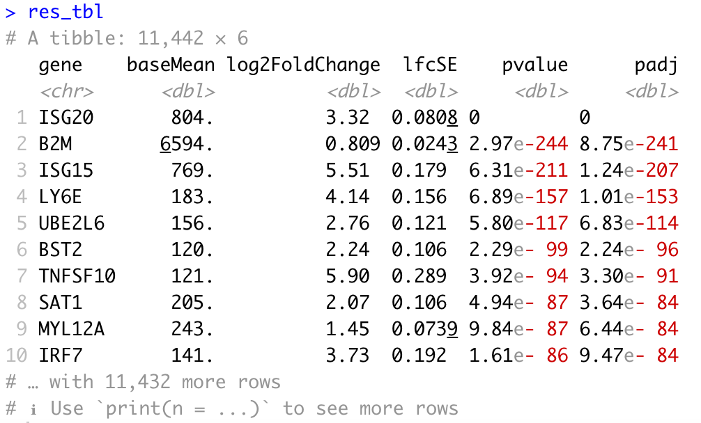
</p>


### Table of results for significant genes

Next, we can filter our table to extract only the significant genes using a p-adjusted threshold of 0.05:

```r
# Set thresholds
padj_cutoff <- 0.05

# Subset the significant results
sig_res <- dplyr::filter(res_tbl, padj < padj_cutoff) %>%
  dplyr::arrange(padj)

# Check significant genes output
sig_res

# Write significant results to file
write.csv(res_tbl,
          paste0("results/", unique(cluster_metadata$cluster_id), "_", 
                 levels(cluster_metadata$group_id)[2], "_vs_", levels(cluster_metadata$group_id)[1], "_signif_genes.csv"),
          quote = FALSE, 
          row.names = FALSE)
```

<p align="center">
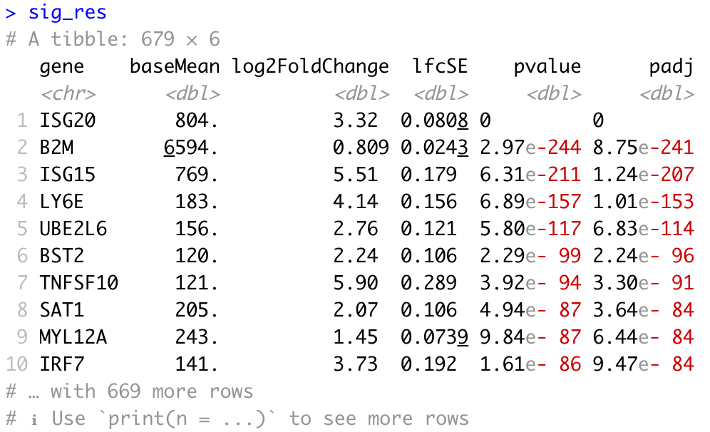
</p>

We may also be interested in determining the total number of significantly upregulated or downregulated genes above a certain fold change threshold (for example log2 fold change (in absolute value) >0.58, which corresponds to a ~50% increase (or ~30% decrease) in gene expression.

```r
# Set thresholds
log2fc_cutoff <- 0.58

# Count significantly up/down genes above threshold
n_sig_up <- dplyr::filter(sig_res, log2FoldChange >= log2fc_cutoff) %>% 
  nrow()
n_sig_dn <- dplyr::filter(sig_res, log2FoldChange <= -log2fc_cutoff) %>% 
  nrow()
```


### Scatterplot of normalized expression of top 20 most significant genes

Now that we have identified the significant genes, we can plot a scatterplot of the top 20 significant genes. This plot is a good check to make sure that we are interpreting our fold change values correctly, as well.

```r
# Scatterplot

## Extract normalized counts from dds object
normalized_counts <- counts(dds, normalized = TRUE)

## Extract top 20 DEG from resLFC (make sure to order by padj)
top20_sig_genes <- sig_res %>%
  dplyr::arrange(padj) %>%
  dplyr::pull(gene) %>%
  head(n = 20)

## Extract matching normalized count values from matrix
top20_sig_counts <- normalized_counts[rownames(normalized_counts) %in% top20_sig_genes, ]
top20_sig_counts

## Convert wide matrix to long data frame for ggplot2
top20_sig_df <- data.frame(top20_sig_counts)
top20_sig_df$gene <- rownames(top20_sig_counts)

top20_sig_df <- melt(setDT(top20_sig_df), 
                     id.vars = c("gene"),
                     variable.name = "cluster_sample_id") %>% 
  data.frame()

## Replace "." by " " in cluster_sample_id variable (melt() introduced the ".")
top20_sig_df$cluster_sample_id <- gsub("\\.", " ", top20_sig_df$cluster_sample_id)
top20_sig_df

## Join counts data frame with metadata
top20_sig_df <- plyr::join(top20_sig_df, as.data.frame(colData(dds)),
                           by = "cluster_sample_id")
top20_sig_df

## Generate plot
ggplot(top20_sig_df, aes(y = value, x = group_id, col = group_id)) +
  geom_jitter(height = 0, width = 0.15) +
  scale_y_continuous(trans = 'log10') +
  ylab("log10 of normalized expression level") +
  xlab("condition") +
  ggtitle("Top 20 Significant DE Genes") +
  theme(plot.title = element_text(hjust = 0.5)) +
  facet_wrap(~ gene)
```

<p align="center">
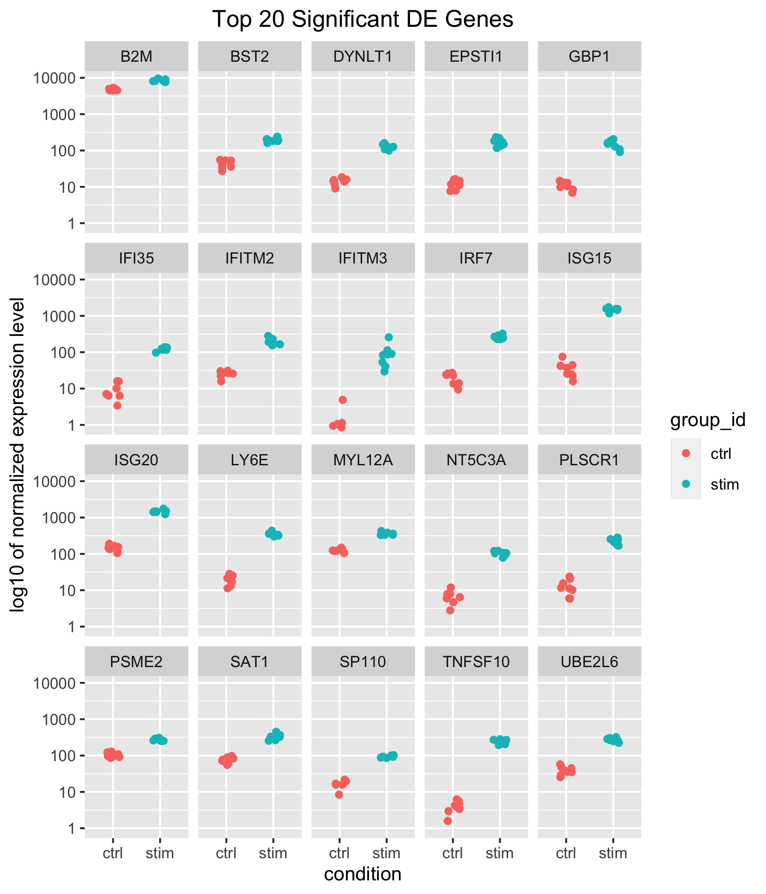
</p>

Our results table above showed positive log2 fold changes for the top 10 significant genes and for the contrast of stimulated versus control samples. Here, we can see that for all top 20 significant genes, counts are higher in stimulated samples.


### Heatmap of all significant genes

We can also explore the clustering of the significant genes using the heatmap.

```r
# Heatmap

## Extract normalized counts for significant genes only
sig_counts <- normalized_counts[rownames(normalized_counts) %in% sig_res$gene, ]

## Set a color-blind friendly palette
heat_colors <- rev(brewer.pal(11, "PuOr"))

## Run pheatmap using the metadata data frame for the annotation
pheatmap(sig_counts, 
         color = heat_colors, 
         cluster_rows = TRUE, 
         show_rownames = FALSE,
         annotation = cluster_metadata[, c("group_id", "cluster_id")], 
         border_color = NA, 
         fontsize = 10, 
         scale = "row", 
         fontsize_row = 10, 
         height = 20)  
```

<p align="center">
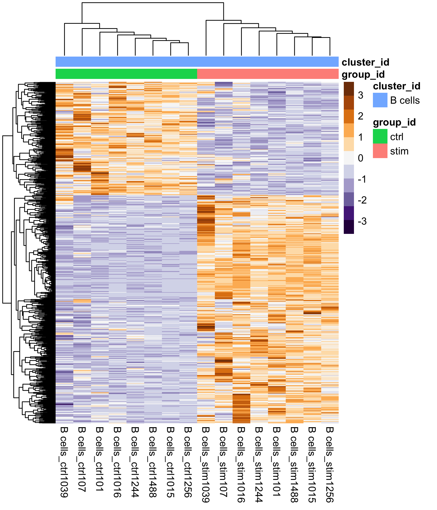
</p>

We see two clear modules of genes emerge, emphasizing the genes that are upregulated in the stimulated samples versus those that are downregulated.


### Volcano plot of results

```r
# Volcano plot
res_table_thres <- res_tbl[!is.na(res_tbl$padj), ] %>% 
  mutate(threshold = padj < padj_cutoff & abs(log2FoldChange) >= log2fc_cutoff)
min(log10(res_table_thres$padj))

## Generate plot
ggplot(res_table_thres) +
  geom_point(aes(x = log2FoldChange, y = -log10(padj), colour = threshold)) +
  ggtitle("Volcano plot of stimulated B cells relative to control") +
  xlab("log2 fold change") +
  xlim(-4.5, 12) +
  ylab("-log10 adjusted p-value") +
  scale_y_continuous(limits = c(0, 250)) +
  scale_color_manual(values = c("grey60", "red3")) +
  theme(legend.position = "none",
        plot.title = element_text(size = rel(1.3), hjust = 0.5),
        axis.title = element_text(size = rel(1.15)))                    
```

<p align="center">
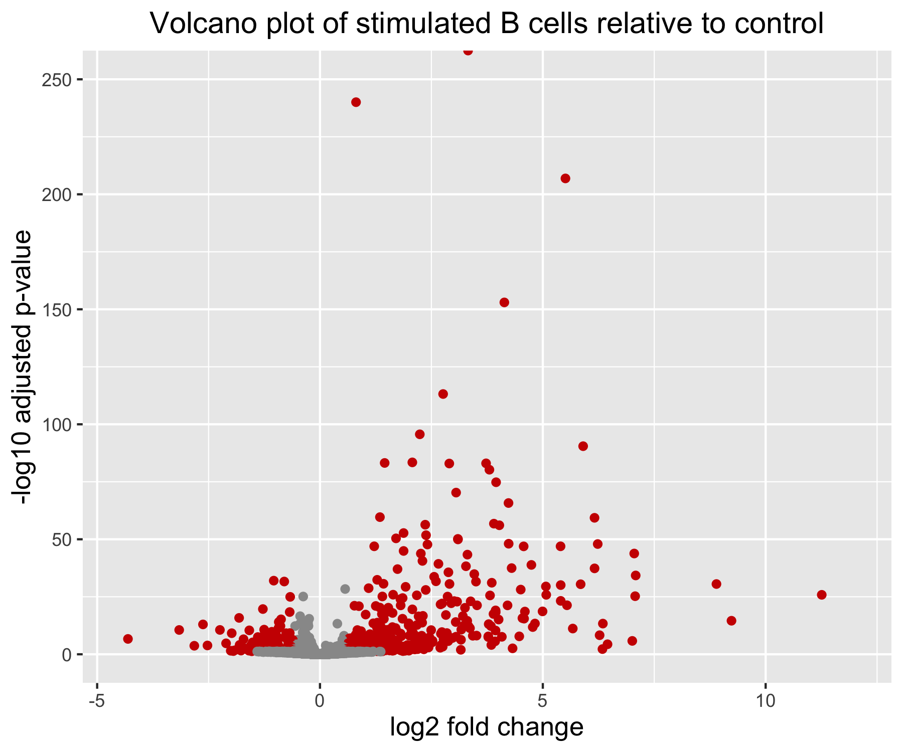
</p>

Note that in this example, one of the gene has an adjusted p-value of 0. On the log10 transformed y-axis, this results in an infinite value; this is why one of our data point appears cut at the top of the plot, no matter how much we increase the range of the y axis.


### Conclusion

We have now finished with the differential expression analysis of our single-cell RNA-seq example cluster. We have generated the differentially expressed genes between our stimulated and control conditions for the B cell population. It can be helpful to create a script to run this analysis on each cell type (cluster) in our dataset. An example script is given below as a starting point.


***

# Useful scripts for running analyses on many different cell type clusters using Wald test for pairwise comparisons or Likelihood Ratio Test for multi-group comparisons


## Script to run pairwise DESeq2 comparisons on all cell types (clusters) - Wald test

The following script will create a function `get_dds_resultsAvsB()` to run the DESeq2 analysis on any cluster to contrast 2 levels of a condition of interest (e.g. stimulated/control, mutant/KO...) using the Wald test. The script will then apply the `get_dds_resultsAvsB()` function to each cluster (as stored in a vector of cluster names), and can be run in a HPC environment for fast and efficient execution and storage of results.

```r
# Create directories to save results if they don't already exist:
if (!dir.exists("DESeq2")) { dir.create("DESeq2") }
if (!dir.exists("DESeq2/pairwise")) { dir.create("DESeq2/pairwise") }
setwd("DESeq2/pairwise/")


# Function to run DESeq2 Wald Test and get results for any cluster:
## clustx is the name of the cluster (cell type) on which to run the function
## A is the sample group to compare (e.g. stimulated condition)
## B is the sample group to compare against (base/control level)
## padj_cutoff defines the ajusted p-value cutoff for significance (set to 0.05 by default)

## This function assumes the counts matrices and metadata for all clusters have been prepared
## and arranged in matching named lists (as illustrated in tutorial above)
## This function assumes the contrast (e.g. stim vs. control) is stored in a variable named "group_id"


get_dds_resultsAvsB <- function(clustx, A, B, padj_cutoff = 0.05) {
  
  print(clustx) # useful for debugging
  
  # Extract counts matrix and metadata for cluster x
  idx <- which(names(counts_ls) == clustx)
  cluster_counts <- counts_ls[[idx]]
  cluster_metadata <- metadata_ls[[idx]]
  
  # Print error message if sample names do not match
  if ( all(colnames(cluster_counts) != rownames(cluster_metadata)) ) {
    print("ERROR: sample names in counts matrix columns and metadata rows do not match!")
  }
  
  dds <- DESeqDataSetFromMatrix(cluster_counts, 
                                colData = cluster_metadata, 
                                design = ~ group_id)
  
  # Transform counts for data visualization
  rld <- rlog(dds, blind = TRUE)
  
  
  # Generate QC plots
  
  ## Plot and save PCA plot
  DESeq2::plotPCA(rld, intgroup = "group_id")
  if (!dir.exists("results")) { dir.create("results") }
  ggsave(paste0("results/", clustx, "_specific_PCAplot.png"))
  
  ## Extract rlog matrix from the object and compute pairwise correlation values
  rld_mat <- assay(rld)
  rld_cor <- cor(rld_mat)
  
  ## Plot and save heatmap
  png(paste0("results/", clustx, "_specific_heatmap.png"),
      height = 6, width = 7.5, units = "in", res = 300)
    pheatmap(rld_cor, annotation = cluster_metadata[, c("group_id"), drop = FALSE])
  dev.off()
  
  
  # Run DESeq2 differential expression analysis
  dds <- DESeq(dds)
  
  ## Plot dispersion estimates
  png(paste0("results/", clustx, "_dispersion_plot.png"),
      height = 5, width = 6, units = "in", res = 300)
    plotDispEsts(dds)
  dev.off()
  
  ## Output and shrink results of Wald test for contrast A vs B
  contrast <- paste(c("group_id", A, "vs", B), collapse = "_")
  # resultsNames(dds)
  
  res <- results(dds, name = contrast, alpha = 0.05)
  res <- lfcShrink(dds, coef = contrast, res = res)
  
  ## Turn the results object into a tibble for use with tidyverse functions
  res_tbl <- res %>%
    data.frame() %>%
    rownames_to_column(var = "gene") %>%
    as_tibble()
  
  write.csv(res_tbl,
            paste0("results/", clustx, "_", contrast, "_all_genes.csv"),
            quote = FALSE, 
            row.names = FALSE)
  
  ## Subset the significant results
  sig_res <- dplyr::filter(res_tbl, padj < padj_cutoff) %>%
    dplyr::arrange(padj)
  
  write.csv(sig_res,
            paste0("results/", clustx, "_", contrast, "_signif_genes.csv"),
            quote = FALSE, 
            row.names = FALSE)
  
  
  # Generate results visualization plots
  
  ## Extract normalized counts from dds object
  normalized_counts <- counts(dds, normalized = TRUE)
  
  ## Extract top 20 DEG from resLFC (make sure to order by padj)
  top20_sig_genes <- sig_res %>%
    dplyr::arrange(padj) %>%
    dplyr::pull(gene) %>%
    head(n = 20)
  
  ## Extract matching normalized count values from matrix
  top20_sig_counts <- normalized_counts[rownames(normalized_counts) %in% top20_sig_genes, ]
  
  ## Convert wide matrix to long data frame for ggplot2
  top20_sig_df <- data.frame(top20_sig_counts)
  top20_sig_df$gene <- rownames(top20_sig_counts)
  
  top20_sig_df <- melt(setDT(top20_sig_df), 
                       id.vars = c("gene"),
                       variable.name = "cluster_sample_id") %>% 
    data.frame()
  
  ## Replace "." by " " in cluster_sample_id variable (melt() introduced the ".")
  top20_sig_df$cluster_sample_id <- gsub("\\.", " ", top20_sig_df$cluster_sample_id)
  top20_sig_df$cluster_sample_id <- gsub("\\  ", "+ ", top20_sig_df$cluster_sample_id)
  
  ## Join counts data frame with metadata
  top20_sig_df <- plyr::join(top20_sig_df, as.data.frame(colData(dds)),
                             by = "cluster_sample_id")
  
  ## Generate plot
  ggplot(top20_sig_df, aes(y = value, x = group_id, col = group_id)) +
    geom_jitter(height = 0, width = 0.15) +
    scale_y_continuous(trans = 'log10') +
    ylab("log10 of normalized expression level") +
    xlab("condition") +
    ggtitle("Top 20 Significant DE Genes") +
    theme(plot.title = element_text(hjust = 0.5)) +
    facet_wrap(~ gene)
  
  ggsave(paste0("results/", clustx, "_", contrast, "_top20_DE_genes.png"))
  
}

# Run the script on all clusters comparing stimulated condition relative to control condition
map(cluster_names, get_dds_resultsAvsB, A = "stim", B = "ctrl")
```

## Script to run DESeq2 on all cell types (clusters) and all levels of a condition - Likelihood Ratio Test

The following script will run the DESeq2 Likelihood Ratio Test (LRT) on all cell types (clusters). This approach may be particularly relevant to contrast >2 groups (e.g. stimulation condition A, B and control; genotypes A, B and WT...) in one single differential expression analysis. The DESeq2 vignette contains more information about running this type of comparison [here](http://bioconductor.org/packages/devel/bioc/vignettes/DESeq2/inst/doc/DESeq2.html#likelihood-ratio-test). 

This script can be run in a HPC environment for fast and efficient execution and storage of results.

```r
# Create directories to save results if they don't already exist:
if (!dir.exists("DESeq2")) { dir.create("DESeq2") }
if (!dir.exists("DESeq2/lrt")) { dir.create("DESeq2/lrt") }
setwd("DESeq2/lrt/")

# Load DEGreport
library(DEGreport)


# Function to run DESeq2 LRT and get results for any cluster:
## clustx is the name of the cluster (cell type) on which to run the function

## This function assumes the counts matrices and metadata for all clusters have been prepared
## and arranged in matching named lists (as illustrated in tutorial above)
## This function assumes the contrasted groups (e.g. stim A, stim B, control...) are stored in a variable named "group_id"


get_dds_LRTresults <- function(clustx){
  
  print(clustx) # useful for debugging
  
  # Extract counts matrix and metadata for cluster x
  idx <- which(names(counts_ls) == clustx)
  cluster_counts <- counts_ls[[idx]]
  cluster_metadata <- metadata_ls[[idx]]
  
  # Print error message if sample names do not match
  if ( all(colnames(cluster_counts) != rownames(cluster_metadata)) ) {
    print("ERROR: sample names in counts matrix columns and metadata rows do not match!")
  }
  
  # Run DESeq2
  dds <- DESeqDataSetFromMatrix(cluster_counts, 
                                colData = cluster_metadata, 
                                design = ~ group_id)
  dds_lrt <- DESeq(dds, test = "LRT", reduced = ~ 1)
  
  # Extract results
  res_LRT <- results(dds_lrt)
  
  # Create a tibble for LRT results
  res_LRT_tb <- res_LRT %>%
    data.frame() %>%
    rownames_to_column(var = "gene") %>% 
    as_tibble()
  
  # Save all results
  if (!dir.exists("results")) { dir.create("results") }
  write.csv(res_LRT_tb,
            paste0("results/", clustx, "_LRT_all_genes.csv"),
            quote = FALSE, 
            row.names = FALSE)
  
  # Subset to return genes with padj < 0.05
  sigLRT_genes <- res_LRT_tb %>% 
    filter(padj < 0.05)
  
  # Save significant results
  write.csv(sigLRT_genes,
            paste0("results/", clustx, "_LRT_signif_genes.csv"),
            quote = FALSE, 
            row.names = FALSE)
  
  # Transform counts for data visualization
  rld <- rlog(dds_lrt, blind = TRUE)
  
  # Extract the rlog matrix from the object and compute pairwise correlation values
  rld_mat <- assay(rld)
  rld_cor <- cor(rld_mat)
  
  # Obtain rlog values for those significant genes
  cluster_rlog <- rld_mat[sigLRT_genes$gene, ]
  cluster_meta_sig <- cluster_metadata[which(rownames(cluster_metadata) %in% colnames(cluster_rlog)), ]
  
  # Use the `degPatterns` function from DEGreport package to show gene clusters across sample groups
  cluster_groups <- degPatterns(cluster_rlog, metadata = cluster_meta_sig,
                                time = "group_id", col = NULL)
  ggsave(paste0("results/", clustx, "_LRT_DEgene_groups.png"))
  
  # Save what is stored in the `df` component
  write.csv(cluster_groups$df,
            paste0("results/", clustx, "_LRT_DEgene_groups.csv"),
            quote = FALSE, 
            row.names = FALSE)
  
  saveRDS(cluster_groups, paste0("results/", clustx, "_LRT_DEgene_groups.rds"))
  save(dds_lrt, cluster_groups, res_LRT, sigLRT_genes, 
       file = paste0("results/", clustx, "_all_LRTresults.Rdata"))
  
}

map(cluster_names, get_dds_LRTresults)
```

