---
title: "Seurat Cheatsheet"
author: "Noor Sohail"
date: Thursday, June 25th 2024
---


## Learning Objectives:

This cheatsheet is meant to provide a summary and examples of the functions available in Seurat. This includes how to access certain pieces of information, handy tips, and visualization functions built into the package. We have pulled together all of this information with examples using the dataset used throughout this workshop so that there are clear visuals on what the output of each function is.

These materials were developed by referencing the following pages from the Seurat website:

- https://satijalab.org/seurat/articles/essential_commands.html
- https://satijalab.org/seurat/articles/visualization_vignette.html


# Dataset

Load in the `integrated_seurat` object that is available in the [data](https://www.dropbox.com/s/vop78wq76h02a2f/single_cell_rnaseq.zip?dl=1) folder provided for the workshow.

```r
library(Seurat)
library(tidyverse)

load(bzfile("data/additional_data/seurat_integrated.RData.bz2"))
seurat_integrated
```

```
## An object of class Seurat 
## 31130 features across 29629 samples within 3 assays 
## Active assay: integrated (3000 features, 3000 variable features)
##  2 layers present: data, scale.data
##  2 other assays present: RNA, SCT
##  2 dimensional reductions calculated: pca, umap
```

# Accessing cell barcodes and gene names

## Cell barcodes

Within Seurat, there are multiple ways to access the cell barcode IDs.

Therefore we can use `colnames()` to get a vector of cell barcodes in the same order as they appear in the seurat object.

```r
colnames(seurat_integrated) %>% head()
```

```
## [1] "ctrl_AAACATACAATGCC-1" "ctrl_AAACATACATTTCC-1" "ctrl_AAACATACCAGAAA-1"
## [4] "ctrl_AAACATACCAGCTA-1" "ctrl_AAACATACCATGCA-1" "ctrl_AAACATACCTCGCT-1"
```

Similarly we can call the `Cells()` function to all get all the cell barcodes.

```r
Cells(seurat_integrated) %>% head()
```

```
## [1] "ctrl_AAACATACAATGCC-1" "ctrl_AAACATACATTTCC-1" "ctrl_AAACATACCAGAAA-1"
## [4] "ctrl_AAACATACCAGCTA-1" "ctrl_AAACATACCATGCA-1" "ctrl_AAACATACCTCGCT-1"
```

It is **very important** that the values stored in `Cells()` is the same as the rownames in `meta.data` or Seurat will start throwing errors at you!

```r
all(rownames(seurat_integrated@meta.data) == Cells(seurat_integrated))
```

```
## [1] TRUE
```

## Features/genes

Now we want to be able to access the rows, or genes, in our Seurat object. Rather than calling these values "genes", many tools will call them "features" as different assays (CITE-seq, ATAC-seq) provide alternative information than genes as output.

The `Features()` function returns a vector of all features/genes in our dataset in the same order as it appears in the Seurat object.

```r
Features(seurat_integrated) %>% head()
```

```
## [1] "FTL"   "IGKC"  "CCL2"  "GNLY"  "IGLC2" "CCL3"
```

The `rownames()` function provides the same output.

```r
rownames(seurat_integrated) %>% head()
```

```
## [1] "FTL"   "IGKC"  "CCL2"  "GNLY"  "IGLC2" "CCL3"
```

## Number of cells and features

If you recall, Seurat stores your count matrix as cells (columns) x genes (rows). 

Therefore, we can access the number of cells by using the `ncol()` function.

```r
ncol(seurat_integrated)
```

```
## [1] 29629
```

Similarly, we get the number of features with the `nrow()` function.

```r
nrow(seurat_integrated)
```

```
## [1] 3000
```

The `dim()` function provides both the number of cells and genes for the **default assay**. Here we see the number of features followed by the number of cells.

```r
dim(seurat_integrated)
```

```
## [1]  3000 29629
```

# Idents

In Seurat, each cell has a label which can be accessed using `Idents()`. These are the default labels used for each cell and are used internally by Seurat plotting functions.

Common information set as the identity for cells include: clusters (as in our example dataset), celltype, sample, etc. You'll notice that identities are automatically stored as factors, which means we can re-organize the levels at any point to change their order for plotting purposes.

```r
Idents(seurat_integrated) %>% head()
```

```
## ctrl_AAACATACAATGCC-1 ctrl_AAACATACATTTCC-1 ctrl_AAACATACCAGAAA-1 
##                     2                     1                     3 
## ctrl_AAACATACCAGCTA-1 ctrl_AAACATACCATGCA-1 ctrl_AAACATACCTCGCT-1 
##                     3                     4                     1 
## Levels: 0 1 2 3 4 5 6 7 8 9 10 11 12 13 14 15 16
```

## Rename Idents

To quickly make modifications to identities, you can use the `RenameIdents()` function where new values are mapped to the identities. This is particularly helpful when annotating your cells from clusters to celltypes as showcased here. Bear in mind that these new identities are not stored in the `meta.data` automatically. We recommend adding these identities as a new column in the Seurat object to keep track of it for future use.

```r
# Rename all identities
seurat_integrated <- RenameIdents(object = seurat_integrated, 
                                 "0" = "Naive or memory CD4+ T cells",
                                 "1" = "CD14+ monocytes",
                                 "2" = "Activated T cells",
                                 "3" = "CD14+ monocytes",
                                 "4" = "Stressed cells / Unknown",
                                 "5" = "CD8+ T cells",
                                 "6" = "Naive or memory CD4+ T cells",
                                 "7" = "B cells",
                                 "8" = "NK cells",
                                 "9" = "CD8+ T cells",
                                 "10" = "FCGR3A+ monocytes",
                                 "11" = "B cells",
                                 "12" = "NK cells",
                                 "13" = "B cells",
                                 "14" = "Conventional dendritic cells",
                                 "15" = "Megakaryocytes",
			                        "16" = "Plasmacytoid dendritic cells")

# These new celltype values are only stored in the idents
# So good practice is to store these changes in a column
seurat_integrated$celltype <- Idents(seurat_integrated)
```


# Highly variable features

## Accessing variable features

To get a vector of all highly variable genes that were selected after running `FindVariableFeatures()`, we can use the `VariableFeatures()` function.

```r
VariableFeatures(seurat_integrated) %>% head()
```

```
## [1] "FTL"   "IGKC"  "CCL2"  "GNLY"  "IGLC2" "CCL3"
```

## Setting variable features

Using the same `VariableFeatures()` function, we can set our own custom set of genes as our highly variable genes.

For example, maybe you want to omit mitochondrial genes from your list of variable genes.

```r
# Get list of all variable genes
# Remove variable genes that start with MT-
var_genes <- VariableFeatures(seurat_integrated)
var_genes <- var_genes[!startsWith(var_genes, "MT-")]

# Now we set our vector of gene names back to VariableFeatures()
VariableFeatures(seurat_integrated) <- var_genes
```


# Assays and layers

## Assays

Within a seurat object you can have multiple "assays". Each assay contains its own count matrix that is separate from the other assays in the object. This structure was created with multimodal datasets in mind so we can store, for example, ATAC peaks within the same seurat object as your RNA counts.

SCTransform also makes use of these assays to store the SCT normalized matrix in a separate assay called "SCT".

To access the list off assays in your seurat object, you can call `@assays`.

```r
seurat_integrated@assays
```

```
## $RNA
## Assay data with 14065 features for 29629 cells
## First 10 features:
##  AL627309.1, AL669831.5, LINC00115, FAM41C, NOC2L, KLHL17, PLEKHN1,
## HES4, ISG15, AGRN 
## 
## $SCT
## SCTAssay data with 14065 features for 29629 cells, and 2 SCTModel(s) 
## First 10 features:
##  AL627309.1, AL669831.5, LINC00115, FAM41C, NOC2L, KLHL17, PLEKHN1,
## HES4, ISG15, AGRN 
## 
## $integrated
## SCTAssay data with 3000 features for 29629 cells, and 1 SCTModel(s) 
## Top 10 variable features:
##  FTL, IGKC, CCL2, GNLY, IGLC2, CCL3, CCL4, CXCL10, CCL7, TIMP1
```

We can additionally see which of the assays in our dataset is set as the default with the `DefaultAssays()` function. This is helpful information to know which counts matrix is being accessed when we use other seurat functions by default.

```r
DefaultAssay(seurat_integrated)
```

```
## [1] "integrated"
```

Here we can see that the default assay is set to "integrated". If we instead wanted to primarily use the RNA counts, we can set a new default by once again calling the `DefaultAssay()` function.

```r
# Set new default assay
DefaultAssay(seurat_integrated) <- "RNA"

# Print out the new default to see if it changed
DefaultAssay(seurat_integrated)
```

```
## [1] "RNA"
```

We can access each assay as if the seurat object was a named list with double brackets:

```r
seurat_integrated[["SCT"]]
```

```
## SCTAssay data with 14065 features for 29629 cells, and 2 SCTModel(s) 
## First 10 features:
##  AL627309.1, AL669831.5, LINC00115, FAM41C, NOC2L, KLHL17, PLEKHN1,
## HES4, ISG15, AGRN
```

And similarly run any function on it:

```r
dim(seurat_integrated[["integrated"]])
```

```
## [1]  3000 29629
```

## Layers

Layers are different counts matrices that you can access within each assay (prior to Seurat version 5, this feature was known as "slots").

Following the standard seurat workflow should give you the following matrices:

- counts (raw counts matrix)
- data (normalized count matrix (generated after `SCTransform()` or `NormalizeData()`))
- scaled.data (output from the `ScaleData()`)

We can see which layers are accessible with the `Layers()` function.

```r
Layers(seurat_integrated[["RNA"]])
```

```
## [1] "counts" "data"
```

In this object we can see that we do not have the scaled.data layer currently. So if we run `ScaleData()` we will be able to access this layer/matrix.

```r
seurat_integrated <- ScaleData(seurat_integrated)
Layers(seurat_integrated)
```

```
## Centering and scaling data matrix

## [1] "counts"     "data"       "scale.data"
```

## Accessing full count matrix

You can grab the entire counts matrix by making use of the `LayerData()` function.

```r
# Subsetting to the first 5 genes and cells to easy viewing
LayerData(seurat_integrated, assay="RNA", layer="counts")[1:5, 1:5]
```

```
## 5 x 5 sparse Matrix of class "dgCMatrix"
##            ctrl_AAACATACAATGCC-1 ctrl_AAACATACATTTCC-1 ctrl_AAACATACCAGAAA-1
## AL627309.1                     .                     .                     .
## AL669831.5                     .                     .                     .
## LINC00115                      .                     .                     .
## FAM41C                         .                     .                     .
## NOC2L                          .                     .                     .
##            ctrl_AAACATACCAGCTA-1 ctrl_AAACATACCATGCA-1
## AL627309.1                     .                     .
## AL669831.5                     .                     .
## LINC00115                      .                     .
## FAM41C                         .                     .
## NOC2L                          .                     .
```

## Accessing specific features and metadata

The `FetchData()` function is useful to directly accessing the count for a particular feature of each cell in your object or a single metadata column. You can also specify the layer and assay to specify which piece of information you want.

```r
# Normalized counts for the gene PTPRC in the assay SCT
FetchData(seurat_integrated, vars=c("PTPRC", "sample"), assay="SCT", layer="data") %>% head()
```

```
##                          PTPRC sample
## ctrl_AAACATACAATGCC-1 2.254699   ctrl
## ctrl_AAACATACATTTCC-1 1.435328   ctrl
## ctrl_AAACATACCAGAAA-1 1.584935   ctrl
## ctrl_AAACATACCAGCTA-1 1.403025   ctrl
## ctrl_AAACATACCATGCA-1 2.667563   ctrl
## ctrl_AAACATACCTCGCT-1 0.000000   ctrl
```

Conveniently, you can also get information from multiple assays at the same time. To do so, you prepend the assay name (in lowercase format) for the feature you supply to the `FetchData()` function.

```r
# Grab the normalized counts in the integrated and RNA assays
FetchData(seurat_integrated, vars=c("rna_PTPRC", "integrated_PTPRC"), layer="data") %>% head()
```

```
##                       rna_PTPRC integrated_PTPRC
## ctrl_AAACATACAATGCC-1  2.254699        0.4585611
## ctrl_AAACATACATTTCC-1  1.435328       -0.3528445
## ctrl_AAACATACCAGAAA-1  1.584935       -0.1980966
## ctrl_AAACATACCAGCTA-1  1.403025       -0.3175056
## ctrl_AAACATACCATGCA-1  2.667563        0.7853486
## ctrl_AAACATACCTCGCT-1  0.000000       -0.8399404
```

# Accessing dimensional reductions

## PCA

The scores for each PC is stored within the embeddings slot of the seurat object. These can be accessed by uisng the `Embeddings()` function.

```r
# Alternative method of accessing PCA values
# seurat_integrated[['pca']]@cell.embeddings

Embeddings(seurat_integrated, reduction="pca")[1:5, 1:5]
```

```
##                              PC_1      PC_2      PC_3       PC_4        PC_5
## ctrl_AAACATACAATGCC-1 -14.9778236 -2.879193 -5.059351  -1.602766   0.8728779
## ctrl_AAACATACATTTCC-1  22.3923271 -5.296913  4.951958   3.112632   0.3379874
## ctrl_AAACATACCAGAAA-1  28.9847264  1.203408 -5.947993  -1.042701  -7.5690434
## ctrl_AAACATACCAGCTA-1  20.1284164  2.826128 -5.265061  -3.620790 -11.3740400
## ctrl_AAACATACCATGCA-1  -0.4713399  1.122713  5.195209 -23.884004  -2.2996247
```

The weight (loadings) for each feature is also stored and can be accessed with `Loadings()` function.

```r
# pbmc[['pca]]@feature.loadings
Loadings(seurat_integrated, reduction="pca")[1:5, 1:5]
```

```
##               PC_1         PC_2        PC_3        PC_4        PC_5
## FTL    0.424580221 -0.029245940 -0.07877921 -0.01084091 -0.17392237
## IGKC  -0.022397858 -0.113342789  0.24606406  0.09924655 -0.08598287
## CCL2   0.138755172  0.002935082 -0.07471508 -0.02671091 -0.25223145
## GNLY  -0.017962104  0.357256939  0.07523939  0.10126832 -0.05577892
## IGLC2 -0.007534059 -0.037760970  0.07610433  0.03463625 -0.02070632
```

We can also view more information about the top PCs, like the genes that are most strongly correlated with the first few PCs with the `ProjectDim()` function.

```r
ProjectDim(seurat_integrated, reduction = "pca")
```

```
## PC_ 1 
## Positive:  FTL, TIMP1, FTH1, C15orf48, CXCL8, CCL2, S100A8, FCER1G, TYROBP, S100A4 
##     CD63, LGALS3, LYZ, S100A9, ACTB, LGALS1, ANXA5, HLA-DRA, SOD2, S100A11 
## Negative:  RPL3, RPL13, RPS6, RPS18, RPL10, RPL21, RPL13A, RPS2, RPS4X, RPS3 
##     RPS14, RPL32, RPL7, PABPC1, RPS19, RPL34, TRAC, RPS3A, RPS27A, TRBC1 
## PC_ 2 
## Positive:  GNLY, CCL5, NKG7, GZMB, FGFBP2, CST7, APOBEC3G, GZMH, KLRD1, CLIC3 
##     PRF1, GZMA, CTSW, CHST12, HOPX, HLA-A, CCL4, RARRES3, HLA-B, AOAH 
## Negative:  CD74, IGHM, IGKC, HLA-DRA, CD79A, CCR7, RPL13, HLA-DRB1, EEF1A1, RPS18 
##     RPS6, RPL10, RPL32, PABPC1, RPL18A, RPS2, LTB, HLA-DQA1, HLA-DQB1, RPL13A 
## PC_ 3 
## Positive:  CD74, IGKC, HLA-DRA, IGHM, HLA-DRB1, HLA-DQA1, HLA-DPA1, CD79A, HLA-DPB1, HLA-DQB1 
##     CD83, HERPUD1, MS4A1, ID3, HLA-DMA, IGLC2, GNLY, HSP90AB1, CD79B, GZMB 
## Negative:  TRAC, FTL, CCL2, PABPC1, S100A8, TRBC1, CD3D, GIMAP7, RPS18, RPS14 
##     RPL3, RPL13, S100A9, FTH1, RPL34, RPL10, RPS4X, LTB, SARAF, RPL21 
## PC_ 4 
## Positive:  CD74, IGHM, CCL5, GNLY, IGKC, NKG7, HLA-DRA, GZMB, RPL3, CD79A 
##     HLA-DPB1, RPL10, RPS2, HLA-DPA1, HLA-DRB1, RPS4X, RPL13, EEF1A1, RPS18, RPS19 
## Negative:  HSPB1, CACYBP, HSPH1, HSP90AB1, HSPA8, SRSF7, SRSF2, UBC, HSPA1A, UBB 
##     YPEL5, H3F3B, DNAJB6, GADD45B, HSPE1, EIF1, DDIT4, RSRC2, ZFAND2A, DNAJB1 
## PC_ 5 
## Positive:  VMO1, FCGR3A, MS4A7, TIMP1, TNFSF10, CXCL10, CALHM6, CXCL16, MS4A4A, LST1 
##     JPT1, AIF1, IFITM3, GBP1, SAT1, ATP1B3, GBP5, TNFSF13B, FGL2, PLAC8 
## Negative:  CCL2, FTL, CXCL8, S100A8, S100A9, CCL7, CXCL3, IGKC, IGHM, CTSL 
##     CD63, CXCL2, LGALS3, PLA2G7, CSTB, IL1B, CXCL1, SERPINB2, CTSB, GNLY
```

## UMAP/tSNE

To access the coordinates used for UMAP/tSNE plots, we specify the reduction of interest in the `Embeddings()` function. 

```r
# seurat_integrated[['umap']]@cell.embeddings
Embeddings(seurat_integrated, reduction="umap") %>% head()
```

```
##                           UMAP_1     UMAP_2
## ctrl_AAACATACAATGCC-1   7.270473  0.9072988
## ctrl_AAACATACATTTCC-1  -8.742020  1.5622634
## ctrl_AAACATACCAGAAA-1 -10.032904  4.7139827
## ctrl_AAACATACCAGCTA-1  -8.363044  5.0377137
## ctrl_AAACATACCATGCA-1   6.875784 -4.6442526
## ctrl_AAACATACCTCGCT-1  -9.338899  2.2808882
```


# Data visualization

Underneath the hood, all of Seurat's plotting functions make use of ggplot which means that we can add more details to our plots using ggplot functions.

## DimPlot

The `DimPlot()` function allows us to visualize metadata that is categorical on different reductions (PCA, UMAP). 

By default `DimPlot()` will color cells by the `Idents()` and use UMAP as the default reduction.

```r
DimPlot(seurat_integrated) + ggtitle("Seurat clusters")
```

<p align="center">
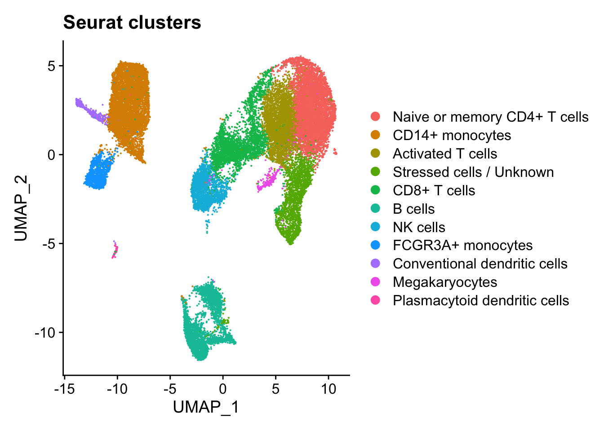
</p>

We can specify a different metadata column using the `group.by` argument

```r
DimPlot(seurat_integrated, group.by = "sample")
```

<p align="center">
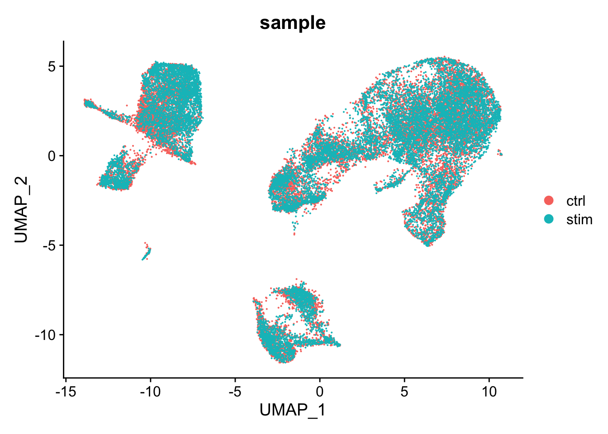
</p>

We can also use the `split.by` argument to create multiple plots that only show cells that have the same value for the metadata column specified.

```r
DimPlot(seurat_integrated, split.by = "sample", group.by="Phase")
```

<p align="center">
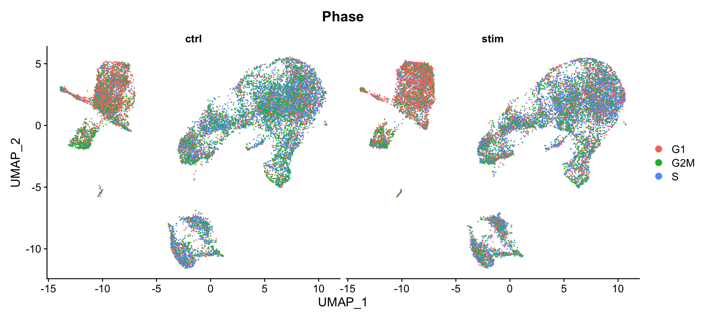
</p>

## FeaturePlot

The `DimPlot()` function allows us to visualize both metadata and features that are continuous on different reductions (PCA, UMAP). 

```r
FeaturePlot(seurat_integrated, features = c("FCGR3A", "MS4A7"))
```

<p align="center">
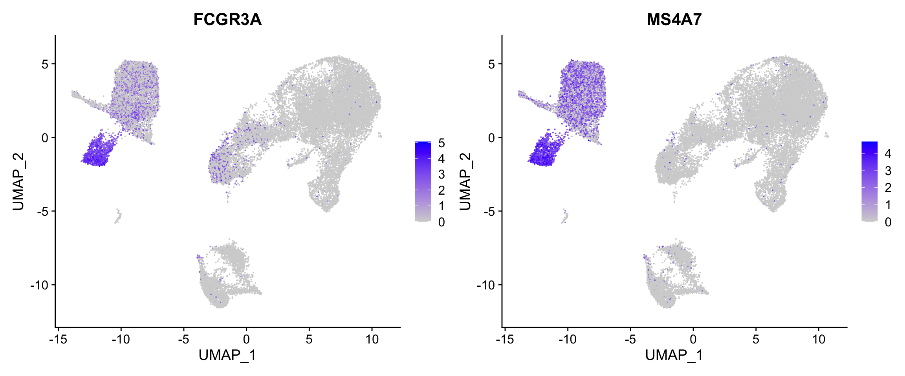
</p>

We can additionally `order` the values in a way that cells with higher values are shown in front (to avoid other cells drowning out the).

To identify cells that show the highest expression of a feature, we can set a `min.cutoff` based upon quantiles, where cells below the the threshold will show no expression. 

```r
FeaturePlot(seurat_integrated, 
            reduction = "umap", 
            features = c("FCGR3A", "MS4A7"), 
            order = TRUE,
            min.cutoff = 'q10')
```

<p align="center">
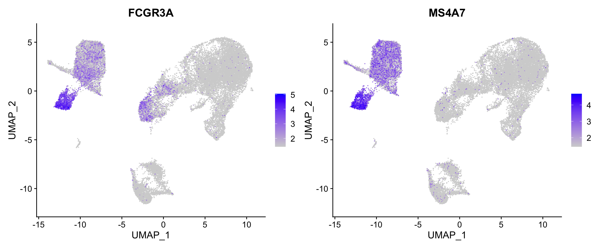
</p>

We can also add labels onto our UMAP to easily identify which groups of cells we are seeing the expression using the `LabelClusters()` function. The parameters show here put a white background behind the text to make it easier to see the labels.

```r
Idents(seurat_integrated) <- "integrated_snn_res.0.8"
p <- FeaturePlot(seurat_integrated, 
            reduction = "umap", 
            features = "FCGR3A", 
            order = TRUE,
            min.cutoff = 'q10')
LabelClusters(p, id = "ident",  fontface = "bold", size = 3, bg.colour = "white", bg.r = .2, force = 0)
```

<p align="center">
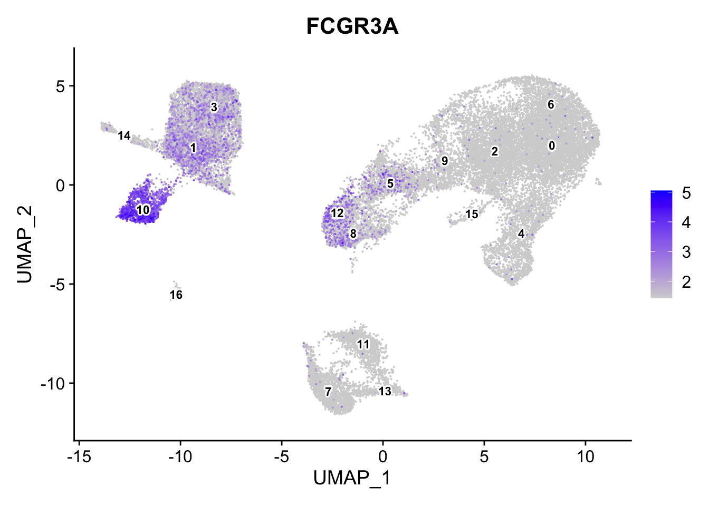
</p>

## FeatureScatter

`FeatureScatter()` creates a scatterplot of expression values for two features with each cell being colored by the ident. Bear in mind that you can also specify a continuous metadata column and not just 2 genes/features. 

```r
Idents(seurat_integrated) <- "celltype"
FeatureScatter(seurat_integrated, feature1 = "MT-ND5", feature2 = "mitoRatio") + ggtitle("MitoRatio vs MT-ND5 expression")
```

<p align="center">
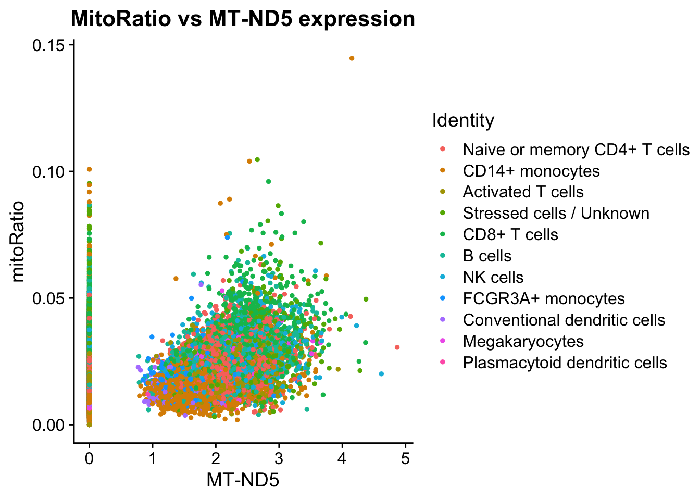
</p>

## CellScatter

To visualize the differences between two specific cells, you can use the `CellScatter()` function to get a scatterplot of values for each feature in both cells.

```r
cell1 <- Cells(seurat_integrated)[1] 
cell2 <- Cells(seurat_integrated)[2]

# Here we can see th emetadata for the first two cells in teh dataset
# We are comparing "Activated T cell" vs "CD14+ monocytes" (so they should be very different)
seurat_integrated@meta.data %>% subset(cells %in% c(cell1, cell2)) %>% select(sample, celltype)
```

```r
CellScatter(seurat_integrated, cell1=cell1, cell2=cell2)
```

<p align="center">
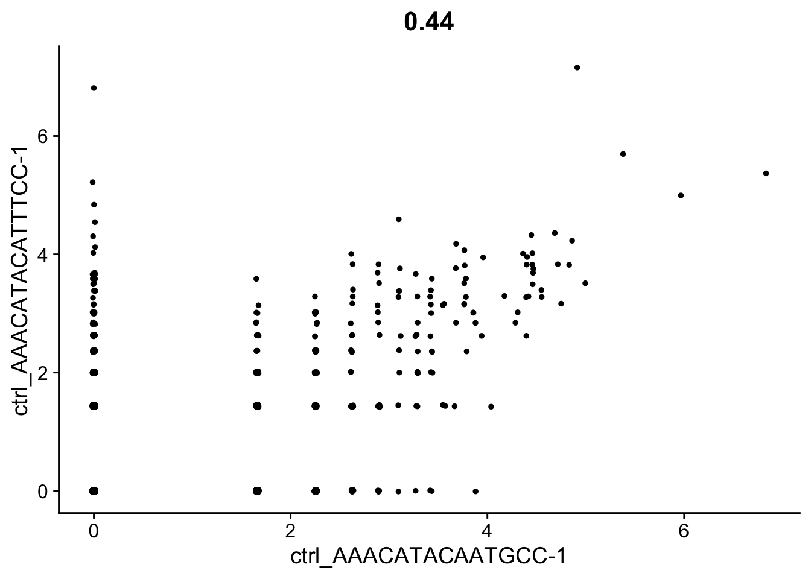
</p>

## VlnPlot

We can create violin plot to compare the distribution of gene expression across different populations using the `VlnPlot()` function.

This is a very customizable function, with many parameters to customize the look of the plots.

```r
VlnPlot(seurat_integrated, c("CD14", "CD79A"))
```

<p align="center">
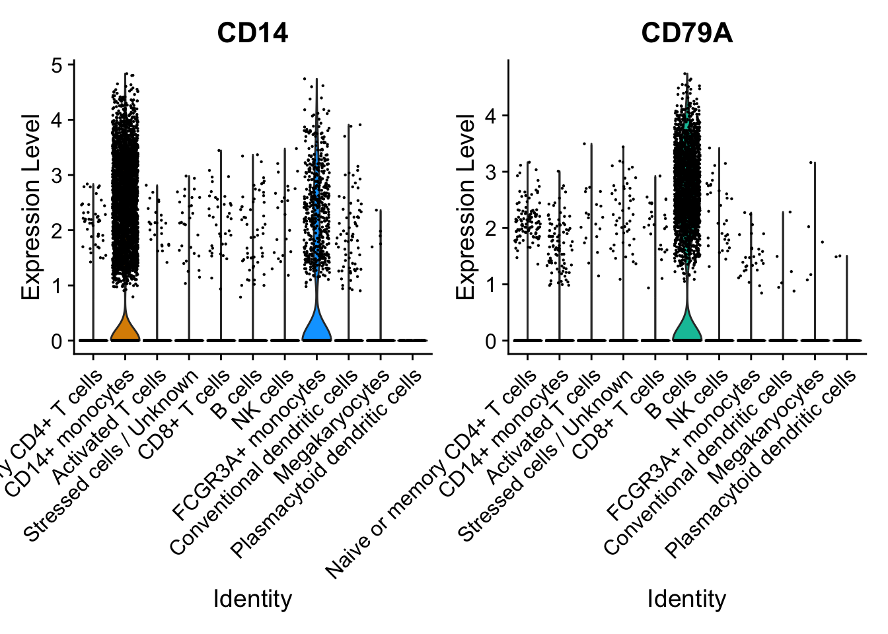
</p>

In this example, I am grouping expression by sample, showing 2 plots per column, and removing the points (cells) by setting their size to 0.

```r
VlnPlot(seurat_integrated, c("IFIT1", "CD53", "CD52", "CXCL8"), group.by="sample", ncol=2, pt.size=0)
```

<p align="center">
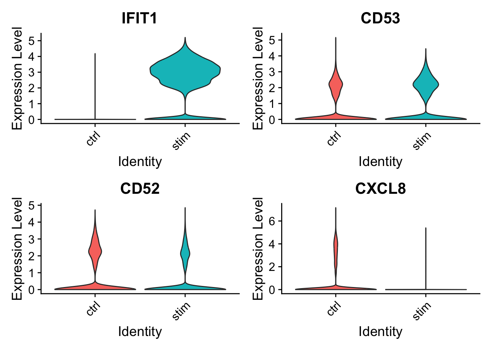
</p>

## RidgePlot

Ridge plots are most commonly used with CITE-seq or hashtagged dataset as they provide an easy way to identify cells that express a protein/antibody. 

For our scRNA dataset, when we call `RidgePlot()`, on the y-axis we see the unique identities assigned for each cell. The x-axis shows us the expression level for whichever feature we chose. This is a great visualization to use when justifying annotation decisions.

```r
RidgePlot(seurat_integrated, "CD3D", assay="RNA") + NoLegend()
```

<p align="center">
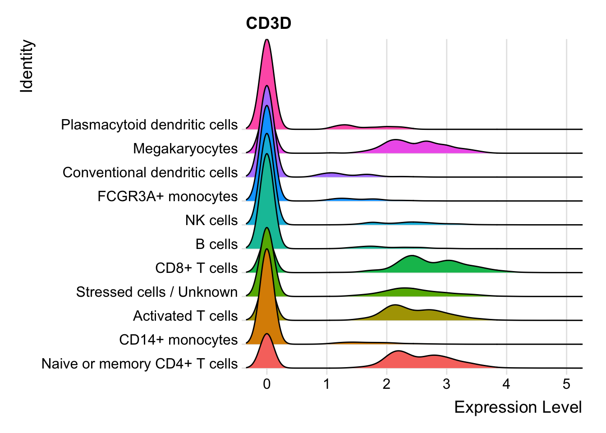
</p>

## DimHeatmap

To see the effect of genes on the principal component, we can see the top and bottom features in PC1 using the `DimHeatmap()` function.

```r
DimHeatmap(seurat_integrated, nfeatures = 10)
```

<p align="center">
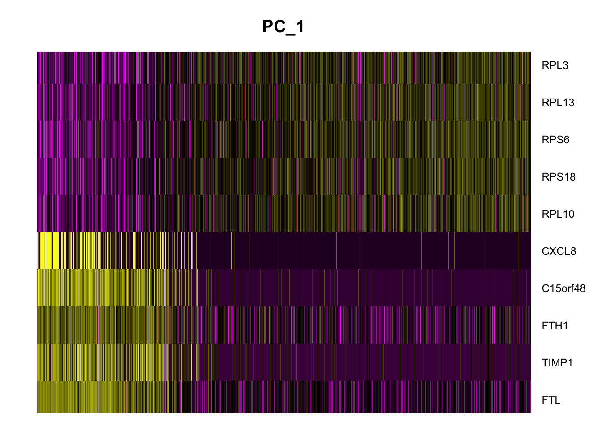
</p>

## DoHeatmap

To plot the expression values for genes across all cells (grouped by their identity), you can call Seurat's `DoHeatmap()` function to identify which populations certain genes are lowly or hihgly expressed.

```r
Idents(seurat_integrated) <- "celltype"
DoHeatmap(seurat_integrated, features=c("CD14", "FCGR3A", "FCER1A", "IL3RA", "CD79A", "CD3D"))
```

<p align="center">
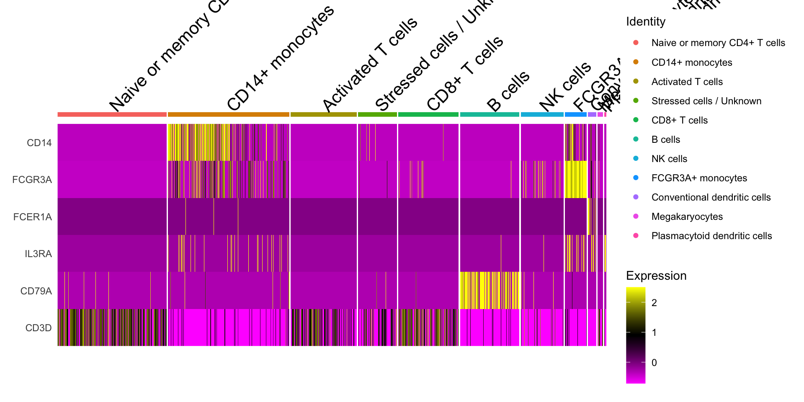
</p>

## DotPlot

Seurat also has a built in visualization tool which allows us to view the average expression of genes groups clusters called `DotPlot()`. The size of the circle represents the number of cells that express the gene within a group and the hue reprents the average expression of the feature.

If you supply a named list with labels annotating genes, those labels will appear at the top of the plot for easier visualization.

```r
# List of known celltype markers
markers <- list()
markers[["CD14+ monocytes"]] <- c("CD14", "LYZ")
markers[["FCGR3A+ monocyte"]] <- c("FCGR3A", "MS4A7")
markers[["Macrophages"]] <- c("MARCO", "ITGAM", "ADGRE1")
markers[["Conventional dendritic"]] <- c("FCER1A", "CST3")
markers[["Plasmacytoid dendritic"]] <- c("IL3RA", "GZMB", "SERPINF1", "ITM2C")

# Create dotplot based on RNA expression
DotPlot(seurat_integrated, markers, assay="RNA", group.by = "integrated_snn_res.0.8")
```

<p align="center">
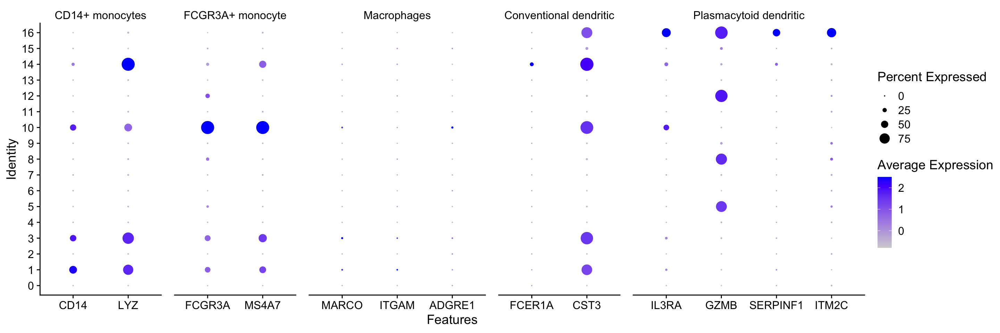
</p>
